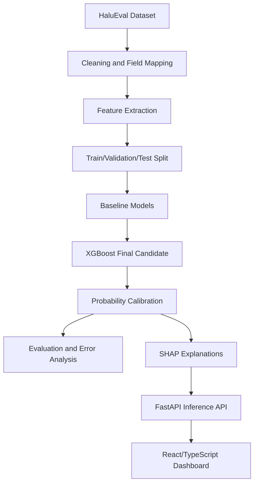
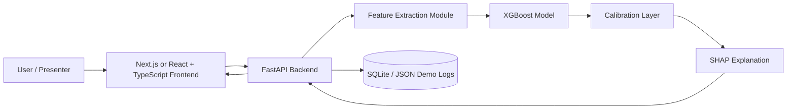
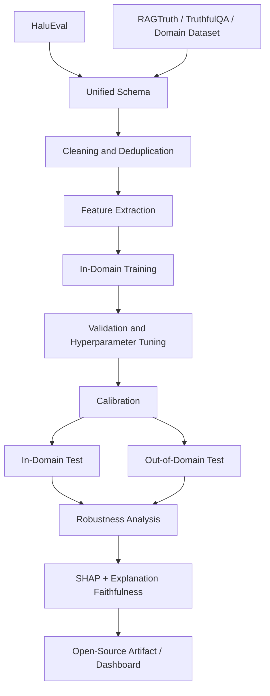
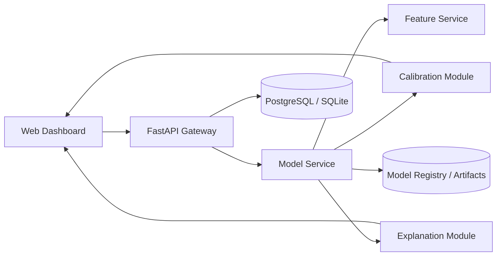

# HaluLens Project Blueprint

## Two-Version Single Source of Truth

**Project theme:** Calibrated, explainable hallucination-risk prediction for black-box LLM outputs using lightweight machine learning, evidence-consistency features, and a presentation-quality web dashboard.

This document intentionally defines **two versions** of the same project:

1. **Version A — 2-Month ML Course Blueprint**  
   A realistic, high-quality undergraduate course project where the **paper is the main deliverable** and the web application supports the paper through demonstration and visualization.

2. **Version B — Extended Publication Blueprint**  
   A stronger post-course version intended for a decent Q2-level journal submission. This version extends the course project rather than replacing it.

The two versions must not be mixed during the course. The biggest risk is trying to implement the publication version in the course timeline.

> **Build a clean, defensible course project first. Then extend it into a stronger publication study.**

---

## Table of Contents

1. [Core Decision](#core-decision)
2. [Critical Evaluation of the Original Idea](#critical-evaluation-of-the-original-idea)
3. [Version A — 2-Month ML Course Blueprint](#version-a--2-month-ml-course-blueprint)
   - [A1. Course Objective](#a1-course-objective)
   - [A2. Course Research Question](#a2-course-research-question)
   - [A3. Course Contribution](#a3-course-contribution)
   - [A4. Idea Verification Scores for Course Version](#a4-idea-verification-scores-for-course-version)
   - [A5. Literature Positioning for Course Version](#a5-literature-positioning-for-course-version)
   - [A6. Course Research Gap](#a6-course-research-gap)
   - [A7. Dataset Plan](#a7-dataset-plan)
   - [A8. Feature Engineering Plan](#a8-feature-engineering-plan)
   - [A9. ML Pipeline](#a9-ml-pipeline)
   - [A10. Evaluation Strategy](#a10-evaluation-strategy)
   - [A11. Course System Architecture](#a11-course-system-architecture)
   - [A12. Web Application for Course Demo](#a12-web-application-for-course-demo)
   - [A13. Course Paper Blueprint](#a13-course-paper-blueprint)
   - [A14. 8-Week Roadmap](#a14-8-week-roadmap)
   - [A15. Course Risks and Mitigations](#a15-course-risks-and-mitigations)
   - [A16. What Must Not Be Included in the Course Version](#a16-what-must-not-be-included-in-the-course-version)
   - [A17. Course Final Verdict](#a17-course-final-verdict)
4. [Version B — Extended Q2 Journal Publication Blueprint](#version-b--extended-q2-journal-publication-blueprint)
   - [B1. Publication Objective](#b1-publication-objective)
   - [B2. Publication Research Question](#b2-publication-research-question)
   - [B3. Publication-Level Contribution](#b3-publication-level-contribution)
   - [B4. Idea Verification Scores for Publication Version](#b4-idea-verification-scores-for-publication-version)
   - [B5. Stronger Literature Positioning](#b5-stronger-literature-positioning)
   - [B6. Publication Research Gap](#b6-publication-research-gap)
   - [B7. Extended Dataset Plan](#b7-extended-dataset-plan)
   - [B8. Extended Feature Engineering](#b8-extended-feature-engineering)
   - [B9. Extended ML Pipeline](#b9-extended-ml-pipeline)
   - [B10. Publication Evaluation Strategy](#b10-publication-evaluation-strategy)
   - [B11. Publication System Architecture](#b11-publication-system-architecture)
   - [B12. Publication Paper Blueprint](#b12-publication-paper-blueprint)
   - [B13. Post-Course Roadmap](#b13-post-course-roadmap)
   - [B14. Publication Risks and Mitigations](#b14-publication-risks-and-mitigations)
   - [B15. Publication Final Verdict](#b15-publication-final-verdict)
5. [Name Evaluation](#name-evaluation)
6. [Final Recommendation](#final-recommendation)

---

# Core Decision

## Recommended final project framing

The project should be framed as:

> **Calibrated explainable hallucination-risk prediction for black-box LLM outputs using lightweight evidence-consistency and linguistic features.**

Do **not** frame it as:

> “A system that detects whether any LLM answer is true from text alone.”

That claim is scientifically weak. Truth cannot always be inferred from style, length, or linguistic patterns. Hallucination detection becomes much more defensible when the model is given a **question**, an **answer**, and preferably some **reference context/evidence**.

## Recommended project name

Use:

- **HaluLens** for course branding and demo.
- **EvidenceLens** if you want a more professional publication-oriented name.

Recommended paper title for course:

> **HaluLens: Calibrated Explainable Hallucination Risk Prediction for Black-Box LLM Outputs**

Recommended publication title:

> **EvidenceLens: Cross-Domain Calibrated and Explainable Hallucination Risk Estimation for Black-Box LLM Responses**

---

# Critical Evaluation of the Original Idea

The original idea is good for an undergraduate ML project, but it had several weaknesses:

| Issue                                                  | Why It Is a Problem                                                                                            | Better Direction                                                                                            |
| ------------------------------------------------------ | -------------------------------------------------------------------------------------------------------------- | ----------------------------------------------------------------------------------------------------------- |
| “Single-pass hallucination detection” is overclaimed   | A single answer may look fluent but still be false; surface text alone is insufficient for truth verification. | Use question + context/evidence + answer. Predict risk, not absolute truth.                                 |
| “Classical ML can match LLM judges” is not always true | Performance depends heavily on dataset artifacts. LLM judges may be stronger in semantic reasoning.            | Compare honestly against simple baselines and optionally one lightweight judge baseline.                    |
| SHAP is presented as novelty                           | SHAP itself is not new.                                                                                        | Novelty should be the integration of calibration, evidence-aware features, and deployable interpretability. |
| HaluEval-only results may not generalize               | Benchmark artifacts can inflate performance.                                                                   | Course version can use HaluEval; publication version must add external evaluation.                          |
| Too many ambitious claims                              | Reviewers penalize exaggerated novelty.                                                                        | Be critical, modest, and experimentally rigorous.                                                           |

The corrected idea remains valuable because it is practical, measurable, explainable, and feasible within two months.

## Venue-Level Novelty Reality Check

| Target                           | Is the contribution sufficient? | Critical Verdict                                                       | How to improve without making it impossible                                          |
| -------------------------------- | ------------------------------- | ---------------------------------------------------------------------- | ------------------------------------------------------------------------------------ |
| Undergraduate ML course          | Yes                             | Strong if experiments, ablations, calibration, and demo are completed. | Keep the scope focused and paper-first.                                              |
| IEEE Access                      | Not as course version only      | Needs broader evaluation and clearer applied contribution.             | Add external dataset, calibration analysis, reproducibility package.                 |
| Expert Systems with Applications | Possible after extension        | Needs a stronger applied decision-support angle and robust evaluation. | Emphasize risk triage, explanation reliability, and real deployment constraints.     |
| ACL Findings                     | Borderline/weak                 | Needs stronger NLP contribution than engineered features + XGBoost.    | Add evidence-conditioned analysis, cross-domain transfer, and deeper error taxonomy. |
| EMNLP Findings                   | Borderline/weak                 | Similar to ACL; benchmark-only applied system is likely insufficient.  | Add new benchmark insight, annotation analysis, or explanation-faithfulness study.   |

Do **not** claim that the course version is ready for ACL/EMNLP. The realistic target after extension is a decent applied Q2 journal, not a top NLP findings paper.

---

# Version A — 2-Month ML Course Blueprint

## A1. Course Objective

Build a complete undergraduate ML project in approximately **8 weeks** that includes:

- journal-style term paper
- working web application
- live demo
- experimental results
- model comparison
- feature ablation
- SHAP-based explanation
- calibrated risk score

The course version must prioritize:

1. **paper quality**
2. **clear methodology**
3. **credible experiments**
4. **working demo**

The web app exists to demonstrate the paper. The project should not become a frontend-only showcase.

---

## A2. Course Research Question

> Can a lightweight black-box machine learning pipeline predict hallucination risk in LLM responses using evidence-consistency, lexical, entity, semantic, and uncertainty features while providing calibrated and interpretable explanations suitable for real-time use?

This question is strong enough for the course because it combines supervised ML, NLP feature extraction, evaluation metrics, calibration, explainability, and system deployment.

---

## A3. Course Contribution

The course project contributes:

1. A reproducible hallucination-risk prediction pipeline using engineered features.
2. A comparison of classical ML models: Logistic Regression, Random Forest, and XGBoost.
3. Probability calibration for more trustworthy risk scores.
4. SHAP-based feature explanations.
5. A React/TypeScript web dashboard for interactive demonstration.

### What is novel enough for the course?

The novelty is not inventing hallucination detection. The novelty is the **balanced system design**:

- black-box input setting
- lightweight ML
- calibrated probabilities
- interpretable feature contributions
- full web-based demonstration

For an undergraduate course, this is strong if executed cleanly.

---

## A4. Idea Verification Scores for Course Version

| Criterion              | Score / 10 | Course-Level Assessment                                                                                           |
| ---------------------- | ---------: | ----------------------------------------------------------------------------------------------------------------- |
| Originality            |          6 | Not entirely new, but sufficiently fresh for an undergraduate ML project when combined with calibration and demo. |
| Novelty                |          6 | Moderate novelty for coursework; not enough for strong publication alone.                                         |
| Practicality           |          9 | Highly practical because it uses existing datasets and classical ML.                                              |
| Engineering Complexity |          6 | Manageable with FastAPI + React/TypeScript.                                                                       |
| Research Complexity    |          7 | Strong enough if experiments, ablations, and calibration are done properly.                                       |
| Publication Potential  |          4 | The course version alone is unlikely to be publishable in a good journal.                                         |
| Implementation Risk    |          5 | Moderate; mostly data/evaluation risk, not coding risk.                                                           |
| Scalability            |          7 | Lightweight inference can scale, but course system does not need production-grade deployment.                     |
| Reproducibility        |          8 | Good if scripts, seeds, and splits are documented.                                                                |
| Educational Value      |          9 | Excellent: covers ML, NLP, XAI, calibration, API design, and frontend demo.                                       |

### Course success probability

**8/10** if scope is controlled.

---

## A5. Literature Positioning for Course Version

### Closest existing work

The project is closest to:

1. **HaluEval benchmark studies** using labeled hallucinated and non-hallucinated examples.
2. **Black-box hallucination detection** using lexical, semantic, and entity-level features.
3. **Classical ML text classification** using Logistic Regression, Random Forest, XGBoost, and feature engineering.
4. **Explainable AI for tabular/text-derived features** using SHAP.

### Closest systems and open-source project categories

The course paper should mention that similar system-level ideas already exist in adjacent forms:

1. **RAG evaluation dashboards** — systems that score whether generated answers are supported by retrieved documents.
2. **LLM-as-a-judge evaluators** — prompt-based evaluators that ask another model to judge factuality or faithfulness.
3. **Fact-checking pipelines** — tools that decompose claims and verify them against search/retrieval results.
4. **Open-source evaluation frameworks** — libraries such as prompt/LLM evaluation toolkits that support hallucination or faithfulness metrics.
5. **Explainable ML dashboards** — generic SHAP/LIME dashboards for tabular ML models.

What they already solve:

- some provide factuality or faithfulness scores;
- some provide strong semantic evaluation;
- some provide generic explainability interfaces.

What they do **not** fully solve for this course project:

- a compact, undergraduate-feasible, reproducible pipeline;
- calibrated user-facing risk probabilities;
- a direct connection between engineered evidence-consistency features, SHAP explanations, and a live educational demo.

Therefore, the project contribution is meaningful for a course, but it must not claim to be the first hallucination detector or the first explainable evaluator.

### What prior work already solved

- hallucination datasets exist
- black-box feature extraction is known
- classical ML can perform reasonably on structured features
- SHAP can explain tree models

### What remains useful for this project

The course contribution is meaningful because it combines these components into a complete, reproducible educational system:

- model
- metrics
- calibration
- explanations
- frontend demo

### Literature honesty rule

The paper must not say:

> “No one has done black-box hallucination detection before.”

Instead say:

> “Prior work has explored hallucination detection, but this project focuses on a compact, course-feasible, calibrated and explainable risk-prediction pipeline with a deployable interface.”

---

## A6. Course Research Gap

### Weak gap to avoid

Avoid claiming:

> “Existing systems have no explainability.”

This is too broad and likely false.

### Stronger course gap

Use this:

> Many hallucination detection approaches are either computationally expensive, difficult to reproduce, dependent on model internals, or presented only as offline benchmark results. For an applied ML setting, there is value in a lightweight, reproducible, calibrated, and explainable black-box pipeline that can be demonstrated interactively.

This is realistic and defensible.

---

## A6.1 Course Feasibility, Blockers, and Simplification Rules

### Can the complete course version be finished in 2 months?

**Yes, but only if Version A is implemented exactly and Version B is postponed.**

### Easiest parts

- training classical ML models;
- building a simple FastAPI endpoint;
- building the React/TypeScript demo UI;
- generating standard plots such as confusion matrix, ROC, PR curve, and SHAP bar charts.

### Hardest parts

- cleaning and mapping dataset fields correctly;
- avoiding train/test leakage;
- making claims scientifically modest;
- writing a high-quality paper while also building the demo;
- interpreting errors honestly instead of only showing successful examples.

### Biggest blockers

| Blocker                  | Why It Matters                | Mitigation                                                          |
| ------------------------ | ----------------------------- | ------------------------------------------------------------------- |
| Dataset format confusion | Can waste the first 1–2 weeks | Start with one subset and inspect manually.                         |
| Weak feature performance | May make results unimpressive | Use robust overlap/entity/semantic features before exotic features. |
| SHAP integration delay   | Can block demo explanations   | Prepare fallback global feature importance chart.                   |
| Overbuilding frontend    | Can damage paper quality      | Build simple dashboard first; polish only after experiments.        |
| Overclaiming novelty     | Can weaken grading/review     | Use honest risk-prediction framing.                                 |

### Simplification rule

If the project falls behind schedule, remove in this order:

1. optional CatBoost;
2. optional secondary subset;
3. complex dashboard pages;
4. semantic embedding features if setup is slow;
5. advanced calibration metrics beyond Brier score and calibration curve.

Never remove:

1. baseline comparison;
2. final model evaluation;
3. paper methodology;
4. ablation table;
5. demo prediction page.

---

## A7. Dataset Plan

### Primary dataset

Use **HaluEval** as the primary dataset.

### Why HaluEval is best for the course

- large enough
- directly related to hallucination evaluation
- commonly referenced
- manageable within 2 months
- provides QA/dialogue/summarization/general examples depending on availability

### Recommended subset for the course

Use only **one or two subsets**, not all possible tasks.

Recommended:

1. **QA subset** as primary
2. optional **dialogue or summarization subset** as secondary test

Do not try to build a universal detector across all domains in the course version.

### Dataset comparison

| Dataset     |                         Size | Advantages                                               | Disadvantages                                 | Licensing                                | Course Suitability                                   |
| ----------- | ---------------------------: | -------------------------------------------------------- | --------------------------------------------- | ---------------------------------------- | ---------------------------------------------------- |
| HaluEval    |                        Large | Directly relevant; benchmark-style; enough training data | May contain artifacts; may not generalize     | Verify original repo/license and cite    | Best primary choice                                  |
| TruthfulQA  |                        Small | Tests truthful answering; useful external reference      | Not ideal for supervised large-scale training | Public research dataset; verify license  | Optional discussion or extension                     |
| RAGTruth    | Medium/large depending split | Better for evidence-grounded hallucination               | More complex; may take longer to process      | Verify terms before redistribution       | Better for publication extension                     |
| Custom data |                     Flexible | Can match demo scenario                                  | Labeling cost and reliability issues          | Must document generation/labeling rights | Not recommended for course except tiny demo-only set |

### Licensing rule

Before implementation, verify dataset license, citation format, redistribution terms, and whether generated examples can be stored in the repository.

---

## A8. Feature Engineering Plan

The course version must use a compact feature set. Do not create dozens of poorly justified features.

### MVP/course feature groups

| Feature Group       | Example Features                                                    | Why It Exists                                             | Cost     | Expected Importance | Phase      |
| ------------------- | ------------------------------------------------------------------- | --------------------------------------------------------- | -------- | ------------------- | ---------- |
| Length/style        | answer length, sentence count, avg sentence length                  | Captures stylistic differences and verbosity              | Very low | Medium              | MVP        |
| Lexical overlap     | answer-context overlap, answer-question overlap, Jaccard similarity | Measures grounding and source adherence                   | Low      | High                | MVP        |
| Entity overlap      | named entity count, entity novelty ratio                            | Unsupported entities often indicate hallucination         | Moderate | High                | MVP/course |
| Numeric consistency | number count, number overlap, new numbers in answer                 | Fabricated numbers/dates are common hallucination signals | Low      | Medium-high         | Course     |
| Hedging             | maybe, might, likely, possibly, uncertain phrases                   | Captures uncertainty language                             | Very low | Medium              | Course     |
| Semantic similarity | embedding cosine similarity between context/question and answer     | Captures semantic drift beyond exact words                | Moderate | High                | Course     |

### Recommended course feature set

Use approximately **15–30 total features**. This is enough for a good paper and easy to explain.

### Do not include in course version

- hidden-state features
- token log-probability features unless easily available
- multi-sampling consistency features
- expensive LLM judge features as part of the main model
- transformer fine-tuning

---

## A9. ML Pipeline

### Course workflow



### Preprocessing

- normalize whitespace
- lowercase only for lexical features, not necessarily for NER
- tokenize text
- handle missing context
- remove invalid samples
- keep label mapping documented

### Split strategy

Recommended:

- train: 70%
- validation: 15%
- test: 15%

Use stratification by label. If official splits are available and clean, use official splits.

### Cross-validation

Minimum acceptable:

- fixed train/validation/test split
- one random seed
- clear reproducibility notes

Better:

- 5-fold cross-validation for model selection
- final untouched test set for reporting

### Models

Baseline models:

1. heuristic baseline
2. Logistic Regression
3. Random Forest

Final model:

4. XGBoost

Optional:

5. CatBoost if time permits

### Final recommendation

Use **XGBoost + Platt calibration** as the final course model unless validation results show otherwise.

### Explainability

Use **SHAP TreeExplainer** for XGBoost.

For the paper, include:

- global feature importance
- local explanation for 2–3 case studies

---

## A10. Evaluation Strategy

### Required metrics

Classification:

- Precision
- Recall
- F1-score
- AUROC
- PR-AUC
- MCC

Calibration:

- Brier score
- calibration curve
- optional Expected Calibration Error

Efficiency:

- average inference latency
- feature extraction time
- model prediction time
- SHAP explanation time
- approximate inference cost per 1,000 predictions
- model artifact size
- runtime memory usage during API inference

### Required plots

- confusion matrix
- ROC curve
- PR curve
- calibration curve
- SHAP global summary bar chart
- SHAP local explanation chart for demo examples

### Operational evaluation table to include in the paper

| Component          | Metric                                           | Why It Matters                                                     |
| ------------------ | ------------------------------------------------ | ------------------------------------------------------------------ |
| Feature extraction | milliseconds/sample                              | Shows whether the pipeline is demo-ready.                          |
| Model inference    | milliseconds/sample                              | Demonstrates classical ML efficiency.                              |
| SHAP explanation   | milliseconds/sample                              | Shows cost of explainability.                                      |
| End-to-end API     | milliseconds/request                             | Reflects real user experience.                                     |
| Model artifact     | MB                                               | Supports reproducibility and deployment discussion.                |
| Memory usage       | approximate MB RAM                               | Shows whether it can run on a normal laptop.                       |
| Cost               | API calls or external cost per 1,000 predictions | Shows advantage over LLM-as-a-judge if no external calls are used. |

### Required comparisons

| Model                 | Purpose                                                  |
| --------------------- | -------------------------------------------------------- |
| Heuristic baseline    | Shows minimum rule-based performance                     |
| Logistic Regression   | Simple interpretable ML baseline                         |
| Random Forest         | Classical non-linear baseline                            |
| XGBoost               | Main candidate model                                     |
| XGBoost + calibration | Final deployed model if calibration improves reliability |

### Ablation studies

At minimum, remove feature groups one at a time:

1. no lexical overlap
2. no entity features
3. no hedging features
4. no semantic similarity

### Error analysis

Manually inspect at least 20 wrong predictions:

- 10 false positives
- 10 false negatives

Classify errors into categories:

- short answer ambiguity
- unsupported but semantically similar answer
- entity extraction failure
- context too weak
- label ambiguity

This will strengthen the paper significantly.

---

## A11. Course System Architecture

### Architecture diagram



### Frontend

Use what you already know:

- Next.js or React + TypeScript
- Tailwind CSS if comfortable
- Recharts or Plotly for charts

### Backend

- FastAPI
- Pydantic request/response schema
- CORS enabled for frontend
- model loaded once at startup

### Storage

Course version can use local JSON logs or SQLite. Do not spend too much time on complex database architecture.

### API endpoints

#### `POST /predict`

Input:

```json
{
  "question": "Who discovered penicillin?",
  "context": "Penicillin was discovered by Alexander Fleming in 1928.",
  "answer": "Penicillin was discovered by Alexander Fleming.",
  "domain": "qa"
}
```

Output:

```json
{
  "risk_score": 0.18,
  "calibrated_probability": 0.21,
  "label": "low_risk",
  "top_features": [
    { "feature": "entity_overlap_ratio", "value": 1.0, "impact": -0.22 },
    { "feature": "semantic_similarity", "value": 0.84, "impact": -0.18 }
  ],
  "latency_ms": 34
}
```

#### `GET /health`

Returns backend status.

---

## A12. Web Application for Course Demo

### App purpose

The app should demonstrate the research idea, not merely output a prediction.

### Required pages

#### 1. Analyze Page

- question input
- context input
- answer input
- analyze button
- sample example buttons

#### 2. Result Panel

- risk gauge
- calibrated probability
- label: low / medium / high risk
- latency
- top SHAP features

#### 3. Explanation Dashboard

- SHAP bar chart
- feature-value table
- simple natural-language explanation

#### 4. Experiment Summary Page

- model comparison table
- confusion matrix image
- ROC/PR/calibration plots
- ablation summary

### Demo scenario

During presentation:

1. Show a grounded answer with low risk.
2. Show a hallucinated answer with unsupported entity or wrong date.
3. Show a borderline answer and explain why calibration matters.
4. Open experiment dashboard and show that this is backed by evaluation, not just UI.

### Screenshots to include in paper

1. input screen
2. low-risk result
3. high-risk result
4. SHAP explanation chart
5. experiment dashboard

---

## A13. Course Paper Blueprint

### Recommended course paper title

**HaluLens: A Calibrated and Explainable Machine Learning Framework for Hallucination Risk Prediction in Black-Box LLM Outputs**

### Abstract outline

Do not write the final abstract yet. Structure it as:

1. Problem: LLM hallucinations reduce trust.
2. Limitation: many detection methods are costly, opaque, or require model internals.
3. Method: lightweight features + classical ML + calibration + SHAP.
4. Experiment: evaluate on HaluEval with baselines and ablations.
5. System: deploy as FastAPI + React/TypeScript dashboard.
6. Result: report actual measured performance and latency.

### Keywords

Large language models, hallucination detection, hallucination risk, explainable AI, SHAP, XGBoost, calibration, black-box NLP, machine learning, trustworthy AI

### Paper sections

#### 1. Introduction

- motivation
- problem statement
- why black-box detection matters
- contributions

#### 2. Related Work

- hallucination detection
- black-box methods
- LLM-as-a-judge and multi-sampling methods
- explainable ML
- calibration

#### 3. Methodology

- task definition
- dataset
- preprocessing
- feature groups
- models
- calibration
- SHAP explanation

#### 4. Experiments

- dataset split
- metrics
- baselines
- model comparison
- ablations
- latency analysis

#### 5. Web Application

- architecture
- user flow
- screenshots
- demo scenario

#### 6. Results and Discussion

- performance interpretation
- feature importance
- errors
- limitations

#### 7. Conclusion and Future Work

- summary
- course contribution
- publication extension

### Paper priority rule

Because the course paper is more important, finish these before over-polishing UI:

1. dataset description
2. methodology diagram
3. model comparison table
4. ablation table
5. SHAP explanation figure
6. error analysis
7. final architecture diagram

---

## A14. 8-Week Roadmap

### Week 1 — Literature and Dataset Setup

Objectives:

- finalize problem framing
- download/prepare HaluEval
- inspect fields and labels
- write paper introduction skeleton

Deliverables:

- dataset loading script
- 10–15 paper references collected
- initial paper outline

Risks:

- dataset format confusion

Mitigation:

- start with one subset only, preferably QA

### Week 2 — Feature Extraction MVP

Objectives:

- implement length, overlap, entity, numeric, hedging features
- generate feature CSV

Deliverables:

- `extract_features.py`
- feature table
- feature documentation

Risks:

- spaCy/NER setup issues

Mitigation:

- fallback to regex/numeric/lexical features if needed

### Week 3 — Baselines and First Results

Objectives:

- train heuristic, Logistic Regression, Random Forest
- create first evaluation table

Deliverables:

- baseline results
- confusion matrix
- draft methodology section

Risks:

- weak baseline performance

Mitigation:

- inspect features and labels before adding complexity

### Week 4 — XGBoost, Calibration, and Ablation

Objectives:

- train XGBoost
- calibrate probabilities
- run ablations

Deliverables:

- final model candidate
- ablation table
- calibration curve

Risks:

- overfitting

Mitigation:

- use validation set and regularization

### Week 5 — SHAP and Error Analysis

Objectives:

- generate SHAP plots
- inspect false positives/false negatives
- write results draft

Deliverables:

- SHAP summary plot
- 3 case studies
- error analysis section

Risks:

- SHAP interpretation confusing

Mitigation:

- explain feature-level, not token-level, importance

### Week 6 — Backend API

Objectives:

- build FastAPI server
- load model artifact
- return prediction + explanation JSON

Deliverables:

- `/predict` endpoint
- `/health` endpoint
- mock API tests

Risks:

- integration delays

Mitigation:

- define exact JSON contract early

### Week 7 — Frontend Dashboard

Objectives:

- build React/TypeScript UI
- connect API
- implement charts

Deliverables:

- analysis page
- result panel
- SHAP chart
- experiment summary page

Risks:

- frontend polish consumes too much time

Mitigation:

- use simple clean layout; prioritize clarity

### Week 8 — Paper Finalization and Demo Rehearsal

Objectives:

- finalize paper
- prepare presentation slides
- rehearse demo

Deliverables:

- final paper PDF/doc
- final code repository
- presentation slides
- demo script

Risks:

- last-minute bugs

Mitigation:

- prepare fallback demo screenshots/video

---

## A15. Course Risks and Mitigations

| Risk Type      | Risk                             | Impact | Mitigation                                           |
| -------------- | -------------------------------- | ------ | ---------------------------------------------------- |
| Technical      | Feature extraction bugs          | Medium | Unit test on small examples.                         |
| Research       | Weak novelty                     | High   | Emphasize calibration, ablation, and explainability. |
| Dataset        | HaluEval artifacts               | High   | Discuss honestly; avoid overclaiming generalization. |
| Implementation | API/frontend delay               | Medium | Build with mock JSON first.                          |
| Novelty        | Looks like “XGBoost + SHAP only” | High   | Frame as calibrated deployable risk pipeline.        |
| Presentation   | Demo failure                     | Medium | Record backup demo video/screenshots.                |

---

## A16. What Must Not Be Included in the Course Version

Do not include:

1. LLM training or fine-tuning.
2. Large transformer training.
3. Hidden-state probing.
4. Multi-sampling hallucination detection as the main method.
5. Multiple large external datasets.
6. Human subject studies.
7. Production authentication/user management.
8. Complex database architecture.
9. Claims of universal truth detection.
10. Claims of state-of-the-art performance unless proven.

---

## A17. Course Final Verdict

| Dimension                        | Score / 10 |
| -------------------------------- | ---------: |
| Course Success Probability       |        8.5 |
| Research Quality                 |          7 |
| Novelty for Undergraduate Course |          7 |
| Paper Quality Potential          |          8 |
| Demo Quality Potential           |          8 |
| Feasibility in 2 Months          |          8 |
| Overall Course Recommendation    |          8 |

### Course verdict

This is a strong and realistic ML course project if implemented as a **paper-first calibrated hallucination-risk prediction system** with a focused dataset, compact feature set, clean experiments, SHAP explanations, and a polished but not over-engineered web demo.

---

# Version B — Extended Q2 Journal Publication Blueprint

## B1. Publication Objective

Extend the course project into a stronger applied research study suitable for a decent Q2-level journal.

The publication version must move beyond “we trained XGBoost on HaluEval.” That alone is not enough.

The extended version should focus on:

- cross-domain robustness
- calibration under distribution shift
- evidence-conditioned hallucination risk
- explanation reliability
- reproducible deployment artifact

---

## B2. Publication Research Question

> How robustly can a calibrated, explainable black-box hallucination-risk model generalize across datasets and domains using evidence-consistency and linguistic features, and how reliable are its explanations under distribution shift?

This is stronger than the course question because it tests generalization and explanation reliability.

---

## B3. Publication-Level Contribution

The publication version should claim the following contributions:

1. A cross-domain black-box hallucination-risk framework using evidence-aware features.
2. Calibration analysis across in-domain and out-of-domain datasets.
3. Feature-group ablation and explanation-faithfulness analysis.
4. Comparison with lightweight classical baselines and at least one stronger semantic/LLM-based baseline if affordable.
5. An open-source reproducible web-based artifact.

### What makes this Q2-journal-worthy?

The publication strength comes from rigorous evaluation, cross-domain validation, calibration analysis, practical deployability, and honest limitations — not from claiming SOTA.

---

## B4. Idea Verification Scores for Publication Version

| Criterion                  | Score / 10 | Publication-Level Assessment                                                                         |
| -------------------------- | ---------: | ---------------------------------------------------------------------------------------------------- |
| Originality                |          6 | Still not fundamentally new, but stronger with cross-domain calibration and explanation reliability. |
| Novelty                    |        6.5 | Moderate; enough for applied Q2 journal if experiments are rigorous.                                 |
| Practicality               |          8 | Practical and deployable.                                                                            |
| Engineering Complexity     |          7 | More complex due to multiple datasets and reproducibility requirements.                              |
| Research Complexity        |          8 | Stronger because it includes robustness, calibration, and explanation faithfulness.                  |
| Publication Potential      |          7 | Reasonable for Q2 applied ML / AI systems venue if well executed.                                    |
| Implementation Risk        |          7 | Dataset alignment and cross-domain evaluation are non-trivial.                                       |
| Scalability                |          8 | Lightweight inference remains scalable.                                                              |
| Reproducibility            |          8 | Strong if containerized and released with scripts.                                                   |
| Educational/Research Value |          8 | Good applied research contribution.                                                                  |

---

## B5. Stronger Literature Positioning

### Closest paper categories

1. Hallucination benchmark papers such as HaluEval-style work.
2. RAG hallucination and factual consistency datasets such as RAGTruth-style work.
3. Truthfulness benchmarks such as TruthfulQA.
4. LLM-as-a-judge evaluation frameworks.
5. Uncertainty and calibration methods for neural/LLM outputs.
6. Explainable AI methods for trust and model debugging.

### What prior work already solved

- detection benchmarks
- judge-based evaluation
- black-box and white-box feature strategies
- uncertainty estimation approaches
- SHAP and LIME explanation techniques

### What remains unsolved enough for publication

1. Many approaches are not calibrated for user-facing probabilities.
2. Many results are benchmark-specific.
3. Explanation reliability is rarely tested, only visualized.
4. Lightweight methods are under-evaluated under domain shift.
5. Practical web artifacts often lack rigorous experimental backing.

### Publication positioning statement

The paper should position itself as an **applied, reproducible, calibration-aware hallucination-risk framework**, not as a theoretical breakthrough.

---

## B6. Publication Research Gap

Publication gap:

> Existing hallucination detection methods often trade off between cost, interpretability, and generalization. There is limited applied work evaluating whether lightweight black-box detectors can remain calibrated, explainable, and useful across multiple task domains and evidence settings.

Why this is stronger:

- includes generalization
- includes calibration
- includes explanation reliability
- fits a Q2 applied journal

---

## B7. Extended Dataset Plan

### Primary dataset

- HaluEval for in-domain training and primary benchmark.

### Secondary datasets

Use at least one of:

1. **RAGTruth** — best for evidence-grounded hallucination.
2. **TruthfulQA** — useful for truthfulness stress testing.
3. **FEVER-style evidence verification data** — useful if adapted carefully.
4. **Small domain-specific dataset** — legal, medical, finance, or academic QA.

### Dataset comparison for publication

| Dataset            | Role                            | Advantage                         | Limitation                                 |
| ------------------ | ------------------------------- | --------------------------------- | ------------------------------------------ |
| HaluEval           | Training/in-domain test         | Large and directly relevant       | May contain artifacts                      |
| RAGTruth           | External evidence-grounded test | Stronger real-world RAG relevance | More complex preprocessing                 |
| TruthfulQA         | Truthfulness stress test        | Known benchmark                   | Small; label mapping may be tricky         |
| Domain-specific QA | Practical extension             | Improves applied relevance        | Requires careful labeling/license checking |

### Recommended publication dataset setup

- Train on HaluEval QA.
- Validate on held-out HaluEval.
- Test on HaluEval test.
- Evaluate zero-shot or lightly adapted on RAGTruth/TruthfulQA.
- Optionally add one small domain dataset.

---

## B8. Extended Feature Engineering

The publication version can extend the course features, but every new feature must be justified and ablated.

### Additional feature groups

| Feature Group                  | Examples                                            | Purpose                          | Cost          | Publication Value |
| ------------------------------ | --------------------------------------------------- | -------------------------------- | ------------- | ----------------- |
| Evidence support               | citation support, sentence-evidence alignment       | Improves RAG/evidence grounding  | Moderate      | High              |
| NLI-based consistency          | entailment/contradiction score from small NLI model | Captures semantic contradiction  | Moderate-high | High              |
| Domain indicators              | task/domain type, context length bucket             | Tests robustness by domain       | Low           | Medium            |
| Calibration features           | uncertainty bins, confidence intervals              | Improves user-facing reliability | Low           | High              |
| Explanation stability features | perturbation sensitivity                            | Tests explanation robustness     | Moderate      | High              |

### Publication feature discipline

For every feature group, report:

- why it was added
- computational cost
- performance change
- calibration change
- explanation impact

If a feature does not help, remove it or discuss it as a negative result.

---

## B9. Extended ML Pipeline

### Extended workflow



### Models to compare

Minimum:

- Logistic Regression
- Random Forest
- XGBoost
- CatBoost

Publication-level optional baselines:

- small NLI-based classifier
- sentence-transformer + classifier
- affordable LLM-as-judge baseline on a subset

### Calibration methods

Compare:

- uncalibrated model
- Platt scaling
- isotonic regression

Report:

- Brier score
- calibration curve
- ECE
- reliability diagram

### Explanation reliability

Add tests such as:

- feature removal consistency
- perturb answer text slightly and observe explanation stability
- compare SHAP importance with ablation importance

This helps avoid the criticism that SHAP is only decorative.

---

## B10. Publication Evaluation Strategy

### Core evaluation blocks

1. In-domain classification performance.
2. Out-of-domain generalization.
3. Calibration analysis.
4. Ablation studies.
5. Explanation reliability.
6. Latency and deployment cost.

### Metrics

Classification:

- Precision
- Recall
- F1
- AUROC
- PR-AUC
- MCC

Calibration:

- Brier score
- ECE
- reliability diagrams

Efficiency:

- latency p50/p95
- memory footprint
- model size
- CPU inference time

Statistical testing:

- bootstrap confidence intervals
- paired significance tests where applicable

### Required publication figures

1. architecture diagram
2. dataset schema diagram
3. model comparison table
4. in-domain vs out-of-domain performance table
5. calibration curves
6. ablation chart
7. SHAP summary plot
8. explanation faithfulness/perturbation plot
9. latency/cost table

---

## B11. Publication System Architecture



### Publication upgrades

- Dockerized backend
- versioned model artifacts
- experiment tracking
- reproducible scripts
- public demo or recorded demo
- README with exact reproduction steps

Do not overbuild a SaaS platform. The artifact should support the research paper.

---

## B12. Publication Paper Blueprint

### Recommended publication title

**EvidenceLens: Cross-Domain Calibrated and Explainable Hallucination Risk Estimation for Black-Box LLM Responses**

### Abstract outline

1. Problem: hallucination risk remains difficult to estimate reliably in black-box LLM systems.
2. Gap: existing methods are often expensive, non-calibrated, weakly explainable, or benchmark-specific.
3. Method: evidence-aware feature extraction, lightweight classifiers, calibration, and SHAP explanations.
4. Experiments: evaluate in-domain and out-of-domain datasets.
5. Analysis: calibration, ablation, explanation reliability, latency.
6. Conclusion: practical and reproducible risk-estimation framework.

### Full paper structure

#### 1. Introduction

- hallucination risk in deployed LLMs
- cost and limitations of existing detectors
- need for calibrated explainable black-box risk estimation
- contributions

#### 2. Related Work

- hallucination detection benchmarks
- black-box vs white-box methods
- LLM-as-a-judge
- RAG hallucination detection
- calibration and uncertainty
- explainable AI

#### 3. Problem Definition

- define hallucination risk
- define supported vs unsupported answer
- explain why risk prediction is more defensible than truth detection

#### 4. Method

- unified input schema
- feature extraction
- model training
- calibration
- explanation module

#### 5. Experimental Setup

- datasets
- preprocessing
- baselines
- metrics
- statistical testing

#### 6. Results

- in-domain performance
- out-of-domain performance
- calibration results
- efficiency results

#### 7. Ablation and Explanation Analysis

- feature group ablations
- SHAP analysis
- explanation stability

#### 8. System Artifact

- dashboard
- API
- reproducibility package

#### 9. Discussion

- practical value
- limitations
- failure cases

#### 10. Conclusion and Future Work

- summarize contributions
- future domain adaptation and human-in-the-loop extensions

---

## B13. Post-Course Roadmap

### Month 1 After Course — Dataset Expansion

Objectives:

- add one external dataset
- build unified schema
- run zero-shot transfer evaluation

Deliverables:

- external dataset results
- dataset comparison table

Risks:

- label mismatch

### Month 2 — Calibration and Robustness

Objectives:

- compare Platt vs isotonic calibration
- analyze in-domain vs out-of-domain reliability

Deliverables:

- calibration curves
- ECE/Brier results
- robustness section draft

Risks:

- calibration may degrade OOD

### Month 3 — Explanation Reliability

Objectives:

- run perturbation tests
- compare SHAP with ablation importance

Deliverables:

- explanation reliability plots
- XAI analysis section

Risks:

- SHAP explanations may not align cleanly with ablation

### Month 4 — Journal Manuscript and Artifact

Objectives:

- polish manuscript
- containerize code
- prepare GitHub repository

Deliverables:

- submission-ready paper
- reproducibility package
- demo video

Risks:

- manuscript may still need stronger baselines

---

## B14. Publication Risks and Mitigations

| Risk Type   | Risk                                        | Mitigation                                                                                 |
| ----------- | ------------------------------------------- | ------------------------------------------------------------------------------------------ |
| Technical   | Multiple datasets have incompatible formats | Build a unified schema early.                                                              |
| Research    | Contribution still appears incremental      | Emphasize calibration, cross-domain robustness, and explanation reliability.               |
| Dataset     | Label definitions differ across datasets    | Explicitly document mapping and perform sensitivity analysis.                              |
| Evaluation  | OOD performance drops sharply               | Report honestly; use it as motivation for calibration/domain adaptation.                   |
| Novelty     | Reviewers say SHAP + XGBoost is standard    | Make SHAP only one part; focus on calibrated evidence-aware risk under distribution shift. |
| Publication | Q2 venue asks for stronger experiments      | Add one stronger baseline and a reproducibility artifact.                                  |

---

## B15. Publication Final Verdict

| Dimension                          | Score / 10 |
| ---------------------------------- | ---------: |
| Q2 Publication Potential           |          7 |
| Research Quality                   |        7.5 |
| Novelty                            |        6.5 |
| Practical Value                    |          8 |
| Reproducibility Potential          |          8 |
| Implementation Difficulty          |          7 |
| Overall Publication Recommendation |          7 |

### Publication verdict

The project can become a decent Q2-level journal paper if the post-course version adds cross-domain evaluation, calibration analysis, explanation reliability testing, and a reproducible artifact. The publication version should not claim theoretical novelty or SOTA unless experiments prove it. Its strongest angle is **practical, calibrated, explainable, and deployable hallucination-risk estimation**.

---

# Name Evaluation

## Current name: HaluLens

### Score

**7/10**

### Strengths

- memorable
- short
- relevant to hallucination
- good for demo branding

### Weaknesses

- slightly informal
- may sound less professional in a journal title
- does not clearly communicate evidence grounding or calibration

## Alternative names

1. **EvidenceLens**
2. **TrustLens**
3. **VeriLens**
4. **GroundScore**
5. **FactualityLens**
6. **TruthTrace**
7. **HalluGauge**
8. **CalibraFact**
9. **RiskLens AI**
10. **LLMTrustMap**
11. **FactShield**
12. **GroundedLens**

## Recommendation

- Use **HaluLens** for the course project because it is memorable and already established in the proposal.
- Use **EvidenceLens** or a formal descriptive title for journal submission.

Best combined strategy:

> Course demo name: **HaluLens**  
> Publication paper name: **EvidenceLens**

---

# Final Recommendation

## What to do now

For the course, implement **Version A only**.

Do not attempt Version B during the course. Instead, design the codebase so Version B can be added later.

## Final course plan summary

The course version should deliver:

1. HaluEval-based experiment.
2. Compact engineered feature set.
3. Logistic Regression, Random Forest, and XGBoost comparison.
4. XGBoost + calibration final model.
5. SHAP explanations.
6. React/TypeScript dashboard.
7. Journal-style paper with strong methodology, results, ablation, and error analysis.

## Final publication plan summary

The publication version should add:

1. external dataset testing
2. cross-domain robustness
3. calibration under distribution shift
4. explanation reliability analysis
5. stronger baselines
6. reproducible artifact packaging

## Overall scores

| Version                              | Course Success | Research Quality | Novelty | Demo Quality | Publication Potential | Overall |
| ------------------------------------ | -------------: | ---------------: | ------: | -----------: | --------------------: | ------: |
| Version A — 2-Month Course           |            8.5 |                7 |       7 |            8 |                     4 |       8 |
| Version B — Q2 Publication Extension |              6 |              7.5 |     6.5 |            8 |                     7 |       7 |

## Final verdict

Yes, this project should be pursued. The correct approach is to treat the course version as a **paper-first applied ML project** with a working demo, and treat the publication version as a later extension focused on cross-domain robustness, calibration, and explanation reliability.
