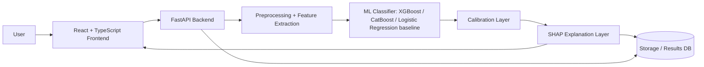

# Blueprint: HaluLens — Calibrated Explainable Hallucination Risk Prediction for LLM Outputs

## Table of Contents

1. [Executive Summary](#executive-summary)
2. [Critical Reframing of the Idea](#critical-reframing-of-the-idea)
3. [1. Idea Verification Scores](#1-idea-verification-scores)
4. [2. Literature Analysis](#2-literature-analysis)
5. [3. Real Research Gap](#3-real-research-gap)
6. [4. Novelty Analysis](#4-novelty-analysis)
7. [5. Feasibility and Scope Control](#5-feasibility-and-scope-control)
8. [6. System Architecture](#6-system-architecture)
9. [7. ML Pipeline](#7-ml-pipeline)
10. [8. Dataset Verification](#8-dataset-verification)
11. [9. Feature Engineering](#9-feature-engineering)
12. [10. Evaluation Strategy](#10-evaluation-strategy)
13. [11. Web Application Design](#11-web-application-design)
14. [12. Implementation Roadmap](#12-implementation-roadmap)
15. [13. Paper Blueprint](#13-paper-blueprint)
16. [14. Name Evaluation](#14-name-evaluation)
17. [15. Risks and Mitigations](#15-risks-and-mitigations)
18. [16. Final Verdict](#16-final-verdict)

## Executive Summary

**Recommended project direction:**

Build a **calibrated, explainable, low-latency hallucination risk predictor** for LLM outputs using **black-box, surface-level, evidence-consistency features** and lightweight machine learning. The system should take as input:

- user query
- optional reference context or retrieved evidence
- model response

and output:

- a hallucination-risk score
- an explanation of the top contributing features
- a confidence calibration indicator
- an interactive dashboard for demo and analysis

### Why this direction is better than the original proposal

The original idea is directionally good, but it is too broad and slightly misleading in its current form. The most important correction is this:

> The project should **not** claim universal hallucination detection from raw text alone.

That claim is too strong because factual hallucination is often impossible to determine without grounding evidence. A better and more publishable framing is:

> **Predict the risk that an LLM answer is unsupported, inconsistent, or likely hallucinated given the question and available evidence.**

This is much more defensible, easier to evaluate, and more honest scientifically.

### Course version vs publication version

- **Course version:** one strong benchmark dataset, one robust model family, one web demo, solid ablations, calibration, and SHAP explanations.
- **Publication extension:** additional domains, out-of-distribution testing, uncertainty calibration analysis, retrieval-conditioned features, and human evaluation.

### Core recommendation

Use **React + TypeScript** on the frontend, **FastAPI** on the backend, and **scikit-learn / XGBoost / CatBoost** for the model pipeline. Keep the ML pipeline simple, reproducible, and measurable.

---

## Critical Reframing of the Idea

The supplied documents are useful, but they contain several weaknesses:

1. **They overclaim novelty.** Black-box feature-based hallucination detection already exists in multiple forms.
2. **They overclaim performance.** Numbers such as “F1 > 0.92” or “sub-50ms” are possible in some setups but should not be promised before experiments.
3. **They blur the task definition.** Hallucination detection on its own is not always well-defined without evidence.
4. **They conflate general hallucination detection with answer verification.** These are related but not the same.

### Better problem definition

Define the task as:

> Given a query, optional supporting context, and an LLM answer, predict the probability that the answer is **unsupported, inconsistent, or likely hallucinated**.

This lets the project support both:

- **context-grounded checking** for RAG or QA systems
- **answer-risk triage** for black-box API outputs

### Best scientific framing

The contribution is not “we can magically know truth from surface text.”

The contribution is:

1. **risk scoring under black-box constraints**
2. **calibration for human-readable probability outputs**
3. **interpretability via SHAP at feature level**
4. **deployment-friendly latency and UX**

That is credible, testable, and suitable for a two-month course project.

---

## 1. Idea Verification Scores

| Criterion              | Score / 10 | Critical Assessment                                                                                                                                         |
| ---------------------- | ---------: | ----------------------------------------------------------------------------------------------------------------------------------------------------------- |
| Originality            |          6 | The general direction is not new. The combination of black-box features + classical ML + SHAP is useful, but not fundamentally novel by research standards. |
| Novelty                |          5 | Moderate at best for publication unless strengthened with calibration, cross-domain testing, and evidence-conditioned analysis.                             |
| Practicality           |          8 | Very practical for a course project because it avoids training large models.                                                                                |
| Engineering Complexity |          6 | Moderate. Backend/frontend integration is manageable; data quality and evaluation are harder.                                                               |
| Research Complexity    |          7 | Enough for an undergraduate paper if the claims are controlled and experiments are rigorous.                                                                |
| Publication Potential  |          5 | Not yet strong enough for a serious journal unless extended with broader evaluation and stronger methodology.                                               |
| Implementation Risk    |          6 | Main risk is weak generalization and unclear labels, not coding difficulty.                                                                                 |
| Scalability            |          7 | The system can scale operationally because inference is lightweight, but scientific scalability is limited if features remain shallow.                      |
| Reproducibility        |          8 | Good, if the data splits, preprocessing, and calibration procedure are fixed and documented.                                                                |
| Educational Value      |          9 | Excellent for an undergraduate ML course because it touches ML, NLP, calibration, explainability, and web deployment.                                       |

### Bottom-line rating

**Overall idea strength for the course: 7.5/10**

It is good, but only if scoped carefully.

---

## 2. Literature Analysis

### Closest literature families

#### A. Black-box hallucination detection using surface features

These methods use features such as:

- answer length
- lexical overlap
- entity mismatch
- uncertainty terms
- semantic similarity
- entailment or contradiction scores

**What they already solved:**

- showed that lightweight classifiers can detect some hallucination patterns
- proved that black-box detection is feasible without internal logits or hidden states
- established strong baselines with TF-IDF, overlap, and tree-based models

**What remains unsolved:**

- robust generalization across domains
- reliable calibration of predicted risk
- strong explanation quality for non-experts
- consistent evaluation under evidence mismatch

#### B. HaluEval-style benchmark studies

HaluEval is the most obvious benchmark family for this task.

**What it already solved:**

- standardized hallucination-like examples
- made it easy to compare methods on QA, dialogue, summarization, and general prompts

**What remains unsolved:**

- benchmark dependency may lead to overfitting
- some subsets are synthetic or distributionally narrow
- results may not transfer to real deployment settings

#### C. Uncertainty and calibration-based hallucination detection

These methods estimate confidence via:

- entropy
- consistency across samples
- probability calibration
- token-level uncertainty

**What they already solved:**

- improved confidence estimates
- better thresholds than raw classifier outputs

**What remains unsolved:**

- they often require multiple samples or internal probabilities
- they may not be usable for strict black-box API settings

#### D. Hidden-state probing / white-box detection

**What they already solved:**

- can be strong when model internals are available

**What remains unsolved:**

- not suitable for proprietary APIs
- not aligned with the black-box constraint of this project

### Closest open-source or system-like implementations

Likely closest system categories include:

- RAG answer verification dashboards
- hallucination scoring APIs
- prompt-response critique tools
- black-box fact-checking or evaluation services

These systems often stop at prediction and do not give a rigorous, feature-level explanation pipeline with calibration and reproducible experiments.

### Reality check on the supplied references

The reference documents cite many very recent papers and systems, but several claims look overstated or may be hard to verify as written. Treat them as **hints**, not truth.

Important caution:

- Do **not** assume that every cited 2025–2026 result is accurate or comparable.
- Do **not** use unsupported performance numbers in the blueprint.
- Do **not** build the project around a single paper’s claims.

### Is the contribution meaningful?

**Yes, but only after reframing.**

The meaningful contribution is not “we invented hallucination detection.”
The meaningful contribution is:

- a lightweight, reproducible, explainable **hallucination risk triage** pipeline
- suitable for black-box models
- with calibration and strong demo value

That is a legitimate undergraduate research contribution.

---

## 3. Real Research Gap

### Weak gap in the supplied idea

The supplied idea says:

> “There is a gap because classical classifiers do not provide real-time explainability.”

This gap is too weak because explainability is not new by itself. SHAP is already standard.

### Stronger research gap

The real gap is:

> There is no sufficiently simple, reproducible, black-box, evidence-aware hallucination risk system that combines **low-latency prediction**, **calibrated probabilities**, and **feature-level explanations** in a way that is suitable for both course-level deployment and future cross-domain study.

### Why this gap is better

It is stronger because it is:

- more specific
- more measurable
- less overclaimed
- more aligned with deployment reality

### Research contribution statement

The project contributes a **calibrated explainable risk model** for LLM outputs, validated on public hallucination benchmarks and optionally on a small custom domain set, with a reproducible web interface for real-time analysis.

---

## 4. Novelty Analysis

### For an undergraduate course

The idea is novel enough if you present it as a carefully engineered system with:

- calibrated risk scores
- SHAP explanations
- real-time web demo
- strong ablations

That is enough for high marks.

### For IEEE Access / ESWA

Not enough yet if the project remains only a HaluEval-trained classical classifier.

To reach journal-level strength, you need at least two of the following:

1. cross-domain evaluation
2. calibration analysis
3. comparison against stronger baselines
4. reliability analysis under distribution shift
5. human judgment study on explanation usefulness

### For ACL Findings / EMNLP Findings

Still borderline unless you make the NLP contribution sharper.

To become more ACL/EMNLP-worthy, the project should emphasize:

- evidence-conditioned hallucination risk
- domain transfer
- interpretability of explanation features
- benchmark construction or analysis

### How to improve novelty without making the project impossible

Recommended novelty upgrades that remain feasible:

1. **Calibration-aware hallucination risk scoring**
2. **Evidence-conditioned feature groups**
3. **Domain shift evaluation** between QA and one smaller specialized domain
4. **Explanation faithfulness checks** by feature ablation and perturbation
5. **Interactive audit dashboard** for model inspection

### What not to claim

Do not claim:

- universal hallucination detection
- zero-shot truth verification
- SOTA research novelty
- “solving hallucinations”

Those claims would weaken the paper.

---

## 5. Feasibility and Scope Control

### Can this be done in ~2 months?

**Yes, if scoped correctly.**

The project is feasible because the hard part is not model training. The hard part is:

- defining the task properly
- choosing the right dataset split
- avoiding overfitting
- producing a solid demo and paper

### Easiest parts

- building the React + TypeScript UI
- building a FastAPI endpoint
- training classical classifiers
- generating SHAP plots
- making charts and dashboards

### Hardest parts

- obtaining reliable labels and clean data
- proving generalization beyond one benchmark
- avoiding misleading claims about hallucination truth
- calibrating probabilities properly
- designing a demo that looks research-grade, not toy-like

### Biggest risks

1. **Weak dataset realism**
2. **Overfitting to benchmark artifacts**
3. **Too many features, too little methodological clarity**
4. **Frontend polished but research weak**
5. **Publication gap too small**

### Dependencies

- Python environment with `scikit-learn`, `xgboost`, `catboost`, `shap`, `spacy`
- Node + React + TypeScript frontend
- one public dataset with labels
- a stable preprocessing pipeline

### Recommended time split

- **Week 1–2:** dataset setup, label auditing, baseline feature extraction
- **Week 3–4:** model training, calibration, evaluation, ablations
- **Week 5:** SHAP explanation pipeline
- **Week 6–7:** backend + frontend integration
- **Week 8:** paper, polishing, demo rehearsals

### Scope reduction if time becomes tight

Remove these first if needed:

1. domain-specific secondary dataset
2. elaborate multi-model ensemble comparisons
3. complex multi-page frontend
4. expensive NLI or LLM-based meta-features

Keep these no matter what:

1. one strong dataset
2. one strong baseline
3. calibrated final model
4. SHAP explanation view
5. polished demo

---

## 6. System Architecture

### High-level architecture



### Component design

#### Frontend

- React + TypeScript
- charts via Recharts or Plotly
- form inputs for query, context, answer, and optional metadata
- explanation panel for top features
- risk gauge and confidence band
- history view for previous checks

#### Backend

- FastAPI REST API
- request validation with Pydantic
- async-safe inference endpoint
- preprocessing pipeline wrapper
- model loading and versioning

#### ML pipeline

- offline training in Python notebooks/scripts
- online inference from serialized model artifacts
- SHAP explanation generation from model outputs

#### Storage

Recommended minimal storage:

- local SQLite for demo history
- model artifacts on disk
- experiment logs as CSV/JSON

Optional production upgrade:

- PostgreSQL
- object storage for model versions and run artifacts

### API design

#### `POST /predict`

Input:

```json
{
  "question": "...",
  "context": "...",
  "answer": "...",
  "domain": "qa"
}
```

Output:

```json
{
  "hallucination_risk": 0.78,
  "calibrated_probability": 0.74,
  "label": "likely_hallucinated",
  "top_features": [
    { "name": "entity_overlap", "value": 0.12, "impact": 0.31 },
    { "name": "answer_length", "value": 214, "impact": 0.14 }
  ],
  "latency_ms": 18
}
```

#### `POST /explain`

Returns full SHAP values and a visual-ready payload.

#### `GET /health`

Simple uptime check.

### Deployment

Recommended course deployment:

- frontend: Vercel or local dev server
- backend: Render / Railway / local FastAPI server
- demo mode: localhost is acceptable if deployment time is limited

### Storage and reproducibility

Must include:

- fixed random seeds
- environment file
- dataset version hash or download instructions
- serialized model artifact
- explicit train/val/test split definitions

---

## 7. ML Pipeline

### Task definition

Binary classification:

- `1` = likely hallucinated / unsupported / inconsistent
- `0` = likely grounded / supported / faithful

### Recommended dataset strategy

Use one primary dataset for the course version and optionally one secondary dataset for extension.

### Training workflow

1. Load dataset and parse samples
2. Clean text fields
3. Extract features
4. Split into train / validation / test
5. Train baseline models
6. Select best model on validation
7. Calibrate probabilities
8. Evaluate on test set
9. Explain with SHAP

### Splits

Recommended split strategy:

- stratified 70/15/15 or official benchmark split if provided
- no leakage across paraphrases or duplicated prompts
- if domain labels exist, preserve domain-aware holdout testing

### Baseline models

1. Logistic Regression
2. Random Forest
3. XGBoost
4. CatBoost

### Final model recommendation

Use **XGBoost** as the main final model unless CatBoost performs clearly better on validation.

Why XGBoost:

- strong on tabular engineered features
- good SHAP support
- robust and well-known
- easy to explain in a course report

### Calibration

Use one of:

- Platt scaling
- isotonic regression

Recommended choice:

**Platt scaling** for simplicity, unless calibration curves show isotonic is clearly better.

### Metrics

Primary:

- Precision
- Recall
- F1
- AUROC
- PR-AUC
- MCC

Calibration:

- Brier score
- Expected Calibration Error (ECE)

Operational:

- inference latency
- memory usage
- model size

### Ablation studies

Feature-group ablations:

- lexical overlap features removed
- entity overlap features removed
- hedging features removed
- semantic similarity features removed
- calibration removed

### Recommended final experimental table

| Model                 |  F1 | AUROC | MCC | ECE | Latency |
| --------------------- | --: | ----: | --: | --: | ------: |
| Logistic Regression   | ... |   ... | ... | ... |     ... |
| Random Forest         | ... |   ... | ... | ... |     ... |
| XGBoost               | ... |   ... | ... | ... |     ... |
| XGBoost + Calibration | ... |   ... | ... | ... |     ... |

The actual numbers should be filled after experiments. Do not predeclare them.

---

## 8. Dataset Verification

### Primary dataset recommendation: HaluEval

#### Why it is the best primary choice

- large enough for an undergraduate project
- already organized for hallucination evaluation
- supports multiple task types
- good for baseline benchmarking

#### Advantages

- easy to start with
- established benchmark status
- allows comparison with prior work
- diverse enough for a class project

#### Disadvantages

- benchmark bias is likely
- may not reflect real deployment distributions
- some splits may be too synthetic or too clean

#### Suitability

Excellent for the course version, but not sufficient alone for strong publication claims.

### Optional secondary datasets

#### TruthfulQA

- useful for knowledge-conflict and false-answer evaluation
- smaller, so good only as a test set or external check

#### RAGTruth

- better if you want retrieval-grounded hallucination detection
- suitable for a publication extension

#### Domain-specific small dataset

Examples:

- medical QA
- legal QA
- finance QA

Use only if you have time to label or obtain reliable public labels.

### Dataset recommendation hierarchy

1. **Primary:** HaluEval
2. **Secondary test:** TruthfulQA or RAGTruth
3. **Extension domain:** one small specialized dataset

### Licensing and reproducibility note

Before using any dataset, verify:

- license terms
- redistribution restrictions
- citation requirements
- whether generated examples can be shared

Do not assume that a dataset is automatically reusable just because it is public.

---

## 9. Feature Engineering

### Principle

Use **simple, fast, explainable features first**.

Avoid feature bloat. The point is not to engineer everything possible. The point is to find a small set of high-value signals.

### Feature groups

#### A. Surface / length features

- answer length
- sentence count
- token count
- average sentence length
- punctuation density

**Why they exist:**

Hallucinated answers often look stylistically different.

**Cost:** very low

**Expected importance:** medium

**Belongs in:** MVP, course version, publication version

#### B. Lexical overlap features

- question-answer token overlap
- context-answer overlap
- n-gram overlap
- Jaccard similarity

**Why they exist:**

Unsupported answers often drift away from the source.

**Cost:** low

**Expected importance:** high

**Belongs in:** MVP, course version, publication version

#### C. Entity and fact-consistency features

- named entity count
- entity overlap ratio
- entity novelty ratio
- numeric mismatch indicators

**Why they exist:**

Hallucinations often introduce unsupported entities, dates, or numbers.

**Cost:** low to moderate

**Expected importance:** high

**Belongs in:** MVP, course version, publication version

#### D. Hedging and uncertainty features

- count of hedging words
- epistemic phrase frequency
- certainty markers

**Why they exist:**

LLMs sometimes reveal uncertainty linguistically.

**Cost:** very low

**Expected importance:** medium

**Belongs in:** course version, publication version

#### E. Semantic similarity features

- sentence embedding cosine similarity between answer and context/question
- sentence-to-sentence coherence
- topic drift indicators

**Why they exist:**

They capture softer semantic mismatch beyond exact lexical overlap.

**Cost:** moderate

**Expected importance:** high

**Belongs in:** course version, publication version

#### F. Optional evidence-support features

- citation presence
- citation format detection
- quote presence
- answer anchoring to retrieved evidence

**Why they exist:**

They help in RAG or evidence-grounded scenarios.

**Cost:** low

**Expected importance:** medium to high

**Belongs in:** publication version, optional course version if data supports it

### Features to avoid in the course version

Do not rely on:

- heavy LLM judge chains
- repeated sampling
- hidden-state probing
- expensive multi-model ensemble pipelines
- complex transformer fine-tuning

These reduce feasibility and weaken the “single-pass black-box” story.

### Suggested MVP feature set

Keep only:

1. length / sentence stats
2. lexical overlap
3. entity overlap
4. hedging counts
5. semantic similarity

That is enough to start.

---

## 10. Evaluation Strategy

### Core experiment design

Compare the following:

1. trivial heuristic baseline
2. Logistic Regression
3. Random Forest
4. XGBoost
5. XGBoost + calibration

### Baselines

#### Heuristic baseline

Example rule set:

- low overlap + high entity novelty = hallucination

This is intentionally weak but useful as a floor.

#### Classical ML baseline

Logistic Regression on engineered features.

#### Tree-based baselines

Random Forest and XGBoost.

### Statistical evaluation

Use:

- bootstrap confidence intervals for F1 and AUROC
- paired comparison if comparing two models on identical test samples

### Visualizations

Must include:

- confusion matrix
- ROC curve
- PR curve
- calibration curve
- SHAP summary plot
- SHAP force/waterfall plot for case studies

### Latency and efficiency

Measure:

- preprocessing time
- inference time
- SHAP explanation time
- end-to-end API time

### Memory usage

Measure model artifact size and runtime memory footprint.

### Case study evaluation

Show at least:

- one clearly hallucinated example
- one clearly factual example
- one ambiguous borderline example

### Error analysis

Analyze failures such as:

- confident hallucinations with low uncertainty language
- short answers with little surface evidence
- answers that are stylistically formal but incorrect
- context mismatch due to missing evidence

### What not to overclaim in evaluation

Do not report only accuracy.
Do not ignore calibration.
Do not compare against weak baselines only.
Do not cherry-pick examples.

---

## 11. Web Application Design

### Goal of the app

The app should demonstrate that the model is not just a classifier but a **research tool for trust assessment**.

### Pages

#### 1. Home / analysis page

- input question
- optional context
- answer text
- analyze button

#### 2. Results page or results panel

- hallucination risk score
- calibrated probability
- confidence band
- top SHAP features
- explanation chart

#### 3. History page

- previous queries
- stored results
- re-open past analysis

#### 4. Experiment dashboard

- model comparison table
- calibration plot
- ablation summary

### User flow

1. User pastes a question, context, and answer.
2. User clicks **Analyze**.
3. Backend extracts features and predicts risk.
4. SHAP explanation is generated.
5. Frontend shows risk score and the feature contributions.
6. User optionally compares with another example.

### What the dashboard should show

- risk gauge: green / yellow / red
- top positive and negative features
- calibration confidence
- latency metric
- model version

### Presentation-quality demo scenario

The demo should walk the audience through three cases:

1. a clear factual answer
2. a clear hallucination
3. a borderline answer that reveals calibration usefulness

### Screenshot/visual assets to implement

1. landing page with input form
2. risk gauge result screen
3. SHAP explanation chart
4. experiment dashboard screenshot
5. failure case screenshot

### Frontend design guidance

Keep it visually clean and academic:

- no gimmicky animations
- consistent typography
- minimal but polished layout
- visible research credibility

### Stack recommendation

- Next.js or React + Vite + TypeScript
- Recharts or Plotly
- Tailwind CSS or shadcn/ui if time permits

Since you already know **Next.js, React, and TypeScript**, the frontend should be built in that stack unless the project already uses another scaffold.

---

## 12. Implementation Roadmap

## Phase A — Minimum Viable Product

### Objective

Deliver a working black-box hallucination risk predictor with one model and one web demo.

### Deliverables

- dataset loader
- feature extraction script
- baseline model
- FastAPI inference endpoint
- simple React/TypeScript UI
- one SHAP explanation view

### Estimated time

2–3 weeks

### Risks

- data cleaning takes longer than expected
- feature engineering may need iteration

### Must-scope items

- HaluEval only
- one primary model
- one baseline
- one simple dashboard

## Phase B — Course Submission

### Objective

Turn the MVP into a complete research project with experiments, figures, and a strong paper.

### Deliverables

- cross-validated results
- calibration analysis
- ablation study
- SHAP summary plots
- confusion matrix, ROC, PR curves
- polished paper draft
- demo script

### Estimated time

3–4 additional weeks

### Risks

- weak model improvement over baselines
- insufficient novelty if the paper is too descriptive

### Must-scope items

- proper experiment tables
- error analysis
- calibration plots
- clean final UI

## Phase C — Publication Extension

### Objective

Make the project suitable for a stronger paper later.

### Deliverables

- second dataset or external benchmark
- domain-shift evaluation
- explanation faithfulness analysis
- optional human study
- reproducible artifact packaging

### Estimated time

4–8 additional weeks after the course, depending on scope

### Risks

- dataset mismatch across domains
- publication-quality claims may still be too weak without stronger methodology

### Must-scope items

- external validation
- stronger comparisons
- a clearer methodological contribution than the course version

---

## 13. Paper Blueprint

### Proposed title

**HaluLens: Calibrated Explainable Hallucination Risk Prediction for Black-Box LLM Outputs**

Alternative title option:

**Explainable Black-Box Hallucination Risk Scoring with Calibrated Classical Machine Learning**

### Abstract outline

1. problem: hallucinations are costly and hard to verify
2. gap: many methods are expensive, opaque, or require internals
3. method: black-box feature extraction + classical ML + calibration + SHAP
4. experiments: benchmark on public dataset(s), compare with baselines
5. results: report improvements and low latency
6. contribution: interpretable, practical, reproducible risk triage system

### Keywords

Hallucination detection, large language models, black-box inference, explainable AI, SHAP, calibration, XGBoost, risk prediction, NLP, trustworthiness

### Introduction

- why hallucinations matter
- why black-box detection is valuable
- why existing expensive judge-based methods are not enough
- what this project contributes

### Literature review

Organize by:

1. hallucination definitions and taxonomies
2. black-box detection methods
3. white-box probing methods
4. uncertainty and calibration
5. explainability methods

### Methodology

- task definition
- dataset construction
- feature extraction
- model training
- calibration
- SHAP explanation

### Experiments

- dataset description
- baselines
- metrics
- ablations
- latency and memory analysis
- case studies

### Discussion

- where the method works
- where it fails
- why calibration matters
- why black-box features are limited

### Limitations

- benchmark dependency
- label ambiguity
- evidence dependence
- reduced performance on short or highly creative answers

### Future work

- domain adaptation
- retrieval-aware scoring
- human-in-the-loop feedback
- richer explanation models
- stronger generalization benchmarks

---

## 14. Name Evaluation

### Current name: HaluLens

### Score

**7/10**

### Assessment

#### Strengths

- short
- memorable
- easy to pronounce
- visually brandable

#### Weaknesses

- “Halu” can sound informal or slightly toy-like
- may not read as fully professional in a paper title
- may not clearly imply calibration or evidence grounding

### Better alternatives

1. **HalluLens**
2. **VeriLens**
3. **TrustLens**
4. **GroundScore**
5. **FactShield**
6. **HalluGauge**
7. **EvidenceLens**
8. **CalibraFact**
9. **LLMTrustMap**
10. **RiskLens AI**
11. **FactualityLens**
12. **TruthTrace**

### Recommended name

**EvidenceLens**

### Why this is better

- more professional
- broader than hallucination alone
- compatible with both course and publication versions
- supports the “evidence-aware” framing better than HaluLens

### If you keep the current name

Use **HaluLens** for the project/demo brand, but use a more formal title in the paper, such as:

> _Calibrated Explainable Hallucination Risk Prediction for Black-Box LLM Outputs_

---

## 15. Risks and Mitigations

### Technical risks

#### Risk: feature extraction too weak

Mitigation:

- prioritize overlap, entity, and semantic similarity features
- test feature groups systematically

#### Risk: SHAP explanations are unstable or noisy

Mitigation:

- use a tree model compatible with TreeExplainer
- verify explanation consistency on repeated samples

#### Risk: latency exceeds demo expectations

Mitigation:

- cache embeddings if used
- keep feature set compact
- avoid heavy models at inference time

### Research risks

#### Risk: model does not outperform trivial baselines by much

Mitigation:

- strengthen feature engineering
- add calibration analysis
- evaluate on more realistic splits

#### Risk: contribution appears incremental

Mitigation:

- emphasize calibration + interpretability + black-box constraint + deployment

### Dataset risks

#### Risk: benchmark leakage or artifacts

Mitigation:

- audit duplicate prompts
- ensure clean train/test separation
- test on a secondary benchmark

#### Risk: labels are ambiguous

Mitigation:

- clearly define what counts as hallucination
- treat borderline cases separately

### Implementation risks

#### Risk: frontend/backend integration delays

Mitigation:

- define API contract early
- test with mock JSON before model integration

### Novelty risks

#### Risk: project is seen as “just SHAP on XGBoost”

Mitigation:

- include calibration
- include strong ablations
- include external validation
- present the system as risk triage, not generic AI magic

### Publication risks

#### Risk: findings are too narrow for a journal

Mitigation:

- add one extra dataset or domain
- include uncertainty analysis
- write honestly about limitations

---

## 16. Final Verdict

### Should this project be pursued?

**Yes.**

But only after narrowing the claims and centering the work on evidence-aware hallucination risk prediction.

### Is it strong enough for an undergraduate ML course?

**Yes, definitely.**

It is strong because it combines:

- NLP
- classical ML
- explainability
- calibration
- full-stack demo development

### Is it realistic in approximately 2 months?

**Yes, if scoped tightly.**

The main danger is over-engineering, not raw feasibility.

### Can it later become a publishable paper?

**Potentially yes, but not in its basic form.**

The publication version needs:

- external validation
- better evaluation design
- calibration analysis
- stronger evidence-conditioned framing

### What should absolutely NOT be included in the course version?

1. training large language models from scratch
2. repeated multi-sampling judge pipelines as a core dependency
3. hidden-state probing if the black-box premise is central
4. a huge feature zoo with no ablation discipline
5. exaggerated claims about universal truth detection

### What should be postponed until the publication stage?

1. multi-domain benchmarking
2. human explanation studies
3. external validation across datasets
4. stronger calibration analysis
5. domain adaptation or retrieval-grounded extensions

### Overall scores

| Dimension                  | Score / 10 |
| -------------------------- | ---------: |
| Course Success Probability |          8 |
| Research Quality           |          6 |
| Novelty                    |          5 |
| Demo Quality               |          8 |
| Publication Potential      |          5 |
| Overall Recommendation     |          7 |

### One-sentence verdict

This is a **good undergraduate project** if reframed as a **calibrated explainable hallucination risk predictor**, but it is **not yet a strong publication-ready research contribution** unless expanded with external validation, calibration analysis, and domain-shift experiments.
