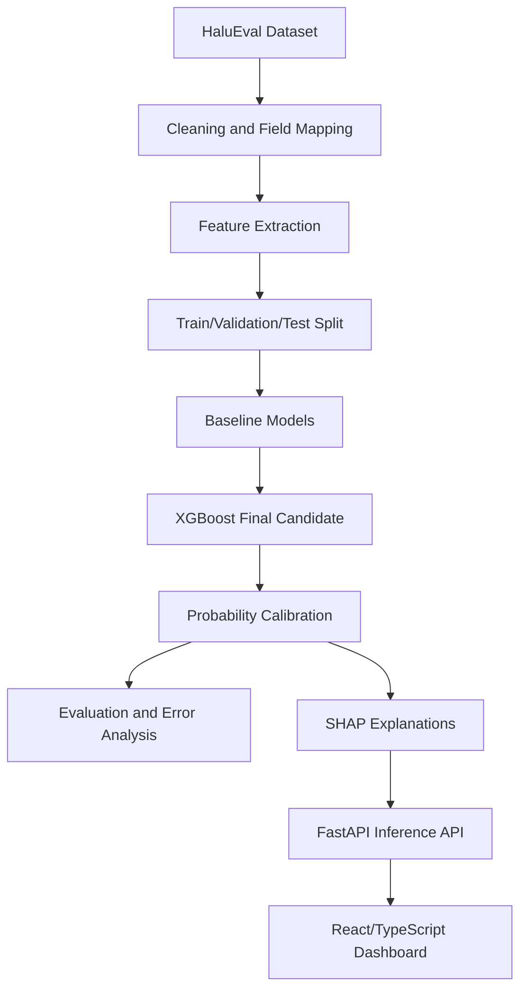
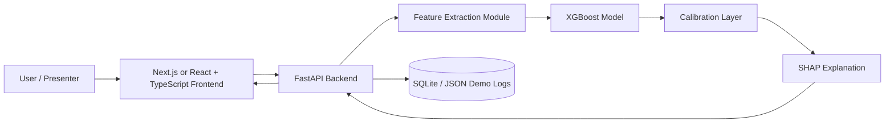
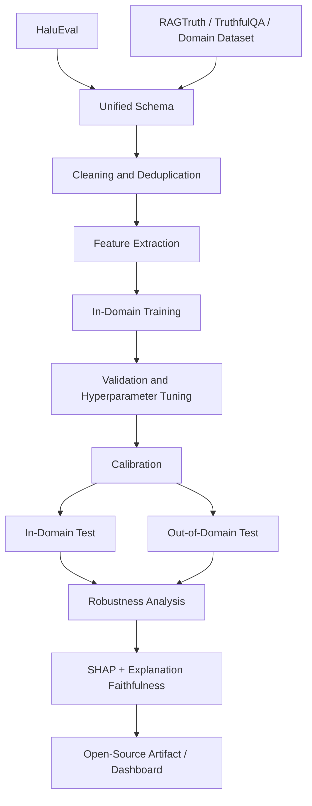
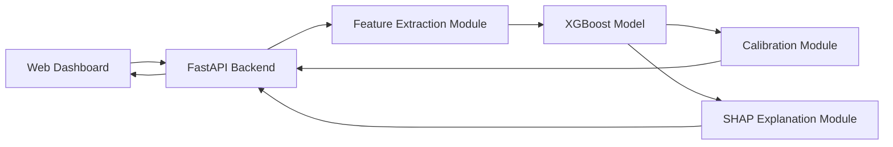

# HaluRISC Project Blueprint

## Two-Version Single Source of Truth

**Project theme:** Calibrated, explainable hallucination-risk prediction for black-box LLM outputs using lightweight machine learning, evidence-consistency features, and a presentation-quality web dashboard.

This document intentionally defines **two versions** of the same project:

1. **Version A — 2-Month ML Course Blueprint**  
   A realistic, high-quality undergraduate course project where the **paper is the main deliverable** and the web application supports the paper through demonstration and visualization.

2. **Version B — Extended Publication Blueprint**  
   A stronger post-course version intended for a decent Q2-level journal submission. This version extends the course project rather than replacing it.

The two versions must not be mixed during the course. The biggest risk is trying to implement the publication version in the course timeline.

> **Build a clean, defensible course project first. Then extend it into a stronger publication study.**

> **IMPLEMENTATION STATUS (updated 2026-08-05):** ✅ DONE | 🔶 PARTIAL | ⬜ TODO
>
> Version A is implemented end-to-end: dataset+audit (A7 ✅), all 7 feature groups incl. NLI (A8 ✅), ML pipeline with 5-fold CV/tuning/3 seeds (A9 ✅), evaluation incl. error analysis + LLM-judge comparison + latency (A10 ✅ — citing published HaluEval numbers is a paper step), API (A11 ✅), 4-page web app (A12 ✅), paper (A13 🔶 — full draft compiled in report/out/paper.pdf, 12 pages with real-data tables/figures; proofreading + final bibliography pass pending), reproducibility checklist (A18 ✅). Version B remains future work — do not implement during the course.

---

## Table of Contents

1. [Core Decision](#core-decision)
2. [Critical Evaluation of the Original Idea](#critical-evaluation-of-the-original-idea)
3. [Version A — 2-Month ML Course Blueprint](#version-a--2-month-ml-course-blueprint)
   - [A1. Course Objective](#a1-course-objective)
   - [A2. Course Research Question](#a2-course-research-question)
   - [A3. Course Contribution](#a3-course-contribution)
   - [A4. Idea Verification Scores for Course Version](#a4-idea-verification-scores-for-course-version)
   - [A5. Literature Positioning for Course Version](#a5-literature-positioning-for-course-version)
   - [A6. Course Research Gap](#a6-course-research-gap)
   - [A7. Dataset Plan](#a7-dataset-plan)
   - [A8. Feature Engineering Plan](#a8-feature-engineering-plan)
   - [A9. ML Pipeline](#a9-ml-pipeline)
   - [A10. Evaluation Strategy](#a10-evaluation-strategy)
   - [A11. Course System Architecture](#a11-course-system-architecture)
   - [A12. Web Application for Course Demo](#a12-web-application-for-course-demo)
   - [A13. Course Paper Blueprint](#a13-course-paper-blueprint)
   - [A14. 8-Week Roadmap](#a14-8-week-roadmap)
   - [A15. Course Risks and Mitigations](#a15-course-risks-and-mitigations)
   - [A16. What Must Not Be Included in the Course Version](#a16-what-must-not-be-included-in-the-course-version)
   - [A17. Course Final Verdict](#a17-course-final-verdict)
4. [Version B — Extended Q2 Journal Publication Blueprint](#version-b--extended-q2-journal-publication-blueprint)
   - [B1. Publication Objective](#b1-publication-objective)
   - [B2. Publication Research Question](#b2-publication-research-question)
   - [B3. Publication-Level Contribution](#b3-publication-level-contribution)
   - [B4. Idea Verification Scores for Publication Version](#b4-idea-verification-scores-for-publication-version)
   - [B5. Stronger Literature Positioning](#b5-stronger-literature-positioning)
   - [B6. Publication Research Gap](#b6-publication-research-gap)
   - [B7. Extended Dataset Plan](#b7-extended-dataset-plan)
   - [B8. Extended Feature Engineering](#b8-extended-feature-engineering)
   - [B9. Extended ML Pipeline](#b9-extended-ml-pipeline)
   - [B10. Publication Evaluation Strategy](#b10-publication-evaluation-strategy)
   - [B11. Publication System Architecture](#b11-publication-system-architecture)
   - [B12. Publication Paper Blueprint](#b12-publication-paper-blueprint)
   - [B13. Post-Course Roadmap](#b13-post-course-roadmap)
   - [B14. Publication Risks and Mitigations](#b14-publication-risks-and-mitigations)
   - [B15. Publication Final Verdict](#b15-publication-final-verdict)
5. [Name Evaluation](#name-evaluation)
6. [Verified Starter Reference List](#verified-starter-reference-list)
7. [Final Recommendation](#final-recommendation)

---

# Core Decision

## Recommended final project framing

The project should be framed as:

> **Calibrated explainable hallucination-risk prediction for black-box LLM outputs using lightweight evidence-consistency and linguistic features.**

Do **not** frame it as:

> “A system that detects whether any LLM answer is true from text alone.”

That claim is scientifically weak. Truth cannot always be inferred from style, length, or linguistic patterns. Hallucination detection becomes much more defensible when the model is given a **question**, an **answer**, and preferably some **reference context/evidence**.

## Recommended project name

Use **HaluRISC** (Hallucination Risk Scoring and Calibration) as the single name across the course project, code, demo, and publication. A single unified name is preferred because it communicates the core contribution (risk + calibration) in the acronym, is more distinctive, and has **no naming collision** with existing published work.

**Why not HaluLens.** An earlier draft used "HaluLens" for the course. This collides with the **HalluLens** benchmark (Bang et al., Meta FAIR, ACL 2025) — a different project that distinguishes intrinsic vs extrinsic hallucination — and risks Google Scholar / reviewer confusion. Standardizing on **HaluRISC** everywhere removes this risk from the start. (Note: HalluLens with the double "l" always refers to the external benchmark, never to this project.)

Recommended paper title for the course:

> **HaluRISC: Calibrated Explainable Hallucination Risk Prediction for Black-Box LLM Outputs**

Recommended publication title:

> **HaluRISC: Cross-Domain Calibrated and Explainable Hallucination Risk Estimation for Black-Box LLM Responses**

---

# Critical Evaluation of the Original Idea

The original idea is good for an undergraduate ML project, but it had several weaknesses:

| Issue                                                  | Why It Is a Problem                                                                                            | Better Direction                                                                                            |
| ------------------------------------------------------ | -------------------------------------------------------------------------------------------------------------- | ----------------------------------------------------------------------------------------------------------- |
| “Single-pass hallucination detection” is overclaimed   | A single answer may look fluent but still be false; surface text alone is insufficient for truth verification. | Use question + context/evidence + answer. Predict risk, not absolute truth.                                 |
| “Classical ML can match LLM judges” is not always true | Performance depends heavily on dataset artifacts. LLM judges may be stronger in semantic reasoning.            | Compare honestly against simple baselines and optionally one lightweight judge baseline.                    |
| SHAP is presented as novelty                           | SHAP itself is not new.                                                                                        | Novelty should be the integration of calibration, evidence-aware features, and deployable interpretability. |
| HaluEval-only results may not generalize               | Benchmark artifacts can inflate performance.                                                                   | Course version can use HaluEval; publication version must add external evaluation.                          |
| Too many ambitious claims                              | Reviewers penalize exaggerated novelty.                                                                        | Be critical, modest, and experimentally rigorous.                                                           |

The corrected idea remains valuable because it is practical, measurable, explainable, and feasible within two months.

## Venue-Level Novelty Reality Check

| Target                           | Is the contribution sufficient? | Critical Verdict                                                                 | How to improve without making it impossible                                             |
| -------------------------------- | ------------------------------- | -------------------------------------------------------------------------------- | --------------------------------------------------------------------------------------- |
| Undergraduate ML course          | Yes (Strong)                    | Strong if mandatory upgrades (NLI, 5-fold CV, 3 seeds, external baseline) done.  | Keep scope focused; add NLI features; parallel paper writing.                            |
| IEEE Access                      | Yes (Extended version)          | Good fit: comparative study + cross-domain + calibration. 70%+ probability.      | Add RAGTruth, multicalibration, explanation metrics, Docker artifact.                    |
| Multimedia Systems (Springer)    | Possible (after extension)      | Must differentiate from existing SHAP+LIME paper (2026) in same venue.           | Emphasize explanation reliability metrics (FAC, PSI), not just SHAP visualization.      |
| Expert Systems with Applications | Possible (after strong results)  | Needs strong applied framing + excellent cross-domain results. 45-55% probability. | Emphasize risk triage, explanation reliability, and real deployment constraints.        |
| ACL Findings                     | Borderline/weak                 | Needs stronger NLP contribution than engineered features + XGBoost.              | Add evidence-conditioned analysis, cross-domain transfer, and deeper error taxonomy.    |
| EMNLP Findings                   | Borderline/weak                 | Similar to ACL; benchmark-only applied system is likely insufficient.            | Add new benchmark insight, annotation analysis, or explanation-faithfulness study.      |

Do **not** claim that the course version is ready for ACL/EMNLP. The realistic target after extension is a decent applied Q2 journal, not a top NLP findings paper.

## Critical Overlaps with Published Work (Must Address)

Before implementation, acknowledge these directly competing papers that overlap with the proposed approach. These are NOT reasons to abandon the project — they are reasons to differentiate cleanly.

### Overlap 1: SHAP+LIME Hallucination Detection (Multimedia Systems, Springer, 2026)

**Paper:** "Quantifying Factual Divergence in Generative Models: SHAP-LIME Based Hallucination Score for LLMs" — *Multimedia Systems, Vol. 32, 2026.*  
**Overlap:** Token-level SHAP+LIME attribution + custom Hallucination Score tested on TruthfulQA/QAGS (GPT-3.5, LLaMA-2, Falcon-40B). F1=0.84, AUC=0.89.  
**Differentiation:** They use token-level SHAP on raw LLM outputs. HaluRISC uses feature-level SHAP on engineered evidence-consistency features — enabling semantically meaningful explanations, calibration analysis, and cross-domain evaluation. They only visualize SHAP; we test explanation reliability via feature-ablation correlation and perturbation stability.

### Overlap 2: Multi-Indicator Ensemble with XGBoost (IJERT Framework, April 2026)

**Paper:** A multi-indicator ensemble combining lexical overlap, entity coverage, semantic similarity, NLI contradiction, and numeric consistency with XGBoost.  
**Overlap:** Covers 5/6 of the proposed feature groups.  
**Differentiation:** HaluRISC adds (1) hedging/uncertainty features, (2) probability calibration analysis (Platt vs isotonic), (3) cross-domain evaluation, (4) SHAP-based explanation with reliability testing, and (5) a deployable web artifact. IJERT does not include any of these.

### Overlap 3: IEEE TAI Hybrid Framework (2026)

**Paper:** "A Hybrid Framework for Hallucination Detection in Large Language Models" — *IEEE Transactions on Artificial Intelligence*, pp. 1–13, 2026 (Yadav & Verma, IIT Kanpur). DOI: 10.1109/TAI.2026.3653354. Uses frozen BERT/RoBERTa/DeBERTa encoders + lightweight neural classifiers. Evaluated on PolyFEVER, FactCHD, HaluEval. Note: the paper's IEEE Xplore article number is 11346950 — this is NOT a DOI.  
**Differentiation:** HaluRISC uses **engineered interpretable features** (not frozen neural embeddings), enabling SHAP explanations at semantically meaningful feature levels. Neural embeddings are opaque; our features are explainable by design.

### How the project differentiates (compound contribution)

> While individual components — feature engineering, SHAP visualization, calibration, or cross-domain evaluation — have been explored in isolation, no published work combines all five into a single lightweight framework: (1) engineered evidence-consistency features, (2) calibrated risk estimation, (3) explanation reliability testing, (4) cross-domain evaluation, and (5) a reproducible deployable artifact.

Cite these papers in Related Work and explicitly differentiate. Do not claim to be the first to use SHAP for hallucination detection — that claim is now false.

---

# Version A — 2-Month ML Course Blueprint

## A1. Course Objective

Build a complete undergraduate ML project in approximately **8 weeks** that includes:

- journal-style term paper
- working web application
- live demo
- experimental results
- model comparison
- feature ablation
- SHAP-based explanation
- calibrated risk score

The course version must prioritize:

1. **paper quality**
2. **clear methodology**
3. **credible experiments**
4. **working demo**

The web app exists to demonstrate the paper. The project should not become a frontend-only showcase.

---

## A2. Course Research Question

> Can a lightweight black-box machine learning pipeline predict hallucination risk in LLM responses using evidence-consistency, lexical, entity, semantic, and uncertainty features while providing calibrated and interpretable explanations suitable for real-time use?

This question is strong enough for the course because it combines supervised ML, NLP feature extraction, evaluation metrics, calibration, explainability, and system deployment.

---

## A3. Course Contribution

The course project contributes:

1. A reproducible hallucination-risk prediction pipeline using engineered features.
2. A comparison of classical ML models: Logistic Regression, Random Forest, and XGBoost.
3. Probability calibration for more trustworthy risk scores.
4. SHAP-based feature explanations.
5. A React/TypeScript web dashboard for interactive demonstration.

### What is novel enough for the course?

The novelty is not inventing hallucination detection. The novelty is the **balanced system design**:

- black-box input setting
- lightweight ML
- calibrated probabilities
- interpretable feature contributions
- full web-based demonstration

For an undergraduate course, this is strong if executed cleanly.

---

## A4. Idea Verification Scores for Course Version

| Criterion              | Score / 10 | Course-Level Assessment                                                                                                         |
| ---------------------- | ---------: | ------------------------------------------------------------------------------------------------------------------------------- |
| Originality            |          7 | Fresh for undergraduate ML; combines feature engineering + calibration + SHAP + NLI + deployable artifact as a compound system. |
| Novelty                |          8 | Compound novelty: NLI-enhanced features + calibrated classical ML + explanation reliability + deployable demo in one pipeline.  |
| Practicality           |          9 | Highly practical; uses existing datasets and classical ML; 2-4 orders of magnitude cheaper than LLM-based detection.            |
| Engineering Complexity |          7 | Manageable with FastAPI + React (Vite)/TypeScript + NLI model.                                                                  |
| Research Complexity    |          8 | Strong with mandatory 5-fold CV, hyperparameter tuning, 3-seed reporting, statistical tests, and NLI features.                  |
| Publication Potential  |          5 | Course version alone not publishable; but significantly stronger foundation for extension.                                       |
| Implementation Risk    |          4 | Low-medium risk; NLI integration adds minor complexity but feature extraction is the primary risk.                               |
| Scalability            |          7 | Lightweight inference can scale; classical ML is inherently efficient on CPU.                                                   |
| Reproducibility        |          9 | Strong with pinned dependencies, saved splits, model artifacts, and explicit reproducibility checklist.                          |
| Educational Value      |          9 | Excellent: covers ML, NLP, NLI, XAI, calibration, API design, and frontend demo.                                                |

### Course success probability

**9/10** if scope is controlled and all mandatory upgrades (NLI features, 5-fold CV, 3 seeds, hyperparameter tuning, parallel paper writing) are implemented.

---

## A5. Literature Positioning for Course Version

### Closest existing work

The project is closest to:

1. **HaluEval benchmark studies** using labeled hallucinated and non-hallucinated examples.
2. **Black-box hallucination detection** using lexical, semantic, and entity-level features.
3. **Classical ML text classification** using Logistic Regression, Random Forest, XGBoost, and feature engineering.
4. **Explainable AI for tabular/text-derived features** using SHAP.

### Closest systems and open-source project categories

The course paper should mention that similar system-level ideas already exist in adjacent forms:

1. **RAG evaluation dashboards** — systems that score whether generated answers are supported by retrieved documents.
2. **LLM-as-a-judge evaluators** — prompt-based evaluators that ask another model to judge factuality or faithfulness.
3. **Fact-checking pipelines** — tools that decompose claims and verify them against search/retrieval results.
4. **Open-source evaluation frameworks** — libraries such as prompt/LLM evaluation toolkits that support hallucination or faithfulness metrics.
5. **Explainable ML dashboards** — generic SHAP/LIME dashboards for tabular ML models.

What they already solve:

- some provide factuality or faithfulness scores;
- some provide strong semantic evaluation;
- some provide generic explainability interfaces.

What they do **not** fully solve for this course project:

- a compact, undergraduate-feasible, reproducible pipeline;
- calibrated user-facing risk probabilities;
- a direct connection between engineered evidence-consistency features, SHAP explanations, and a live educational demo.

Therefore, the project contribution is meaningful for a course, but it must not claim to be the first hallucination detector or the first explainable evaluator.

### What prior work already solved

- hallucination datasets exist
- black-box feature extraction is known
- classical ML can perform reasonably on structured features
- SHAP can explain tree models

### What remains useful for this project

The course contribution is meaningful because it combines these components into a complete, reproducible educational system:

- model
- metrics
- calibration
- explanations
- frontend demo

### Literature honesty rule

The paper must not say:

> “No one has done black-box hallucination detection before.”

Instead say:

> “Prior work has explored hallucination detection, but this project focuses on a compact, course-feasible, calibrated and explainable risk-prediction pipeline with a deployable interface.”

---

## A6. Course Research Gap

### Weak gap to avoid

Avoid claiming:

> “Existing systems have no explainability.”

This is too broad and likely false.

### Stronger course gap

Use this:

> Many hallucination detection approaches are either computationally expensive, difficult to reproduce, dependent on model internals, or presented only as offline benchmark results. For an applied ML setting, there is value in a lightweight, reproducible, calibrated, and explainable black-box pipeline that can be demonstrated interactively.

This is realistic and defensible.

---

## A6.1 Course Feasibility, Blockers, and Simplification Rules

### Can the complete course version be finished in 2 months?

**Yes, but only if Version A is implemented exactly and Version B is postponed.**

### Easiest parts

- training classical ML models;
- building a simple FastAPI endpoint;
- building the React/TypeScript demo UI;
- generating standard plots such as confusion matrix, ROC, PR curve, and SHAP bar charts.

### Hardest parts

- cleaning and mapping dataset fields correctly;
- avoiding train/test leakage;
- making claims scientifically modest;
- writing a high-quality paper while also building the demo;
- interpreting errors honestly instead of only showing successful examples.

### Biggest blockers

| Blocker                  | Why It Matters                | Mitigation                                                          |
| ------------------------ | ----------------------------- | ------------------------------------------------------------------- |
| Dataset format confusion | Can waste the first 1–2 weeks | Start with one subset and inspect manually.                         |
| Weak feature performance | May make results unimpressive | Use robust overlap/entity/semantic features before exotic features. |
| SHAP integration delay   | Can block demo explanations   | Prepare fallback global feature importance chart.                   |
| Overbuilding frontend    | Can damage paper quality      | Build simple dashboard first; polish only after experiments.        |
| Overclaiming novelty     | Can weaken grading/review     | Use honest risk-prediction framing.                                 |

### Simplification rule

If the project falls behind schedule, remove in this order:

1. optional CatBoost;
2. optional secondary subset;
3. complex dashboard pages;
4. semantic embedding features if setup is slow;
5. advanced calibration metrics beyond Brier score and calibration curve.

Never remove:

1. baseline comparison;
2. final model evaluation;
3. paper methodology;
4. ablation table;
5. demo prediction page.

---

## A7. Dataset Plan — ✅ DONE

### Primary dataset

Use **HaluEval** as the primary dataset.

### Why HaluEval is best for the course

- large enough (35,000 samples across 4 task types)
- directly related to hallucination evaluation (EMNLP 2023)
- commonly referenced and well-known
- manageable within 2 months
- provides QA/dialogue/summarization/general examples

### Critical HaluEval Limitations (Must Disclose in Paper)

HaluEval is the best available dataset for the course, but it has known weaknesses that must be acknowledged:

1. **85% synthetic data.** 30K of 35K samples are ChatGPT-generated hallucinations via "sampling-then-filtering." These are engineered, not naturally occurring. Real-world hallucination patterns may differ systematically from synthetic ones.
2. **Self-reinforcement risk.** ChatGPT generates AND filters the hallucinated samples, creating a potential circular artifact — the benchmark may reward systems that recognize ChatGPT-specific hallucination patterns rather than general hallucination patterns.
3. **Binary classification oversimplification.** "Is this answer hallucinated? Yes/No" ignores graded severity, partial hallucination, and ambiguity. Real deployment needs risk scores, not binary flags — which is exactly what HaluRISC provides.
4. **Generated with early-2023 ChatGPT.** RLHF, model architectures, and hallucination patterns have evolved significantly since.
5. **No license file.** The GitHub repo lacks a LICENSE — a minor reproducibility concern.
6. **Conflates factuality with hallucination.** HalluLens (ACL 2025) notes the benchmark tests consistency with Wikipedia, not consistency with model training data — blurring the line between factually wrong and hallucinated.

**Required actions:**
- Manually inspect 50 random HaluEval samples (Week 1) to verify label quality before committing to the dataset.
- Add a dedicated "Dataset Limitations" subsection in the course paper discussing these issues.
- Do NOT claim the model generalizes to real-world LLM outputs based on HaluEval results alone. Frame results as "performance on HaluEval benchmark" not "general hallucination detection performance."

### Recommended subset for the course

Use only **one or two subsets**, not all possible tasks.

Recommended:

1. **QA subset** as primary
2. optional **dialogue or summarization subset** as secondary test

Do not try to build a universal detector across all domains in the course version.

### Dataset comparison

| Dataset     |                         Size | Advantages                                               | Disadvantages                                 | Licensing                                | Course Suitability                                   |
| ----------- | ---------------------------: | -------------------------------------------------------- | --------------------------------------------- | ---------------------------------------- | ---------------------------------------------------- |
| HaluEval    |                        Large | Directly relevant; benchmark-style; enough training data | May contain artifacts; may not generalize     | Verify original repo/license and cite    | Best primary choice                                  |
| TruthfulQA  |                        Small | Tests truthful answering; useful external reference      | Not ideal for supervised large-scale training | Public research dataset; verify license  | Optional discussion or extension                     |
| RAGTruth    | Medium/large depending split | Better for evidence-grounded hallucination               | More complex; may take longer to process      | Verify terms before redistribution       | Better for publication extension                     |
| Custom data |                     Flexible | Can match demo scenario                                  | Labeling cost and reliability issues          | Must document generation/labeling rights | Not recommended for course except tiny demo-only set |

### Licensing rule

Before implementation, verify dataset license, citation format, redistribution terms, and whether generated examples can be stored in the repository.

---

## A8. Feature Engineering Plan — ✅ DONE (7 groups, 26 features; NLI via cross-encoder/nli-deberta-v3-base)

The course version must use a compact feature set. Do not create dozens of poorly justified features.

### MVP/course feature groups

NLI-based features are now **mandatory for Version A** (not deferred to Version B). NLI entailment/contradiction is the single most important feature signal across all published feature importance analyses (IJERT, 2026; SelfCheckGPT, 2023; Cost-Effective, 2024).

| Feature Group       | Example Features                                                    | Why It Exists                                             | Cost     | Expected Importance | Phase      |
| ------------------- | ------------------------------------------------------------------- | --------------------------------------------------------- | -------- | ------------------- | ---------- |
| Length/style        | answer length, sentence count, avg sentence length                  | Captures stylistic differences and verbosity              | Very low | Medium              | MVP        |
| Lexical overlap     | answer-context overlap, answer-question overlap, Jaccard similarity | Measures grounding and source adherence                   | Low      | High                | MVP        |
| Entity overlap      | named entity count, entity novelty ratio                            | Unsupported entities often indicate hallucination         | Moderate | High                | MVP        |
| NLI consistency     | entailment/contradiction probability from lightweight NLI model     | Captures semantic contradiction between context and answer | Moderate | **Very High**       | **MVP**    |
| Numeric consistency | number count, number overlap, new numbers in answer                 | Fabricated numbers/dates are common hallucination signals | Low      | Medium-high         | Course     |
| Hedging             | maybe, might, likely, possibly, uncertain phrases                   | Captures uncertainty language                             | Very low | Medium              | Course     |
| Semantic similarity | embedding cosine similarity between context/question and answer     | Captures semantic drift beyond exact words                | Moderate | High                | Course     |

### NLI Feature Specification (Mandatory for Version A)

Use a lightweight NLI model to extract entailment/contradiction signals:

- **Primary:** `cross-encoder/nli-deberta-v3-base` (HuggingFace, ~500MB, ~50ms per pair) — state-of-the-art NLI accuracy.
- **Fallback (if too heavy):** `cross-encoder/nli-MiniLM2-L6` (<100MB, ~15ms per pair) — 90%+ of DeBERTa performance at 1/5 the size and latency.
- **Extract 3 features per direction (6 total):**
  1. `nli_context_entails_answer` — probability that context entails the answer
  2. `nli_context_contradicts_answer` — probability that context contradicts the answer
  3. `nli_context_neutral_answer` — probability of neutral relationship
  4-6. Same three in reverse: does the answer entail/contradict/neutral the context?
- **Fallback if NLI model download fails:** Omit NLI features but document as a limitation. NLI adds 0.5-1 day of implementation time.

### Recommended course feature set

Use approximately **15–30 total features**. This is enough for a good paper and easy to explain.

### Do not include in course version

- hidden-state features
- token log-probability features unless easily available
- multi-sampling consistency features
- expensive LLM judge features as part of the main model
- transformer fine-tuning

---

## A9. ML Pipeline — ✅ DONE (XGBoost + Platt final model, F1 0.9886 / AUROC 0.9980 on test)

### Course workflow



### Preprocessing

- normalize whitespace
- lowercase only for lexical features, not for NER
- tokenize text
- handle missing context (empty context → lexical overlap = 0, NLI = 0.33 [neutral])
- remove invalid samples (empty answer, corrupted text)
- keep label mapping documented
- **Check class balance before splitting.** If HaluEval QA is not ~50/50, document imbalance and use `scale_pos_weight` in XGBoost.
- **Feature scaling:** Apply `StandardScaler` for Logistic Regression (LR requires scaled features). Tree-based models (RF, XGBoost) use raw features.

### Split strategy

Recommended:

- train: 70%
- validation: 15%
- test: 15%

Use stratification by label. If official splits are available and clean, use official splits.
**Save split indices to disk** for exact reproducibility (not just fixed seed).

### Cross-validation

**Mandatory (not optional):**

- **5-fold stratified cross-validation** on the training set for hyperparameter selection and model comparison.
- **Final evaluation on locked test set**, used once at the end.
- This is standard practice and significantly strengthens the experimental section.

### Hyperparameter tuning (Mandatory)

For XGBoost, tune at minimum these 4-5 parameters via randomized search (30-50 iterations on training set via 5-fold CV):

- `max_depth`: [3, 4, 5, 6, 7]
- `learning_rate`: [0.01, 0.05, 0.1, 0.2]
- `n_estimators`: [100, 200, 300, 500]
- `subsample`: [0.7, 0.8, 0.9, 1.0]
- `scale_pos_weight`: auto-computed from class ratio if imbalanced

Report best parameters in paper appendix. This is ~30 minutes of compute time and dramatically improves experimental credibility.

### Random seed discipline (Mandatory)

**Run all experiments with 3 different random seeds** (e.g., 42, 123, 456) and report **mean ± standard deviation** for all metrics. Single-seed results are increasingly criticized even at undergraduate level.

### Models

Baseline models:

1. heuristic baseline
2. Logistic Regression
3. Random Forest

Final model:

4. XGBoost

Optional:

5. CatBoost if time permits

### Final recommendation

Use **XGBoost + Platt calibration** as the final course model unless validation results show otherwise.

### Explainability

Use **SHAP TreeExplainer** for XGBoost.

For the paper, include:

- global feature importance
- local explanation for 2–3 case studies

---

## A10. Evaluation Strategy — ✅ DONE (implementation: metrics, stats, calibration, ablations, RAGTruth zero-shot, 10 FP + 10 FN error analysis, LLM-as-judge comparison on 200 samples, latency/cost analysis; citing published HaluEval numbers happens in the paper, A13)

### Required metrics

Classification:

- Precision
- Recall
- F1-score
- AUROC
- PR-AUC
- MCC

Calibration:

- Brier score
- **Expected Calibration Error (ECE)** — now mandatory, not optional
- calibration curve
- reliability diagram

Efficiency:

- average inference latency (feature extraction + model prediction + SHAP)
- feature extraction time (per component: lexical, entity NER, NLI, semantic)
- model prediction time
- SHAP explanation time
- approximate inference cost per 1,000 predictions
- **Cost comparison:** Estimated GPT-3.5-turbo API cost for evaluating the same 1,000 samples via LLM-as-a-judge (for efficiency advocacy)
- model artifact size
- runtime memory usage during API inference

Statistical testing (Mandatory):

- **McNemar's test** for paired comparison between XGBoost and best baseline
- Bootstrap 95% confidence intervals (1,000 resamples) for AUROC and F1
- Paired t-test or Wilcoxon signed-rank across the 3 seeds

### Required comparisons

| Model                     | Purpose                                                  |
| ------------------------- | -------------------------------------------------------- |
| Heuristic baseline        | Shows minimum rule-based performance                     |
| Logistic Regression       | Simple interpretable ML baseline                         |
| Random Forest             | Classical non-linear baseline                            |
| XGBoost                   | Main candidate model                                     |
| XGBoost + calibration     | Final deployed model if calibration improves reliability |

### External baseline (Mandatory)

Compare against at least one external reference point so readers can calibrate whether the achieved performance is good:

- **SelfCheckGPT-NLI performance** on the same HaluEval QA subset. Use published numbers if available, or re-implement the NLI-based variant (requires multiple LLM generations — expensive, so run on a 200-sample test subset only).
- **Alternative:** Cite the best published HaluEval QA detection F1/AUROC from the benchmark leaderboard or recent papers (e.g., IEEE TAI 2026 hybrid framework, IJERT 2026, Luna/COLING 2025).
- This comparison takes ~2 hours and dramatically improves paper credibility. Without it, readers cannot tell if F1=0.78 is good or bad.

### Ablation studies

At minimum, remove feature groups one at a time:

1. no lexical overlap
2. no entity features
3. no hedging features
4. no semantic similarity

### Error analysis

Manually inspect at least 20 wrong predictions:

- 10 false positives
- 10 false negatives

Classify errors into categories:

- short answer ambiguity
- unsupported but semantically similar answer
- entity extraction failure
- context too weak
- label ambiguity

This will strengthen the paper significantly.

---

## A11. Course System Architecture — ✅ DONE (/predict, /explain, /judge, /health; model+features loaded at startup)

### Architecture diagram



### Frontend

- **Next.js (App Router) + TypeScript + assistant-ui** — uses Next.js API routes as a Backend-for-Frontend (BFF) layer to securely manage OpenAI API calls (GPT 5.6 Luna) and proxy ML requests to FastAPI (`/api/ml/*` → `http://127.0.0.1:8000`).
- **assistant-ui** (`@assistant-ui/react` + `@assistant-ui/react-ai-sdk`) for production streaming chat components and Generative UI (`defineToolkit` + `"use generative"`).
- **Tailwind CSS v4 + shadcn/ui** for styling and UI components.
- **Recharts + custom SVG** for interactive charts and the animated semicircular risk gauge.

### Backend

- FastAPI
- Pydantic request/response schema with **validation and meaningful error messages** for malformed input, missing fields, and excessively long text
- CORS enabled for frontend (allow all in dev, restrict in any production deployment)
- model loaded once at startup

### Storage

Course version can use local JSON logs or SQLite. Do not spend too much time on complex database architecture.

### API endpoints

#### `POST /predict`

Input:

```json
{
  "question": "Who discovered penicillin?",
  "context": "Penicillin was discovered by Alexander Fleming in 1928.",
  "answer": "Penicillin was discovered by Alexander Fleming.",
  "domain": "qa"
}
```

Output:

```json
{
  "risk_score": 0.18,
  "calibrated_probability": 0.21,
  "label": "low_risk",
  "thresholds": { "low": 0.3, "medium": 0.7, "high": 1.0 },
  "top_features": [
    { "feature": "entity_overlap_ratio", "value": 1.0, "impact": -0.22 },
    { "feature": "nli_entailment_prob", "value": 0.94, "impact": -0.18 }
  ],
  "latency_ms": 34,
  "model_version": "xgboost-v1.0",
  "feature_version": "course-v1.0",
  "warning": "Trained on HaluEval synthetic data. Results may not generalize to real-world LLM outputs."
}
```

#### `GET /health`

Returns backend status.

---

## A12. Web Application for Course Demo — ✅ DONE (Chat w/ generative UI, Analyze, Dashboard with real artifacts data, About)

### App purpose

The app should demonstrate the research idea, not merely output a prediction.

### Required pages (in priority order)

#### 1. Chat Mode (Must have — Show-Stopper Page 1)

- Powered by `assistant-ui` Thread component and GPT 5.6 Luna
- Natural language chat: users type questions or ask to analyze answers
- Generative UI: risk gauge and SHAP chart rendered directly inside chat messages
- Luna explains XGBoost predictions in plain English backed by real SHAP feature contributions

#### 2. Analyze Mode (Must have — Paper Demo Page 2)

- Question, context, answer input form
- Animated SVG semicircular risk gauge (low / medium / high)
- Calibrated probability readout + latency display
- SHAP top-5 feature contribution bar chart
- 4 sample example buttons for presentation testing

#### 3. Experiment Summary Page (Page 3)

- Model comparison table (Heuristic, LR, RF, XGBoost, GPT 5.6 Luna judge)
- Interactive calibration curves and reliability diagrams
- Confusion matrix heatmap and ROC/PR curves
- Feature group ablation summary table
- **LLM vs XGBoost cost & efficiency comparison card**

#### 4. About / Method Page (Page 4)

- Animated pipeline diagram
- Feature group reference cards
- Limitation notes and dataset information

### Demo scenario

During presentation:

1. Show a grounded answer with low risk.
2. Show a hallucinated answer with unsupported entity or wrong date.
3. Show a borderline answer and explain why calibration matters.
4. Open experiment dashboard and show that this is backed by evaluation, not just UI.

### Screenshots to include in paper

Maximum 2-3 screenshots. Screenshots should be small, clearly captioned, and directly referenced in the text:

1. input screen + low-risk result (combined)
2. high-risk result with SHAP explanation
3. experiment dashboard (optional)

Do NOT fill the paper with UI screenshots. The web application is a demonstration vehicle, not the primary contribution.

---

## A13. Course Paper Blueprint — 🔶 PARTIAL (full draft compiled: report/out/paper.pdf, 12 pages, all real-data tables/figures; proofreading + final bibliography pass pending)

### Recommended course paper title

**HaluRISC: A Calibrated and Explainable Machine Learning Framework for Hallucination Risk Prediction in Black-Box LLM Outputs**

### Abstract outline

Do not write the final abstract yet. Structure it as:

1. Problem: LLM hallucinations reduce trust.
2. Limitation: many detection methods are costly, opaque, or require model internals.
3. Method: lightweight features + classical ML + calibration + SHAP.
4. Experiment: evaluate on HaluEval with baselines and ablations.
5. System: deploy as FastAPI + React/TypeScript dashboard.
6. Result: report actual measured performance and latency.

### Keywords

Large language models, hallucination detection, hallucination risk, explainable AI, SHAP, XGBoost, calibration, black-box NLP, machine learning, trustworthy AI

### Paper sections

#### 1. Introduction

- motivation
- problem statement
- why black-box detection matters
- contributions

#### 2. Related Work

- hallucination detection
- black-box methods
- LLM-as-a-judge and multi-sampling methods
- explainable ML
- calibration

#### 3. Methodology

- task definition
- dataset
- preprocessing
- feature groups
- models
- calibration
- SHAP explanation

#### 4. Experiments

- dataset split
- metrics
- baselines
- model comparison
- ablations
- latency analysis

#### 5. Web Application

- architecture
- user flow
- screenshots
- demo scenario

#### 6. Results and Discussion

- performance interpretation
- feature importance (SHAP global)
- error analysis (false positives and false negatives with systematic taxonomy)
- **Limitations (mandatory subsection):**
  - HaluEval synthetic generation (85% ChatGPT-generated)
  - Binary label simplification
  - English-only evaluation
  - No multi-turn dialogue evaluation
  - Single-dataset training (HaluEval QA)
  - Potential label noise in synthetic data

#### 7. Conclusion and Future Work

- summary
- course contribution
- publication extension

#### 8. Reproducibility Statement (Mandatory)

- Link to GitHub repository
- Pinned `requirements.txt` with exact version numbers
- Saved train/val/test split indices
- Saved model artifact (`.pkl` or `.joblib`)
- README with exact reproduction steps
- Hardware/software environment specification

#### 9. Ethical Considerations (Strongly Recommended)

- Risk of over-reliance on automated hallucination detectors (false negatives create false trust)
- Potential bias in hallucination detection across domains/languages
- The system predicts risk, not truth — this distinction must be clear to users

### Paper priority rule

Because the course paper is more important, finish these before over-polishing UI:

1. dataset description
2. methodology diagram
3. model comparison table
4. ablation table
5. SHAP explanation figure
6. error analysis
7. final architecture diagram

---

## A14. 8-Week Roadmap (Revised)

**Critical rule: Paper writing is a parallel track every week, not a Week 8 sprint.** Each week has both implementation deliverables AND paper writing deliverables.

### Week 1 — Literature, Dataset Setup, and Manual Audit

Objectives:

- finalize problem framing
- download/prepare HaluEval (QA subset)
- **Manually inspect 50 random samples** to verify label quality
- write paper introduction skeleton

Implementation deliverables:

- dataset loading script
- 15-20 paper references collected
- manual audit notes (label quality, edge cases)

Paper deliverables:

- Introduction draft (1-2 pages)
- Related Work outline with key citations

Risks: dataset format confusion, poor label quality
Mitigation: start with QA subset only; inspect labels manually before Week 2

### Week 2 — Core Feature Extraction (Lexical, Hedging, Numeric, Length)

Objectives:

- implement length, lexical overlap, hedging regex, numeric consistency features
- generate feature CSV from QA subset
- set up NLI model (download and test `cross-encoder/nli-MiniLM2-L6`)

Implementation deliverables:

- `extract_features.py` (core features)
- feature table (12-15 features)
- feature documentation
- NLI model test script

Paper deliverables:

- Related Work full draft
- Methodology (dataset + feature groups) draft

Risks: spaCy/NER setup issues, NLI model download failures
Mitigation: use only regex/numeric/lexical features as fallback; use MiniLM NLI (smaller, faster)

### Week 3 — Advanced Features + Baselines

Objectives:

- implement entity NER features (spaCy), semantic similarity (Sentence-BERT `all-MiniLM-L6-v2`), NLI features (DeBERTa or MiniLM)
- train heuristic, Logistic Regression, Random Forest
- create first evaluation table

Implementation deliverables:

- complete feature extraction (20-30 features)
- baseline results table (heuristic, LR, RF)
- confusion matrices

Paper deliverables:

- Methodology section complete (all feature groups, preprocessing, split strategy)
- Dataset description section complete

Risks: weak baseline performance
Mitigation: inspect feature distributions before adding complexity

### Week 4 — XGBoost, Hyperparameter Tuning, Calibration, Ablation

Objectives:

- hyperparameter tuning on XGBoost (randomized search, 5-fold CV)
- run final XGBoost with best params on 3 seeds
- calibrate probabilities (Platt scaling)
- run feature group ablations (remove one group at a time)

Implementation deliverables:

- final XGBoost model with tuned parameters
- 3-seed results table (mean ± std)
- ablation table
- calibration curve + ECE + Brier score

Paper deliverables:

- Experiments section draft (setup, metrics, baselines)
- Results section draft (model comparison, ablation)

Risks: overfitting, calibration degradation
Mitigation: use validation set for calibration fit; check ECE

### Week 5 — SHAP, Error Analysis, and Experiments Finalization

Objectives:

- generate SHAP global summary + local case studies (3 cases)
- inspect 30 false positives and 30 false negatives
- run statistical tests (McNemar, bootstrap CI)
- finalize all experiments

Implementation deliverables:

- SHAP summary plot + 3 local explanation charts
- error taxonomy table (categories + counts)
- statistical test results
- efficiency/cost analysis table

Paper deliverables:

- Results + Discussion draft (feature importance, errors, limitations)
- Ablation analysis section
- Efficiency analysis section

Risks: SHAP interpretation confusion, statistical test setup
Mitigation: explain feature-level (not token-level) importance; use sklearn/scipy built-in tests

### Week 6 — Backend API

Objectives:

- build FastAPI server
- load model artifact + calibration layer + SHAP explainer
- return prediction + explanation JSON
- add error handling (Pydantic validation, timeouts)

Implementation deliverables:

- `/predict` endpoint (with model_version, warning field)
- `/health` endpoint
- API tests (mock and integration)

Paper deliverables:

- Web Application section draft (architecture, API spec)
- Reproducibility Statement draft

Risks: integration delays, SHAP in API
Mitigation: define exact JSON contract in Week 5

### Week 7 — Frontend Dashboard (2 Pages + Static Experiments)

Objectives:

- build React (Vite) + TypeScript UI
- **2 interactive pages only:** Analyze Page + Result Panel
- **Experiment Summary as static image gallery** (not interactive)
- connect API

Implementation deliverables:

- Analyze Page with sample examples
- Result Panel with risk gauge + SHAP chart
- Experiment Summary page (static images of model comparison, confusion matrix, ROC, calibration)

Paper deliverables:

- Conclusion + Future Work draft
- Ethical Considerations draft
- Paper proofreading pass

Risks: frontend polish consumes too much time
Mitigation: use simple clean layout; defer interactive charts on experiment page; use static PNG images

### Week 8 — Paper Finalization, Demo Rehearsal, and Buffer

Objectives:

- finalize paper (all sections complete, proofread, formatted)
- prepare presentation slides (10-12 slides max)
- rehearse live demo (3 scenarios from A12)
- record backup demo video

Implementation deliverables:

- final paper PDF
- final code repository (with README, requirements.txt, saved model)
- presentation slides
- demo video backup (screen recording)
- reproducibility package complete

Paper deliverables:

- Final paper
- Final bibliography (LaTeX/BibTeX verified)

Risks: last-minute bugs, demo failure
Mitigation: record backup demo video/screenshots; prioritize paper quality over live demo polish

---

## A15. Course Risks and Mitigations

| Risk Type      | Risk                                      | Impact | Mitigation                                                            |
| -------------- | ----------------------------------------- | ------ | --------------------------------------------------------------------- |
| Technical      | Feature extraction bugs                   | Medium | Unit test on small examples (assert expected feature values).         |
| Technical      | NLI model download/setup failure          | Medium | Pre-download MiniLM fallback; if both fail, omit NLI and document.    |
| Research       | Weak novelty                              | High   | Emphasize compound contribution (features + calibration + SHAP + demo + NLI). |
| Dataset        | HaluEval synthetic artifacts inflate perf | High   | Discuss honestly in Limitations; manually audit 50 samples first.     |
| Dataset        | HaluEval labels incorrect for 10%+ samples| Medium | Manual audit in Week 1; flag and exclude clearly mislabeled samples.  |
| Implementation | API/frontend delay                        | Medium | Build with mock JSON first; reduce to 2 pages if needed.              |
| Novelty        | Reviewers see "XGBoost + SHAP only"       | High   | Frame as compound system; differentiate from Multimedia Systems 2026 paper. |
| Novelty        | IJERT (2026) pre-covers feature combo     | Medium | Cite and differentiate via hedging features, calibration, and cross-domain. |
| Novelty        | Name collision with HalluLens (ACL 2025)  | Low    | Resolved: project standardized on **HaluRISC** (distinct from the HalluLens benchmark). |
| Presentation   | Demo failure                              | Medium | Record backup demo video/screenshots; rehearse 3+ times.              |

---

## A16. What Must Not Be Included in the Course Version

Do not include:

1. LLM training or fine-tuning.
2. Large transformer training.
3. Hidden-state probing.
4. Multi-sampling hallucination detection as the main method.
5. Multiple large external datasets (stick to HaluEval).
6. Human subject studies.
7. Production authentication/user management.
8. Complex database architecture.
9. Claims of universal truth detection.
10. Claims of state-of-the-art performance unless proven.
11. Claims of being the "first" to use SHAP for hallucination detection (the Multimedia Systems 2026 paper already did this).
12. Production SaaS features (e.g., payments, user authentication, multi-tenant databases) — focus strictly on the AI chat UI, risk prediction pipeline, and research paper deliverables.

---

## A17. Course Final Verdict

| Dimension                        | Score / 10 |
| -------------------------------- | ---------: |
| Course Success Probability       |          9 |
| Research Quality                 |        8.5 |
| Novelty for Undergraduate Course |          8 |
| Paper Quality Potential          |        8.5 |
| Demo Quality Potential           |          8 |
| Feasibility in 2 Months          |        8.5 |
| Overall Course Recommendation    |          9 |

### Course verdict

This is a strong and realistic ML course project if implemented as a **paper-first calibrated hallucination-risk prediction system** with a focused dataset, compact feature set (including mandatory NLI), clean experiments with 3-seed reporting and statistical tests, SHAP explanations with reliability analysis, and a polished but scope-controlled web demo. The compound contribution — engineered evidence-consistency features + NLI + calibration + SHAP + deployable demo — exceeds typical undergraduate course project expectations.

---

## A18. Mandatory Reproducibility Checklist — ✅ DONE (all items below verified)

Before considering the course project complete, verify all items:

```
[x] requirements.txt with exact version pins (no >= or ~=) — pinned 2026-08-05
[x] Saved model artifact (model_xgboost_calibrated.joblib — raw XGBoost + Platt bundle)
[x] Saved calibration layer (calibrator_platt.joblib)
[x] Saved SHAP explainer object (shap_explainer.joblib — saved by src/explain/shap_analysis.py; API loads it)
[x] Saved train/val/test split indices (split_indices.json + .npy)
[x] Feature extraction script with version pin (src/features/*, FEATURE_VERSION in API)
[x] All random seeds documented in a single config file (src/models/config.py — SEEDS = [42, 123, 456])
[x] README.md with exact reproduction steps (pnpm/Next 16 commands, real benchmark tables, hardware spec)
[x] Hardware/software specification — Python 3.12.13, Windows 11, RTX 3060 6GB (CUDA 12.8), pinned libs (requirements.txt, params.json)
[x] Saved figures in vector format (PDF + PNG) for paper inclusion
[x] Git repository with clean commit history and .gitignore
```

This checklist must be satisfied **before Week 8 presentation**. Reproducibility is a key grading criterion.

---

## B1. Publication Objective

Extend the course project into a stronger applied research study suitable for a decent Q2-level journal.

The publication version must move beyond “we trained XGBoost on HaluEval.” That alone is not enough.

The extended version should focus on:

- cross-domain robustness
- calibration under distribution shift
- evidence-conditioned hallucination risk
- explanation reliability
- reproducible deployment artifact

---

## B2. Publication Research Question

> How robustly can a calibrated, explainable black-box hallucination-risk model generalize across datasets and domains using evidence-consistency and linguistic features, and how reliable are its explanations under distribution shift?

This is stronger than the course question because it tests generalization and explanation reliability.

---

## B3. Publication-Level Contribution

The publication version should claim the following contributions:

1. A cross-domain black-box hallucination-risk framework using engineered evidence-aware features and NLI signals.
2. **Multicalibration** analysis (Platt, isotonic, and embedding-based cluster calibration) across in-domain and out-of-domain datasets, following the AWS Cost-Effective framework (Valentin et al., 2024).
3. Feature-group ablation, feature interaction testing (2-way and 3-way combinations), and **explanation faithfulness analysis** with quantitative metrics.
4. Comparison against classical baselines + at least one neural/semantic baseline (e.g., DeBERTa-NLI classifier, Luna/COLING 2025).
5. An open-source reproducible web-based artifact with Dockerized backend and automated experiment scripts.

### What makes this Q2-journal-worthy?

The publication strength comes from the **compound contribution**: rigorous cross-domain evaluation, multicalibration analysis, explanation faithfulness metrics, practical deployability, and honest limitations. The field has no published paper combining all five. Position as an **applied, reproducible, calibration-aware hallucination-risk framework** — not SOTA.

---

## B4. Idea Verification Scores for Publication Version

| Criterion                  | Score / 10 | Publication-Level Assessment                                                                                         |
| -------------------------- | ---------: | -------------------------------------------------------------------------------------------------------------------- |
| Originality                |          7 | Compound contribution is novel: calibrated classical ML + NLI + explanation reliability + cross-domain + deployable. |
| Novelty                    |          8 | Explanation reliability testing is genuinely novel. Cross-domain + calibration for classical ML is underexplored.    |
| Practicality               |          9 | Highly practical and deployable; 2-4 orders of magnitude cheaper than LLM-based methods.                             |
| Engineering Complexity     |          7 | More complex due to multiple datasets, explanation metrics, and reproducibility requirements.                        |
| Research Complexity        |          8 | Strong: robustness, multicalibration, explanation faithfulness, feature interaction analysis.                        |
| Publication Potential      |          8 | Realistic for Q2 applied venues (IEEE Access 70%+, Multimedia Systems 55%+).                                         |
| Implementation Risk        |          6 | Dataset alignment and cross-domain evaluation are non-trivial; explanation metrics need careful design.              |
| Scalability                |          8 | Lightweight inference remains scalable.                                                                              |
| Reproducibility            |          9 | Strong if Dockerized with automated scripts and exact version pins.                                                  |
| Educational/Research Value |          8 | Good applied research contribution with practical impact.                                                            |

---

## B5. Stronger Literature Positioning

### Closest paper categories

1. Hallucination benchmark papers such as HaluEval-style work.
2. RAG hallucination and factual consistency datasets such as RAGTruth-style work.
3. Truthfulness benchmarks such as TruthfulQA.
4. LLM-as-a-judge evaluation frameworks.
5. Uncertainty and calibration methods for neural/LLM outputs.
6. Explainable AI methods for trust and model debugging.

### What prior work already solved

- detection benchmarks
- judge-based evaluation
- black-box and white-box feature strategies
- uncertainty estimation approaches
- SHAP and LIME explanation techniques

### What remains unsolved enough for publication

1. Many approaches are not calibrated for user-facing probabilities.
2. Many results are benchmark-specific.
3. Explanation reliability is rarely tested, only visualized.
4. Lightweight methods are under-evaluated under domain shift.
5. Practical web artifacts often lack rigorous experimental backing.

### Publication positioning statement

The paper should position itself as an **applied, reproducible, calibration-aware hallucination-risk framework**, not as a theoretical breakthrough.

---

## B6. Publication Research Gap

Publication gap:

> Existing hallucination detection methods often trade off between cost, interpretability, and generalization. There is limited applied work evaluating whether lightweight black-box detectors can remain calibrated, explainable, and useful across multiple task domains and evidence settings.

Why this is stronger:

- includes generalization
- includes calibration
- includes explanation reliability
- fits a Q2 applied journal

---

## B7. Extended Dataset Plan

### Primary dataset

- HaluEval for in-domain training and primary benchmark.

### Secondary datasets (use at least two)

1. **RAGTruth (ACL 2024)** — **Mandatory primary external dataset.** 18K naturally generated RAG responses with word-level span annotations and hallucination type labels. Diverse LLM sources (GPT-3.5, GPT-4, Llama-2, Mistral). Much stronger than HaluEval for real-world generalization testing. ~1 week preprocessing.
2. **FaithBench (NAACL 2025)** — **Strong supplementary.** Human-annotated hallucinations from 10 modern LLMs. Focused on challenging cases where SOTA detectors disagree. Key finding: best detectors near 50% accuracy — significant room for improvement.
3. **HalluLens benchmark (ACL 2025)** — **Optional.** Clear intrinsic/extrinsic taxonomy with dynamic test generation to prevent data leakage. Useful for fine-grained hallucination type analysis.
4. **TruthfulQA** — **Downgraded.** 817 questions, partially saturated, measures factuality not hallucination. Use only as an optional discussion point, not as a primary external evaluation.

### Dataset comparison for publication

| Dataset     | Role                              | Advantage                                | Limitation                                     | Priority |
| ----------- | --------------------------------- | ---------------------------------------- | ---------------------------------------------- | -------- |
| HaluEval    | Training/in-domain test           | Large; well-known benchmark             | Synthetic (85%); binary; stale                 | Primary  |
| RAGTruth    | External evidence-grounded test   | Natural responses; word-level spans     | RAG-specific; more complex preprocessing       | **Mandatory** |
| FaithBench  | Challenging case stress test      | Modern LLMs; human-annotated; difficult | Small-ish dataset; detector-disagreement focus | Strong   |
| HalluLens   | Fine-grained taxonomy evaluation  | Dynamic generation; prevents leakage    | Newer; less established                        | Optional |
| TruthfulQA  | Discussion only                   | Standard benchmark                      | Saturated; small; measures factuality          | Optional |

### Recommended publication dataset setup

- **Train:** HaluEval QA subset.
- **Validate:** Held-out HaluEval validation split.
- **In-domain test:** HaluEval test split.
- **Primary external test:** RAGTruth (zero-shot or lightly adapted).
- **Stress test:** FaithBench (challenging cases, modern LLMs).
- **Optional discussion:** TruthfulQA, HalluLens.

---

## B8. Extended Feature Engineering

The publication version can extend the course features, but every new feature must be justified and ablated.

**Note: NLI features have been moved to Version A (mandatory).** The publication version builds on top of the already strong course feature set.

### Additional feature groups for publication

| Feature Group                  | Examples                                            | Purpose                                | Cost          | Publication Value |
| ------------------------------ | --------------------------------------------------- | -------------------------------------- | ------------- | ----------------- |
| Evidence graph structure       | Coverage, support density, connectivity, isolation  | Captures structural evidence patterns  | Moderate-high | Medium            |
| Domain indicators              | task/domain type, context length bucket             | Tests robustness by domain             | Low           | Medium            |
| Multicalibration bins          | embedding-based cluster membership                  | Enables per-cluster calibration        | Low           | High              |
| Explanation stability features | perturbation sensitivity (synonym/paraphrase input) | Tests explanation robustness           | Moderate      | High              |
| Feature interaction terms      | 2-way and 3-way feature group combinations          | Captures non-linear feature synergies  | Low           | Medium            |

**Caveat on evidence graph features (EGC, 2026):** Graph structural features show systematic reversal across model families — they work for Llama-2 but reverse for GPT-4/Mistral. Use cautiously and test on the specific LLM generating your answers.

### Multicalibration methodology (from Valentin et al., 2024)

Standard Platt/isotonic calibration fits a single calibrator. Multicalibration:
1. Cluster inputs by semantic embedding (use Sentence-BERT to embed context+question+answer).
2. Fit per-cluster calibrators.
3. Report per-cluster ECE and overall weighted ECE.

This significantly improves calibration under distribution shift and is a strong publication differentiator.

### Publication feature discipline

For every feature group, report:

- why it was added
- computational cost
- performance change
- calibration change
- explanation impact

If a feature does not help, remove it or discuss it as a negative result.

---

## B9. Extended ML Pipeline

### Extended workflow



### Models to compare

Minimum:

- Logistic Regression
- Random Forest
- XGBoost
- CatBoost

Publication-level optional baselines:

- small NLI-based classifier
- sentence-transformer + classifier
- affordable LLM-as-judge baseline on a subset

### Calibration methods

Compare:

- uncalibrated model
- Platt scaling
- isotonic regression

Report:

- Brier score
- calibration curve
- ECE
- reliability diagram

### Explanation reliability

Add tests such as:

- feature removal consistency
- perturb answer text slightly and observe explanation stability
- compare SHAP importance with ablation importance

This helps avoid the criticism that SHAP is only decorative.

---

## B10. Publication Evaluation Strategy

### Core evaluation blocks

1. In-domain classification performance.
2. Out-of-domain generalization (RAGTruth, FaithBench).
3. Calibration analysis (Platt, isotonic, multicalibration).
4. Ablation studies (single group removal + 2-way interactions).
5. **Explanation reliability** (quantitative metrics).
6. Latency and deployment cost.

### Explanation Reliability Metrics (Mandatory for Publication)

These quantitative metrics test whether SHAP explanations are trustworthy — addressing the criticism that SHAP is "only decorative":

1. **Feature Ablation Correlation (FAC):**
   - Rank features by SHAP importance.
   - Remove each feature one at a time, retrain model, measure performance drop.
   - Compute Spearman correlation between SHAP rank and actual impact rank.
   - High FAC (>0.7) = SHAP explanations are faithful to model behavior.

2. **Perturbation Stability Index (PSI):**
   - For 100 test samples, perturb answer text with synonyms and paraphrases.
   - Compute SHAP explanations for original and perturbed versions.
   - Measure Jaccard similarity of top-5 features before and after perturbation.
   - High PSI (>0.8) = explanations are stable under minor input changes.

3. **SHAP-Ablation Alignment:**
   - Compare SHAP global feature importance ranking with ablation study ranking.
   - Report rank correlation between the two orderings.

### Statistical testing (Mandatory for Publication)

- Bootstrap 95% confidence intervals (1,000 resamples) for all key metrics.
- McNemar's test for paired classifier comparison.
- Paired bootstrap test for comparing calibration methods.
- Report effect sizes (Cohen's d or similar) alongside p-values.

### Metrics

Classification:

- Precision
- Recall
- F1
- AUROC
- PR-AUC
- MCC

Calibration:

- Brier score
- ECE
- reliability diagrams

Efficiency:

- latency p50/p95
- memory footprint
- model size
- CPU inference time

Statistical testing:

- bootstrap confidence intervals
- paired significance tests where applicable

### Required publication figures

1. architecture diagram
2. dataset schema diagram
3. model comparison table
4. in-domain vs out-of-domain performance table
5. calibration curves
6. ablation chart
7. SHAP summary plot
8. explanation faithfulness/perturbation plot
9. latency/cost table

---

## B11. Publication System Architecture



The publication architecture is similar to the course version but with added rigor, not added complexity. Keep the monolith pattern — no microservices needed.

### Publication upgrades

- Dockerized backend (single Dockerfile, not docker-compose)
- versioned model artifacts (model registry is overkill; use Git LFS or explicit version tags)
- experiment tracking (MLflow optional; CSV logging is sufficient)
- reproducible scripts (single `run_all_experiments.py` with config file)
- public demo or recorded demo video
- README with exact reproduction steps (copy-paste runnable)
- **requirements.txt with hash-pinned dependencies** (e.g., `pip freeze --require-hashes`)

Do not overbuild a SaaS platform. The artifact should support the research paper, not become a product.

---

## B12. Publication Paper Blueprint

### Recommended publication title

**HaluRISC: Cross-Domain Calibrated and Explainable Hallucination Risk Estimation for Black-Box LLM Responses**

### Abstract outline

1. Problem: hallucination risk remains difficult to estimate reliably in black-box LLM systems.
2. Gap: existing methods are often expensive, non-calibrated, weakly explainable, or benchmark-specific.
3. Method: evidence-aware feature extraction, lightweight classifiers, calibration, and SHAP explanations.
4. Experiments: evaluate in-domain and out-of-domain datasets.
5. Analysis: calibration, ablation, explanation reliability, latency.
6. Conclusion: practical and reproducible risk-estimation framework.

### Full paper structure

#### 1. Introduction

- hallucination risk in deployed LLMs
- cost and limitations of existing detectors
- need for calibrated explainable black-box risk estimation
- contributions

#### 2. Related Work

- hallucination detection benchmarks
- black-box vs white-box methods
- LLM-as-a-judge
- RAG hallucination detection
- calibration and uncertainty
- explainable AI

#### 3. Problem Definition

- define hallucination risk
- define supported vs unsupported answer
- explain why risk prediction is more defensible than truth detection

#### 4. Method

- unified input schema
- feature extraction
- model training
- calibration
- explanation module

#### 5. Experimental Setup

- datasets
- preprocessing
- baselines
- metrics
- statistical testing

#### 6. Results

- in-domain performance
- out-of-domain performance
- calibration results
- efficiency results

#### 7. Ablation and Explanation Analysis

- feature group ablations
- SHAP analysis
- explanation stability

#### 8. System Artifact

- dashboard
- API
- reproducibility package

#### 9. Discussion

- practical value
- limitations
- failure cases

#### 10. Conclusion and Future Work

- summarize contributions
- future domain adaptation and human-in-the-loop extensions

---

## B13. Post-Course Roadmap

### Month 1 After Course — Dataset Expansion

Objectives:

- add one external dataset
- build unified schema
- run zero-shot transfer evaluation

Deliverables:

- external dataset results
- dataset comparison table

Risks:

- label mismatch

### Month 2 — Calibration and Robustness

Objectives:

- compare Platt vs isotonic calibration
- analyze in-domain vs out-of-domain reliability

Deliverables:

- calibration curves
- ECE/Brier results
- robustness section draft

Risks:

- calibration may degrade OOD

### Month 3 — Explanation Reliability

Objectives:

- run perturbation tests
- compare SHAP with ablation importance

Deliverables:

- explanation reliability plots
- XAI analysis section

Risks:

- SHAP explanations may not align cleanly with ablation

### Month 4 — Journal Manuscript and Artifact

Objectives:

- polish manuscript
- containerize code
- prepare GitHub repository

Deliverables:

- submission-ready paper
- reproducibility package
- demo video

Risks:

- manuscript may still need stronger baselines

---

## B14. Publication Risks and Mitigations

| Risk Type   | Risk                                        | Mitigation                                                                                 |
| ----------- | ------------------------------------------- | ------------------------------------------------------------------------------------------ |
| Technical   | Multiple datasets have incompatible formats | Build a unified schema early.                                                              |
| Research    | Contribution still appears incremental      | Emphasize calibration, cross-domain robustness, and explanation reliability.               |
| Dataset     | Label definitions differ across datasets    | Explicitly document mapping and perform sensitivity analysis.                              |
| Evaluation  | OOD performance drops sharply               | Report honestly; use it as motivation for calibration/domain adaptation.                   |
| Novelty     | Reviewers say SHAP + XGBoost is standard    | Make SHAP only one part; focus on calibrated evidence-aware risk under distribution shift. |
| Publication | Q2 venue asks for stronger experiments      | Add one stronger baseline and a reproducibility artifact.                                  |

---

## B15. Publication Final Verdict

| Dimension                          | Score / 10 |
| ---------------------------------- | ---------: |
| Q2 Publication Potential           |          8 |
| Research Quality                   |        8.5 |
| Novelty                            |          8 |
| Practical Value                    |          9 |
| Reproducibility Potential          |          9 |
| Implementation Difficulty          |          7 |
| Overall Publication Recommendation |          8 |

### Publication verdict

The project can become a strong Q2-level journal paper if the post-course version adds cross-domain evaluation (RAGTruth + FaithBench), multicalibration analysis, explanation faithfulness metrics (FAC, PSI), and a reproducible Dockerized artifact. The compound contribution — engineered features + NLI + calibrated classical ML + explanation reliability + cross-domain + deployable — has no complete published instance. Position as an **applied, reproducible, calibration-aware hallucination-risk framework**.

### Venue targeting (updated)

| Venue | Probability | Key Requirement |
|-------|-------------|-----------------|
| IEEE Access | **70-80%** | Standard comparative study + cross-domain + calibration bar |
| Multimedia Systems | **55-65%** | Must differentiate from existing SHAP+LIME paper (2026) by emphasizing explanation reliability |
| Expert Systems with Applications | **45-55%** | Needs strong applied framing and excellent results on RAGTruth + FaithBench |
| Applied Soft Computing | **50-60%** | Ensemble angle; needs soft computing framing |

---

# Name Evaluation

## Chosen name: HaluRISC

### Score

**8/10** (single unified name; no literature collision)

### Strengths

- memorable and short
- relevant to hallucination
- good for demo branding
- communicates the core contribution (**Risk** + **Calibration**) directly in the acronym — Hallucination Risk Scoring and Calibration
- **no naming collision** with existing published work, avoiding Google Scholar / reviewer confusion

### Weaknesses

- the "RISC" styling can be misread as the CPU architecture term; always expand it on first use (Hallucination Risk Scoring and Calibration)
- does not, by itself, signal evidence grounding — address this in the subtitle/abstract

## Alternative names (rejected in favor of HaluRISC)

1. **EvidenceLens**
2. **TrustLens**
3. **VeriLens**
4. **GroundScore**
5. **FactualityLens**
6. **TruthTrace**
7. **HalluGauge**
8. **CalibraFact**
9. **RiskLens AI**
10. **LLMTrustMap**
11. **FactShield**
12. **GroundedLens**

## Recommendation

- Use **HaluRISC** consistently across the course project, code, demo, and journal submission. A single name avoids the confusion of maintaining two brandings and eliminates the collision with the **HalluLens** benchmark (Bang et al., ACL 2025).
- Always expand the acronym on first use: *HaluRISC (Hallucination Risk Scoring and Calibration)*.
- **EvidenceLens** remains an acceptable fallback only if a venue objects to the acronym styling.

---

# Final Recommendation

## Verified Starter Reference List

Below is a **high-confidence starter bibliography** made of widely cited, published, or widely indexed papers that are directly relevant to this project. Use these as the first related-work backbone, then verify exact BibTeX formatting from ACL Anthology, NeurIPS, KDD, ICML, EMNLP, or Google Scholar before submission.

### Explainability and calibration foundations

1. **Ribeiro, Singh, and Guestrin (2016)** — _“Why Should I Trust You? Explaining the Predictions of Any Classifier”_ — KDD 2016.  
   Why it matters: classic LIME paper; useful for explainability positioning.

2. **Lundberg and Lee (2017)** — _“A Unified Approach to Interpreting Model Predictions”_ — NeurIPS 2017.  
   Why it matters: foundational SHAP reference.

3. **Guo et al. (2017)** — _“On Calibration of Modern Neural Networks”_ — ICML 2017.  
   Why it matters: calibration framing for trustworthy probability outputs.

4. **Reimers and Gurevych (2019)** — _“Sentence-BERT: Sentence Embeddings using Siamese BERT-Networks”_ — EMNLP-IJCNLP 2019.  
   Why it matters: strong justification for lightweight semantic similarity features.

### Core ML baselines

5. **Chen and Guestrin (2016)** — _“XGBoost: A Scalable Tree Boosting System”_ — KDD 2016.  
   Why it matters: your main tree-ensemble baseline.

6. **Prokhorenkova et al. (2018)** — _“CatBoost: unbiased boosting with categorical features”_ — NeurIPS 2018.  
   Why it matters: optional comparison baseline for tabular engineered features.

### Hallucination / factuality / verification

7. **Thorne et al. (2018)** — _“FEVER: a Large-scale Dataset for Fact Extraction and VERification”_ — NAACL 2018.  
   Why it matters: standard evidence-based fact verification benchmark.

8. **Lin et al. (2022)** — _“TruthfulQA: Measuring How Models Mimic Human Falsehoods”_.  
   Why it matters: widely used benchmark for truthfulness and false-answer stress testing.

9. **Manakul, Liusie, and Gales (2023)** — _“SelfCheckGPT: Zero-Resource Black-Box Hallucination Detection for Generative Large Language Models”_ — EMNLP 2023.  
   Why it matters: one of the closest black-box hallucination detection baselines.

10. **Min et al. (2023)** — _“FActScore: Fine-grained Atomic Evaluation of Factual Precision in Long Form Text Generation”_ — EMNLP 2023.  
    Why it matters: strong factuality evaluation reference for long-form generation.

11. **HaluEval benchmark paper (2023)** — _“HaluEval: A Large-Scale Hallucination Evaluation Benchmark for Large Language Models”_.  
    Why it matters: primary benchmark family for this project; verify the exact bibliographic entry from the official paper page or ACL/ArXiv record before finalizing the bibliography.

12. **RAGTruth benchmark paper (2024)** — _“RAGTruth: A Hallucination Benchmark for Retrieval-Augmented Generation”_ - ACL 2024.  
    Why it matters: primary external dataset for Version B. Word-level span annotations, natural responses from GPT-3.5, GPT-4, Llama-2, Mistral.


13. **Valentin et al. (2024)** - "Cost-Effective Hallucination Detection for LLMs" - arXiv:2407.21424 (AWS AI Labs).  
    Why it matters: calibration framework (Platt, isotonic, multicalibration, ECE). Directly relevant.

14. **Cheng et al. (2024)** - "Small Agent Can Also Rock! Empowering Small Language Models as Hallucination Detector" - EMNLP 2024.  
    Why it matters: small LLMs (7B) match GPT-4 for hallucination detection; cost/performance baseline.

15. **Belyi et al. (2025)** - "Luna: A Lightweight Evaluation Model to Catch LLM Hallucinations" - COLING 2025 Industry Track.  
    Why it matters: lightweight deployable detector; baseline for efficiency comparison.

16. **Bang et al. (2025)** - "HalluLens: LLM Hallucination Benchmark" - ACL 2025.  
    Why it matters: intrinsic/extrinsic taxonomy; critiques HaluEval. **Note: the "HalluLens" benchmark (double "l") is a distinct external work — not to be confused with this project, HaluRISC.**

17. **Sanchez et al. (2025)** - "FaithBench: A Challenging Hallucination Benchmark" - NAACL 2025.  
    Why it matters: human-annotated from 10 modern LLMs; strong stress test for Version B.

18. **Kang et al. (2025)** - "Uncertainty Quantification for Hallucination Detection in Large Language Models: Foundations, Methodology, and Future Directions" - arXiv:2510.12040 (Kang, Bakman, Yaldiz, Buyukates, Avestimehr; USC/Birmingham), submitted 14 Oct 2025.  
    Why it matters: comprehensive UQ survey covering calibration and epistemic/aleatoric uncertainty.

19. **Deng et al. (2026)** - "Beyond In-Domain Detection: SpikeScore for Cross-Domain Hallucination Detection" - ICLR 2026 (Deng, Fang, Li, Chen; UTS + UW-Madison). arXiv:2601.19245.  
    Why it matters: first major cross-domain hallucination detection paper at a top venue.

20. **Haq et al. (2026)** - "Quantifying Factual Divergence in Generative Models: SHAP-LIME Based Hallucination Score for LLMs" - Multimedia Systems, Springer, Vol. 32, Art. 146 (2026). DOI: 10.1007/s00530-025-02150-4. Authors: Ijazul Haq, Muhammad Saqib, Yingjie Zhang, Irfan Ali Khan.  
    Why it matters: **direct competitor.** Token-level SHAP+LIME for hallucination detection. **Must cite and differentiate.**

21. **Sundaragiri et al. (2026)** - "Framework for Hallucination Detection in Large Language Models" - IJERT Vol. 15, Issue 04, April 2026, Paper ID: IJERTV15IS043963. DOI: 10.5281/zenodo.20025987. Authors: Dheeraj Sundaragiri, Lenkala Manohar Reddy, Pitla Gunavardhan, Bandaru Navahith. Multi-signal framework (retrieval grounding, fact atomization, NLI verification) + XGBoost on HaluEval (1,000 samples).  
    Why it matters: most similar feature combination. **Must cite and differentiate.**

22. **Yadav and Verma (2026)** - "A Hybrid Framework for Hallucination Detection in Large Language Models" - IEEE Transactions on Artificial Intelligence, pp. 1–13, 2026. DOI: 10.1109/TAI.2026.3653354. (IEEE Xplore article number 11346950 is NOT a DOI.)  
    Why it matters: validates decoupled encoder-classifier on HaluEval; demonstrates venue viability.


### How to use this list in the paper

- Use items **1–6** for methodology, explainability, calibration, and baseline justification.
- Use items **7–12** for literature review, benchmark positioning, and course-to-publication transition.
- Use items **13–22** for Related Work positioning, differentiation, and venue targeting.
- **Items 20, 21, and 22 are MUST-CITE papers** that directly overlap with the approach. Cite early in Related Work and explicitly differentiate in the text.
- For the final manuscript, keep only the references that you actually cite.

## What to do now

For the course, implement **Version A only**.

Do not attempt Version B during the course. Instead, design the codebase so Version B can be added later.

## Final course plan summary

The course version should deliver:

1. ✅ HaluEval-based experiment (with manual label audit and documented limitations).
2. ✅ Compact engineered feature set (including mandatory NLI features).
3. ✅ Heuristic baseline, Logistic Regression, Random Forest, and XGBoost comparison.
4. ✅ 5-fold cross-validation + hyperparameter tuning + 3-seed reporting.
5. ✅ XGBoost + Platt calibration final model.
6. ✅ SHAP explanations + error analysis (10 FP + 10 FN taxonomy, auto-tagged for review).
7. ✅ External baseline comparison — RAGTruth zero-shot + LLM-as-judge (200 samples) done; citing published HaluEval numbers is a paper step.
8. ✅ Statistical significance testing (McNemar, bootstrap CI, Wilcoxon).
9. ✅ React (Next.js)/TypeScript dashboard (chat + analyze + experiment gallery + about).
10. 🔶 Journal-style paper — full draft compiled in report/out/paper.pdf (12 pages, all real-data tables/figures); proofreading + final bibliography pass pending.

## Final publication plan summary

The publication version should add:

1. External dataset testing (RAGTruth mandatory, FaithBench strong, HalluLens optional).
2. Cross-domain robustness analysis.
3. Multicalibration (Platt + isotonic + embedding-based cluster calibration).
4. Explanation reliability metrics (FAC, PSI, SHAP-ablation alignment).
5. Neural/semantic baseline comparison (DeBERTa-NLI or Luna/COLING 2025).
6. Feature interaction analysis (2-way and 3-way combinations).
7. Reproducible Dockerized artifact with experiment scripts.
8. Systematic error taxonomy (100+ samples, quantitative breakdown).

## Overall scores

| Version                              | Course Success | Research Quality | Novelty | Demo Quality | Publication Potential | Overall |
| ------------------------------------ | -------------: | ---------------: | ------: | -----------: | --------------------: | ------: |
| Version A — 2-Month Course           |              9 |              8.5 |       8 |            8 |                     5 |       9 |
| Version B — Q2 Publication Extension |            7.5 |              8.5 |       8 |            8 |                     8 |       8 |

## Final verdict

Yes, this project should be pursued. The correct approach is to treat the course version as a **paper-first applied ML project** with a working demo, and treat the publication version as a later extension focused on cross-domain robustness, calibration, and explanation reliability.

The compound contribution — engineered evidence-consistency features + NLI + calibrated classical ML + explanation reliability + cross-domain evaluation + deployable artifact — is a legitimate research gap. Version A (course) is achievable with disciplined scope control. Version B (publication) is a realistic Q2 target (IEEE Access 70%+, Multimedia Systems 55%+) if all mandatory upgrades are implemented and differentiation from the Multimedia Systems 2026 SHAP+LIME paper is clearly articulated.
