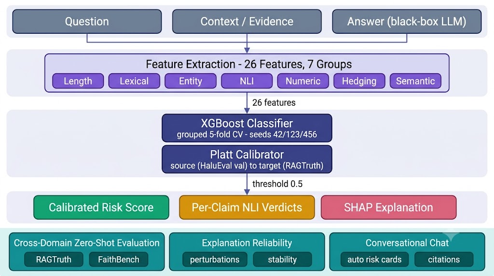
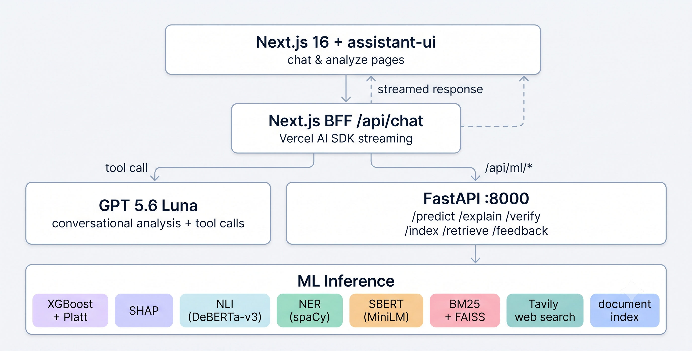

# HaluRISC — Project and Methods

This document explains **what HaluRISC is, why it exists, and exactly how it was
built**: datasets, features, models, training protocol, and the deployed system.
It is written for team members preparing a paper defense or onboarding onto the
codebase. Every number traces to a file under `artifacts/`, and the normative
research design lives in [`../blueprint.md`](../blueprint.md).

## Contents

- [1. Project Overview](#1-project-overview)
  - [1.1 What HaluRISC Is](#11-what-halurisc-is)
  - [1.2 Problem and Motivation](#12-problem-and-motivation)
  - [1.3 Research Gap and Positioning](#13-research-gap-and-positioning)
  - [1.4 Contributions](#14-contributions)
  - [1.5 Headline Results](#15-headline-results)
  - [1.6 How to Read This Repository](#16-how-to-read-this-repository)
  - [1.7 Scope Limits and What We Do Not Claim](#17-scope-limits-and-what-we-do-not-claim)
- [2. Datasets](#2-datasets)
  - [2.1 HaluEval QA](#21-halueval-qa)
  - [2.2 RAGTruth (Official)](#22-ragtruth-official)
  - [2.3 FaithBench](#23-faithbench)
  - [2.4 Unified Schema, Registry, and License Manifest](#24-unified-schema-registry-and-license-manifest)
  - [2.5 Splits and Leakage Control](#25-splits-and-leakage-control)
  - [2.6 Dataset Limitations](#26-dataset-limitations)
  - [2.7 Download and Verify Commands](#27-download-and-verify-commands)
- [3. Features](#3-features)
  - [3.1 Design Principles](#31-design-principles)
  - [3.2 The 26 Features in Seven Groups](#32-the-26-features-in-seven-groups)
  - [3.3 NLI Specification](#33-nli-specification)
  - [3.4 Entity, Numeric, Hedging, and Semantic Details](#34-entity-numeric-hedging-and-semantic-details)
  - [3.5 Preprocessing Rules](#35-preprocessing-rules)
  - [3.6 Extraction Pipeline](#36-extraction-pipeline)
  - [3.7 Per-Group Evidence](#37-per-group-evidence)
  - [3.8 Adding a Feature](#38-adding-a-feature)
- [4. Models and Training](#4-models-and-training)
  - [4.1 Task Definition and Output Contract](#41-task-definition-and-output-contract)
  - [4.2 Baselines and Controls](#42-baselines-and-controls)
  - [4.3 XGBoost and Hyperparameter Tuning](#43-xgboost-and-hyperparameter-tuning)
  - [4.4 Protocol Discipline](#44-protocol-discipline)
  - [4.5 Calibration Protocol](#45-calibration-protocol)
  - [4.6 Artifacts Produced](#46-artifacts-produced)
  - [4.7 Reproduce Commands](#47-reproduce-commands)
  - [4.8 Design Rationale (Defense Notes)](#48-design-rationale-defense-notes)
- [5. System and API](#5-system-and-api)
  - [5.1 Architecture](#51-architecture)
  - [5.2 Endpoints and Contracts](#52-endpoints-and-contracts)
  - [5.3 Display Score Logic](#53-display-score-logic)
  - [5.4 Claim Verification Tiers 1–4](#54-claim-verification-tiers-14)
  - [5.5 UI Routes](#55-ui-routes)
  - [5.6 Running Locally and Environment Keys](#56-running-locally-and-environment-keys)
  - [5.7 Performance, Limits, and Safety](#57-performance-limits-and-safety)

---

## 1. Project Overview

### 1.1 What HaluRISC Is

**HaluRISC** expands to **Hallucination Risk Scoring and Calibration**. It is a
lightweight, black-box machine learning framework that predicts the **risk**
that an LLM answer is hallucinated, given the question, an optional reference
context, and the candidate answer.

The framing rule is deliberate: HaluRISC predicts **risk, not truth**. It flags
answers that are unsupported by, or contradictory to, the available evidence.
It never inspects the generating model, never needs its weights or logits, and
runs in tens of milliseconds on a CPU.

Pipeline in one sentence: 26 engineered evidence-consistency features (seven
groups) feed a tuned XGBoost classifier; the probability is calibrated; SHAP
explains each verdict; a FastAPI backend and a Next.js dashboard deploy the
whole thing; and the chat layer adds per-claim evidence verification.

### 1.2 Problem and Motivation

LLMs are embedded in products where a confidently wrong answer has a real cost,
and hallucinations are fluent by construction, so surface reading does not
catch them. The three dominant detection families each carry a cost:

| Family | Example | Strength | Weakness |
|---|---|---|---|
| LLM-as-judge / self-consistency | SelfCheckGPT, Luna | No training needed; strong semantics | Slow (a forward pass per check), costs money, verdicts are not interpretable |
| Neural classifiers over frozen encoders | IEEE TAI 2026 hybrid framework | High accuracy | Needs model weights and GPUs; embeddings are opaque |
| Hand-crafted features + classical ML | IJERT 2026 multi-signal framework | Cheap, interpretable, CPU-friendly | Rarely calibrated, rarely tested across domains, explanations rarely validated |

HaluRISC sits in the third family and closes its usual gaps: calibration,
cross-domain evaluation, and measured explanation reliability, packaged as a
reproducible artifact.

### 1.3 Research Gap and Positioning

**The gap.** Many detectors are expensive, opaque, dependent on model internals,
or reported only as offline benchmark numbers. There is limited applied work
testing whether a lightweight black-box detector stays **calibrated, explainable,
and useful across domains**. Individual components (feature engineering, SHAP,
calibration, cross-domain testing) exist in isolation; no published work combines
all of them into one lightweight framework with a deployable artifact.

**Must-cite overlapping work and how HaluRISC differs:**

| Work | Overlap | Differentiation |
|---|---|---|
| Haq et al., Multimedia Systems 32(2), 2026, DOI 10.1007/s00530-025-02150-4 | Token-level SHAP+LIME hallucination score | HaluRISC explains **feature-level evidence signals**, adds calibrated risk, cross-domain evaluation, and measured explanation reliability |
| Sundaragiri et al., IJERT 15(04), 2026, DOI 10.5281/zenodo.20025987 | Lexical/entity/semantic/NLI/numeric features + XGBoost on HaluEval | HaluRISC adds hedging features, calibration analysis, cross-domain transfer, explanation reliability, and a deployable system |
| Yadav & Verma, IEEE TAI, 2026, DOI 10.1109/TAI.2026.3653354 | Encoder-based hybrid classifier | HaluRISC uses engineered interpretable features, not frozen embeddings, so explanations are semantically meaningful |
| Deng et al., SpikeScore, ICLR 2026 | Cross-domain hallucination detection | HaluRISC quantifies the transfer gap on RAGTruth and FaithBench and isolates the answer-length confound behind it |

### 1.4 Contributions

The contribution is compound, not any single component:

1. A reproducible black-box pipeline with **26 engineered evidence-consistency
   features** in seven groups, including bidirectional NLI entailment and
   contradiction signals.
2. A rigorous comparison of **nine baselines and controls** (majority, heuristic,
   three TF-IDF variants, NLI-only, logistic regression, random forest, XGBoost)
   under grouped 5-fold CV and a **three-seed protocol** (42/123/456).
3. **Calibration analysis** (raw vs Platt vs isotonic; source domain and target
   recalibration; subgroup diagnostics) with calibrators fitted strictly on
   validation or designated calibration data.
4. **Explanation reliability measured, not visualized**: SHAP-vs-permutation
   agreement, bootstrap stability, neutralization, controlled perturbations, and
   a structured expert audit of an error-enriched sheet.
5. A **deployed, reproducible artifact**: FastAPI inference service, per-claim
   evidence verification, Next.js/assistant-ui dashboard, frozen manifest, and a
   CPU-compatible Dockerfile.

### 1.5 Headline Results

| Result | Value | Artifact |
|---|---|---|
| In-domain (HaluEval QA test, n = 3,000) | F1 **0.9846**, AUROC **0.9979**, MCC 0.9697, ECE **0.0045** (standard B2 model) | `b2/b2_model_comparison.csv`, `b4/b4_calibration_metrics.csv` |
| Deployed model (EC-XGB, B9) | F1 **0.9855**, AUROC **0.9984**, MCC 0.9715 on HaluEval QA; RAGTruth all-task flag rate **99.9% → 61.3%**, AUROC 0.475 → 0.582, ECE 0.635 → 0.278 | `b6/b6_model_comparison.csv`, `b6/b6_external_metrics.csv` |
| Deployed display score (EC-XGB, B9) | Platt calibrator on RAGTruth QA: ECE **0.726 → 0.126**; atomic conjunction-aware claim splitting | `b6/b6_calibration.json`, `src/claims/decompose.py` |
| Source-domain calibration | Raw already calibrated; Platt 0.0091 and isotonic 0.0070 do **not** improve it | `b4/b4_calibration_metrics.csv` |
| Target recalibration (RAGTruth QA) | ECE **0.8185 → 0.1335** (Platt) / 0.1316 (isotonic) | `b4/b4_target_calibration.json` |
| Zero-shot transfer | RAGTruth QA F1 0.302; RAGTruth all 0.603; FaithBench 0.813 (recall 1.0 everywhere) | `b3/b3_dataset_metrics.csv` |
| Ablation | Lexical −0.0247 F1; entity/numeric/hedging neutral; semantic +0.0014 | `ablation_results.csv` |
| Explanation reliability | Kendall τ 0.66 vs permutation; bootstrap Jaccard 1.0 | `b5/b5_feature_importance.json`, `b5/b5_stability_bootstrap.json` |
| Expert audit (B5.5) | 26 error-enriched cases, 23/26 agreement (88%), AI-assisted | `b5/b5_review_cases_reviewed.csv` |
| Length confound | Hallucinated share 2.1% (1 word) → 99.2% (17+ words); 67% of FPs in 5–8 words | `b5/b5_length_error_analysis.csv` |
| Efficiency | 61.8 ms p50 per analysis; ~$0.001 per 1,000 predictions | `latency_analysis.json` |
| LLM judge comparison | XGBoost F1 0.985 vs GPT 5.6 Luna 0.841, at ~100x lower cost | `llm_judge_results.json` |
| Tests | 206 pytest tests pass | `tests/` |

### 1.6 How to Read This Repository

| Document | What it covers |
|---|---|
| [`../blueprint.md`](../blueprint.md) | The single source of truth: design, claims, verified results, risks |
| [`../roadmap.md`](../roadmap.md) | Implementation record: what was built, phase by phase |
| [`01-project-and-methods.md`](01-project-and-methods.md) | This file: datasets, features, models, system |
| [`02-experiments-and-results.md`](02-experiments-and-results.md) | Every experiment, every number, artifact traceability |
| [`03-reproduction-and-defense.md`](03-reproduction-and-defense.md) | Rebuild/verify, demo script, defense Q&A, glossary |
| [`b5-explanation-reliability.md`](b5-explanation-reliability.md) | Deep guide: explanation-reliability experiments + audit procedure |
| [`b6-reproducibility.md`](b6-reproducibility.md) | Deep guide: run-all orchestrator, manifest, Docker |
| [`b7-research-ui.md`](b7-research-ui.md) | Deep guide: web routes, dashboard tabs, API contract |
| `../docs/manifest.frozen.json` | Frozen artifact hashes, seeds, hardware, environment |

**Reading paths:** for a defense, read 01 → 02 → 03. For reproduction, read 03
first. For deep dives, follow the b5/b6/b7 guides.

### 1.7 Scope Limits and What We Do Not Claim

- We predict **risk**, not truth, and we never present the score as a fact-check.
- We do **not** claim state-of-the-art performance, guaranteed journal
  acceptance, or that SHAP was first used for hallucination detection (the
  Multimedia Systems 2026 paper did that first).
- The model is **English-only** and trained on a single dataset.
- HaluEval labels are **binary**, so graded severity and partially supported
  answers are out of scope.
- The B5.5 audit was **AI-assisted** (two passes, `review_mode = ai-expert`), not
  a two-human study, and its sheet deliberately oversamples errors.
- Results on HaluEval are benchmark results, **not** evidence of general
  real-world hallucination detection. The RAGTruth transfer numbers show exactly
  why that distinction matters.

---

## 2. Datasets

Three corpora are used: **HaluEval QA** (training and in-domain testing),
**RAGTruth** (primary external transfer and target recalibration), and
**FaithBench** (summarization stress test). No dataset comes from Kaggle or an
unverified mirror; every download is scripted and pinned.

### 2.1 HaluEval QA

| Property | Value |
|---|---|
| Source | `https://github.com/RUCAIBox/HaluEval`, file `data/qa_data.json` |
| License | MIT |
| Pinned revision | commit `b7253db3cdaa0ab2c382f92b26b390109174f77e` |
| File hash | `qa_data.json` SHA-256 `89ed139ec5e3...`, 6,164,420 bytes |
| Size | 10,000 questions × 2 answer variants = **20,000 rows** |
| Label mapping | correct answer → 0, hallucinated answer → 1 (perfectly balanced) |
| Split | 70/15/15 grouped by `item_idx`: 14,000 / 3,000 / 3,000 |
| Provenance file | `data/raw/halueval/revision.json` |

Every question carries a knowledge passage, one correct answer, and one
hallucinated answer. Because both variants of a question share the same context,
the split is performed at the **question-group level** so the two rows never
land in different partitions.

### 2.2 RAGTruth (Official)

| Property | Value |
|---|---|
| Source | `https://github.com/ParticleMedia/RAGTruth` (official, not the HF mirror) |
| License | MIT |
| Pinned revision | commit `c103204b9ce28d6bbad859304bf30de72b8ed8fe` |
| Files | `response.jsonl` (21,458,735 bytes), `source_info.jsonl` (15,117,971 bytes), both SHA-256 verified |
| Size | **17,790 rows in 2,965 `source_id` groups** |
| QA slice | 5,934 rows / 989 groups; recalibration set 5,034 rows / 839 groups; held-out test 900 rows / 150 groups (no overlapping groups) |
| Label mapping | any human-annotated hallucination span → 1, no spans → 0 |
| Provenance file | `data/raw/ragtruth_official/revision.json` |

RAGTruth contains naturally generated responses with human word-level span
annotations across three tasks (QA, summarization, data-to-text) and multiple
generator models. It is the external bar: zero-shot transfer is measured first,
then a separate, explicitly labelled target-recalibration experiment.

### 2.3 FaithBench

| Property | Value |
|---|---|
| Source | `https://github.com/vectara/FaithBench` |
| License | **CC BY-NC-SA 4.0** (non-commercial share-alike) |
| Pinned revision | commit `cf89797d82812c23b5d5e5c121f1d9b8983bbbce` |
| Files | `batch_1.json` … `batch_16.json` (no batch 13), each SHA-256 verified |
| Size | **750 rows / 750 groups** |
| Label mapping | worst-severity aggregation: Benign/empty → 0; Questionable/Unwanted → 1 |
| Provenance file | `data/raw/faithbench/revision.json` |

FaithBench is a stress test built from modern LLM summaries. Because the license
forbids redistribution, raw files are never committed: the repository ships only
the downloader, revision, hashes, and citations. A pre-registered label-mapping
sensitivity check is included in the B3 results.

### 2.4 Unified Schema, Registry, and License Manifest

The B1 layer (`src/data/prepare_unified.py`) converts all three corpora into one
canonical, lossless schema: **38,540 deterministic rows** (HaluEval 20,000 +
RAGTruth 17,790 + FaithBench 750). Rerunning the builder is byte-identical.

Companion outputs:

- `artifacts/results/dataset_mapping_report.json` / `.csv` — counts, label
  distributions, span types, exclusions, FaithBench sensitivity, raw SHA-256.
- `artifacts/results/dataset_license_manifest.json` — per-dataset license,
  revision, grouping rule, label rule, citation, and file hashes, assembled from
  `src/data/registry.py` plus each `revision.json`.

### 2.5 Splits and Leakage Control

This is one of the project's central methodological points.

- **Row-level splits are invalid here.** A random row split lets one row of a
  question (correct) fall in train and the other (hallucinated) in test, so the
  model can memorize the pairing. That split inflated F1 to **0.9886**.
- **Grouped splits fix it.** Splitting by `item_idx` (HaluEval) and `source_id`
  (RAGTruth) gives the reported **0.9846**, a drop of 0.004 in F1 and 0.0001 in
  AUROC. Small, but real, and it is the reason all headline numbers changed
  after the corrected run.
- **Evidence is saved**: `artifacts/split_indices.json` + `.npy`, an automated
  assertion that no group crosses partitions, and a split-integrity report in
  the frozen manifest.
- RAGTruth target calibration uses a dedicated 5,034-row calibration set, fully
  disjoint from the 900-row test set.

### 2.6 Dataset Limitations

The papers disclose these, and defense answers should too:

1. **~85% of HaluEval is synthetic.** 30K of 35K samples are ChatGPT-generated
   through sampling-then-filtering, so the hallucination patterns are engineered.
2. **Circular generation.** ChatGPT generated and filtered the hallucinated
   samples, so benchmark performance can reward ChatGPT-specific artifacts.
3. **Binary labels.** "Hallucinated yes/no" ignores severity and partially
   supported answers.
4. **Generational drift.** The data reflects an early-2023 ChatGPT process;
   modern models hallucinate differently.
5. **Factuality vs hallucination.** HalluLens (ACL 2025) notes that HaluEval
   tests consistency with Wikipedia, not with model training data, blurring the
   two concepts.
6. **Label noise.** The B5.5 audit found two cases (items 2251 and 2436) labelled
   hallucinated whose context directly supports the answer.
7. **Length confound.** In HaluEval the hallucinated share rises from 2.1% for
   one-word answers to 99.2% above 17 words. The model reproduced this
   confound, which is the mechanism behind the transfer failure (see Doc 2,
   §10). Raw files are not redistributed; the transfer numbers are reported as
   benchmark-transfer numbers, not general detection performance.

### 2.7 Download and Verify Commands

```powershell
# HaluEval QA (writes revision.json with commit + SHA-256)
& .venv\Scripts\python.exe src\data\download.py

# Official RAGTruth (response.jsonl + source_info.jsonl + revision.json)
& .venv\Scripts\python.exe src\data\download_ragtruth.py

# FaithBench batches 1..16 (CC BY-NC-SA; never redistributed)
& .venv\Scripts\python.exe src\data\download_faithbench.py

# HaluEval cleaning + grouped 70/15/15 splits
& .venv\Scripts\python.exe src\data\prepare.py

# Unified canonical schema (38,540 rows) + mapping + license manifest
& .venv\Scripts\python.exe src\data\prepare_unified.py

# 50-sample manual label audit: build the review sheet (fill by hand)
& .venv\Scripts\python.exe src\data\build_audit_review_sheet.py
```

Verify provenance at any time by reading `data/raw/*/revision.json` and
`artifacts/results/dataset_license_manifest.json`.

## 3. Features

### 3.1 Design Principles

1. **Black-box only.** Nothing requires the LLM's weights, logits, hidden states,
   or attention. The detector reads text: question, context, answer.
2. **Evidence-consistency.** Features measure how well the answer agrees with
   the question and the reference context, not how "true" it sounds.
3. **Interpretable by construction.** Every feature has a human-readable name
   and meaning, so SHAP attributions are semantically checkable.
4. **Cheap.** Extraction runs on CPU in tens of milliseconds; no extra LLM calls
   are needed for the model itself.

### 3.2 The 26 Features in Seven Groups

| Group | Features | Source / computation | Cost |
|---|---|---|---|
| Length/style | `n_chars`, `n_words`, `n_sentences`, `avg_word_len` | regex / string stats | very low |
| Lexical | `overlap_answer_context`, `overlap_answer_question`, `jaccard_ans_ctx`, `jaccard_ans_q` | lowercased token sets | very low |
| Entity | `n_entities_answer`, `n_entities_context`, `entity_overlap_ratio`, `novel_entity_ratio` | spaCy `en_core_web_sm` NER | moderate |
| NLI | `nli_ctx_entails_ans`, `nli_ctx_contradicts_ans`, `nli_ctx_neutral_ans`, `nli_ans_entails_ctx`, `nli_ans_contradicts_ctx`, `nli_ans_neutral_ctx` | `cross-encoder/nli-deberta-v3-base`, both directions | high |
| Numeric | `n_numbers_answer`, `n_numbers_context`, `number_overlap_ratio`, `novel_numbers` | regex number extraction + set ops | low |
| Hedging | `hedge_count`, `hedge_density` | curated hedge lexicon | very low |
| Semantic | `cosine_ctx_ans`, `cosine_q_ans` | MiniLM sentence embeddings | moderate |

The exact feature list is frozen in `artifacts/models/feature_names.json` and in
the B2 run config (`b2/b2_run_config.json`); the API reports the count as 26.

### 3.3 NLI Specification

- **Primary model:** `cross-encoder/nli-deberta-v3-base` (DeBERTa-v3 cross
  encoder, fine-tuned on SNLI + MultiNLI). It outputs
  entailment / contradiction / neutral probabilities per pair.
- **Directions:** every pair is scored twice, context → answer and answer →
  context, giving six probability features. The contradiction probability is the
  single most interpretable hallucination signal in the set.
- **Fallback:** `cross-encoder/nli-MiniLM2-L6-H768` if the primary checkpoint is
  unavailable or too slow; the actual checkpoint used is recorded in
  `data/processed/nli_model_used.json` and in the manifest.
- NLI outputs are cached during extraction and the feature vector is LRU-cached
  in the API, because the cross encoder dominates latency.

### 3.4 Entity, Numeric, Hedging, and Semantic Details

- **Entity features** use spaCy `en_core_web_sm`. `entity_overlap_ratio` is the
  fraction of answer entities that also appear in the context;
  `novel_entity_ratio` is the fraction of answer entities absent from context
  (fabricated names and dates show up here).
- **Numeric features** extract numbers from answer and context with regex,
  compare the sets, and count novel numbers (a classic hallucination signature
  in dates, populations, and measurements).
- **Hedging features** count uncertainty terms ("maybe", "probably", "might",
  "reportedly", etc.) and their density. The ablation shows this group is
  neutral on HaluEval, and that negative result is reported.
- **Semantic features** use `all-MiniLM-L6-v2` sentence embeddings: cosine
  similarity between context and answer, and between question and answer. The
  ablation shows the context-answer cosine is mildly harmful on this benchmark.

### 3.5 Preprocessing Rules

- Text is whitespace-normalized before feature extraction.
- **Casing:** lexical features operate on lowercased token sets; NER and NLI
  keep the original casing (entities and entailment are case-sensitive).
- **Missing context:** lexical overlap is set to 0 and NLI probabilities to 1/3
  (neutral), so an empty context neither rewards nor punishes an answer.
- **Scaling:** `StandardScaler` for logistic regression only; tree models use
  raw features.
- Label mapping is documented and versioned (`b1-labels-v1`).

### 3.6 Extraction Pipeline

- Entry point: `src/features/extract_features.py` (with per-group modules
  `entity_features.py`, `nli_features.py`, `semantic_features.py`, and the core
  lexical/numeric/hedging code).
- Extraction runs **once** (batched, GPU fp16 if available) and writes
  `data/processed/features_full.parquet` for all 20,000 HaluEval rows. External
  corpora are extracted by the B3/B4 runners with the same modules.
- A `FEATURE_VERSION` string is embedded in model metadata and returned by the
  API (`feature_version`), so a model can refuse mismatched feature sets.
- The frozen manifest records the parquet hash, so the feature matrix used for
  the reported numbers is verifiable.

### 3.7 Per-Group Evidence

Full numbers are in [Doc 2, §7 (ablation)](02-experiments-and-results.md#7-feature-group-ablation)
and [§8 (explanation reliability)](02-experiments-and-results.md#8-explanation-reliability).
Summary:

| Group | ΔF1 when removed | Reading |
|---|---|---|
| Lexical | **−0.0247** | Dominant signal: grounding in context/question vocabulary |
| Length | −0.0045 | Real but partly benchmark artifact |
| NLI | −0.0023 | Modest on this benchmark; the NLI-only model reaches F1 0.671 |
| Numeric | −0.0002 | Neutral |
| Entity | +0.0001 | Neutral |
| Hedging | +0.0001 | Neutral |
| Semantic | +0.0014 | Removing it slightly helps; reported as a negative result |

### 3.8 Adding a Feature

Protocol, enforced by the blueprint: justify the feature, extract it, ablate it
(7 groups × 3 seeds), and report the F1/AUROC delta, calibration change, cost,
and explanation impact. If it does not help out-of-domain behaviour without
hurting in-domain results, remove it or report it as a negative result. Never
add features without an ablation.

---

## 4. Models and Training

### 4.1 Task Definition and Output Contract

Given question `q`, optional context `c`, and candidate answer `a`, the model
estimates `P(hallucinated | q, c, a)`. Binary label at threshold 0.5. The API
returns:

- `risk_score` — raw XGBoost probability,
- `calibrated_score` — evidence-domain score (see §4.5 and §5.3),
- `legacy_score` — the HaluEval-Platt source-domain score,
- `label` (low/medium/high bands) and `thresholds`,
- `latency_ms`, `model_version`, `feature_version`, `warning`, `features`.

### 4.2 Baselines and Controls

Nine models are trained and compared (mean over seeds where stochastic):

| Model | Purpose |
|---|---|
| Majority (all 0) | Confirms the labels are balanced (scores 0) |
| Heuristic `1 − overlap_answer_context` (threshold 0.97 tuned on validation) | Minimum rule-based performance; no training |
| TF-IDF answer-only | Artifact control: how much signal is in answer style alone |
| TF-IDF context-only | Zero-signal control (paired answers share context) |
| TF-IDF full (Q+C+A) | Classical text baseline |
| NLI-only | Isolates the strongest feature family |
| Logistic regression (standardized features) | Interpretable linear baseline |
| Random forest (300 trees) | Classical non-linear baseline; best non-XGB model |
| **XGBoost** | Final model |

### 4.3 XGBoost and Hyperparameter Tuning

- Randomized search, **30 iterations**, scored by **grouped 5-fold stratified
  cross-validation on the training split** (never on validation or test).
- Search space: `max_depth` ∈ {3,4,5,6,7}, `learning_rate` ∈ {0.01,0.05,0.1,0.2},
  `n_estimators` ∈ {100,200,300,500}, `subsample` ∈ {0.7,0.8,0.9,1.0},
  `colsample_bytree` ∈ {0.7,0.8,0.9,1.0}.
- **Best configuration:** depth 4, learning rate 0.01, 500 trees, subsample 0.9,
  column subsample 0.7, cross-validated AUROC **0.9970**.
- Full grid results: `artifacts/results/b2/b2_tuning.json`.

### 4.4 Protocol Discipline

- **Seeds 42, 123, 456** for every stochastic model/experiment; results reported
  as mean over seeds. Per-seed rows are kept (`b2/b2_per_seed_metrics.csv`).
- **Grouped CV:** the two rows of one question never appear in different folds.
- **Threshold fixed at 0.5** for all reported classification metrics.
- **The test split is used once.** Tuning uses train folds; calibration fitting
  uses validation or the designated target-calibration set.
- Significance: McNemar on paired test predictions; bootstrap 95% CIs (1,000
  resamples) for F1/AUROC; Wilcoxon signed-rank across the three seeds.
- Artifact controls (answer-only, context-only, TF-IDF, overlap heuristic)
  quantify benchmark shortcuts before any result is interpreted.

### 4.5 Calibration Protocol

Three calibration layers exist, and they are separate by design:

1. **Source-domain comparison (B4):** Platt (sigmoid) and isotonic regression are
   fitted on the HaluEval **validation split only** and compared on the test
   split against the raw model. Result: raw is already well calibrated
   (ECE 0.0045), and neither method improves it. Reported as a negative result.
2. **Target-domain recalibration (B4):** a calibrator is re-fitted on 5,034
   RAGTruth QA rows and evaluated on the disjoint 900-row test set. ECE falls
   from 0.8185 to 0.1335 (Platt) / 0.1316 (isotonic). The decision threshold
   must also be retuned afterward, because the predicted positive rate collapses
   at 0.5.
3. **Display calibrator (deployed):** an isotonic calibrator fitted on the same
   5,034 natural RAGTruth rows produces the user-facing `calibrated_score`
   (ECE 0.133 on the disjoint test) instead of the saturating HaluEval-Platt
   score, which remains available as `legacy_score`. In chat, per-claim verdicts
   adjust it further (contradicted up, supported down).

### 4.6 Artifacts Produced

- `artifacts/models/` — deployed bundle: `model_xgboost_raw.joblib`,
  `model_xgboost_calibrated.joblib`, `calibrator_platt.joblib`, `scaler.joblib`,
  `shap_explainer.joblib`, `feature_names.json`, `params.json`,
  and `b4/calibrator_display.joblib`.
- `artifacts/models/b2/` — per-seed XGBoost, random forest, and logistic
  regression boosters/models, TF-IDF vectorizers, scalers.
- `artifacts/results/b2/` — comparison tables, per-seed metrics, tuning,
  leakage comparison, statistical tests, bootstrap CIs, confusion matrices,
  per-row test predictions (`b2_predictions.parquet`).
- `artifacts/split_indices.json` + `.npy` — the locked grouped split.

### 4.7 Reproduce Commands

```powershell
# Full protocol: tuning, 3 seeds, calibration, stats, ablations
& .venv\Scripts\python.exe src\models\train_pipeline.py

# Corrected B2 baseline suite (9 models, grouped CV, per-seed predictions)
& .venv\Scripts\python.exe src\models\run_b2_baselines.py --device cpu

# Everything in order (config-driven): see Doc 3 §4
& .venv\Scripts\python.exe src\models\run_all_experiments.py --dry-run
```

### 4.8 Design Rationale (Defense Notes)

- **Why XGBoost?** It handles mixed-scale tabular features, is CPU-fast, gives
  tree-exact SHAP values, and matched or beat every baseline. The margin over
  random forest is small but significant (McNemar p = 0.044).
- **Why not an LLM judge as the main model?** Cost and latency. The measured
  judge is ~100x more expensive and slower, and scores lower F1 on the same 200
  samples. It remains in the system as a routed adjudicator for borderline
  claims.
- **Why 26 base features, and 35 in the deployed model?** Every feature must
  survive an ablation. The entity, numeric, and hedging groups are neutral on
  HaluEval and are kept because they are interpretable and cheap, with the
  negative result disclosed. The deployed EC-XGB adds eight claim-level NLI
  aggregates (Table `tab:claim` in the manuscript) plus a natural-response
  source indicator, which lift the vector to 35 features and drive the
  over-flagging fix under domain shift.
- **Why does the heuristic baseline score 0.935?** HaluEval's hallucinated
  answers often reduce lexical overlap by construction. That is exactly why
  artifact controls exist and why the discussion of shortcuts is central.

## 5. System and API

### 5.1 Architecture



Two tiers, one process boundary:

- **Next.js frontend (port 3000)** — App Router, assistant-ui chat, Tailwind v4,
  Recharts/SVG charts. It acts as a **backend-for-frontend (BFF)**: `/api/chat`
  streams with the Vercel AI SDK and calls the ML API through the rewrite
  `/api/ml/*` → `http://127.0.0.1:8000/*`, and the OpenAI key stays server-side
  in `app/api/chat/route.ts`.
- **FastAPI backend (port 8000)** — loads the XGBoost model, calibrator, SHAP
  explainer, scaler, and the heavy feature models (spaCy NER, NLI cross-encoder,
  SBERT) **once at startup**. One worker, no `--reload`, an inference lock for
  CUDA feature extraction, bounded inputs, and an LRU feature cache.



The publication architecture is intentionally a monolith: no microservices, no
database beyond JSON/JSONL logs, and no authentication or user management.

### 5.2 Endpoints and Contracts

| Endpoint | Method | Purpose / contract |
|---|---|---|
| `/health` | GET | `{status, model, feature_version, artifacts_loaded, feature_models_ready, explainer_ready, n_features, device}` |
| `/meta` | GET | thresholds, warning text, device, feature groups, versions (frontend reads this; nothing hardcoded) |
| `/predict` | POST | `{risk_score, calibrated_score, legacy_score, label, thresholds, latency_ms, model_version, feature_version, warning, features}` |
| `/explain` | POST | `{top_features[{feature, value, impact}], base_value}` via SHAP TreeExplainer on the raw model |
| `/verify` | POST | claim-level verification: decomposition + NLI + retrieval verdicts, adjusts `calibrated_score` |
| `/index` | POST | index a document collection for retrieval (rate-limited) |
| `/retrieve` | POST | retrieve passages for a query (BM25 + FAISS + reranker) |
| `/judge` | POST | LLM-as-judge for borderline claims (needs `OPENAI_API_KEY`) |
| `/feedback` | POST | store chat verdict feedback for later threshold tuning |

Field names are stable (AGENTS.md §8). `risk_score` is the raw XGBoost
probability, `calibrated_score` is the evidence-domain display score, and
`legacy_score` is the HaluEval-Platt source score.

### 5.3 Display Score Logic

The headline percentage in the UI is **not** the raw model score. Two things
happen:

1. **Evidence-domain calibration.** The deployed EC-XGB ships a Platt
   calibrator fitted on 5,034 natural RAGTruth QA rows (ECE 0.126 on the
   disjoint 900-row test, versus 0.726 raw). This removes the blanket-99%
   saturation that HaluEval-Platt produced on full sentences. The claim
   splitter is atomic and conjunction-aware, so compound claims are verified as
   separate clauses.
2. **Per-claim adjustment.** In `/verify`, claims are decomposed from the answer
   and checked with sentence-level NLI against the context, an indexed document
   collection, or web search. Contradicted claims push the score up, supported
   claims pull it down.

The UI shows the raw model score as a labelled secondary signal
(`legacy_score`) and displays a training-data warning with every prediction.

### 5.4 Claim Verification Tiers 1–4

| Tier | What runs | Output |
|---|---|---|
| 1 | Auto risk card per answer | Calibrated score, band, SHAP bars, evidence link |
| 2 | Per-claim NLI verdicts | `supported` / `contradicted` / `unsupported` with the driving evidence sentence quoted |
| 3 | Retrieval | Document index (BM25 + FAISS dense + reciprocal rank fusion + cross-encoder reranker) and Brave web search (LLM Context, Tavily fallback) |
| 4 | LLM judge routing | Borderline claims (`HALU_JUDGE_CONF_LOW/HIGH`, default 0.50–0.75) routed to an LLM verdict with a reasoning note; feedback stored for threshold tuning |

The verdict headline leads the card: any contradicted claim sets risk high, an
unsupported claim sets it medium, fully supported claims set it low. This
ordering is a direct response to the style-sensitivity finding in the B5
results.

### 5.5 UI Routes

| Route | What it shows |
|---|---|
| `/chat` | assistant-ui Thread + streaming; tool calls produce risk cards in the message thread |
| `/analyze` | Form (or file upload) → gauge, calibrated score, seven-group SHAP inspector, compare mode for two answers |
| `/dashboard/overview` | B2 baselines, grouped CV, McNemar, CIs, tuning, leakage impact, manifest provenance |
| `/dashboard/robustness` | B3 zero-shot transfer, Δ vs in-domain, subgroups, bootstrap CIs, label sensitivity |
| `/dashboard/calibration` | B4 ECE/ACE/Brier/NLL per subset × method, target story (0.81 → 0.13), reliability diagrams |
| `/dashboard/explainability` | B5 Kendall τ, group SHAP vs ablation, neutralization curve, perturbation stability, bootstrap Jaccard, review export |
| `/dashboard/failures` | B3 error cases (FaithBench redacted), B5 failure cases, review sheet |
| `/dashboard/efficiency` | Per-module latency, measured cost per 1,000, judge comparison |
| `/demo` | Offline presenter walkthrough, server-rendered from artifacts; no API, no key, no network |
| `/about` | Methodology and versions read from the manifest |

Dashboard rule: **no fabricated data** — every number is read from
`artifacts/results/` by `web/lib/results.ts`.

### 5.6 Running Locally and Environment Keys

```powershell
# Backend (repo root, .venv): one worker, no --reload
& .venv\Scripts\python.exe -m uvicorn src.api.main:app --port 8000

# Frontend (web/)
pnpm install
pnpm run dev        # http://localhost:3000
```

| File | Keys | Notes |
|---|---|---|
| Root `.env` (backend) | `OPENAI_API_KEY`, `OPENAI_MODEL`, `BRAVE_SEARCH_API_KEY`, `BRAVE_ANSWERS_API_KEY`, `TAVILY_API_KEY` (legacy), `HALU_WEB_SEARCH_PROVIDER`, `FASTAPI_HOST`, `FASTAPI_PORT`, `HALU_API_DEVICE`, `HALU_API_PRELOAD`, `HALU_XGB_DEVICE`, `HALU_JUDGE_*`, `HALU_RATE_*` | loaded by `python-dotenv`; `.env` is gitignored |
| `web/.env.local` (frontend) | `OPENAI_API_KEY` (server-only), `OPENAI_MODEL`, `NEXT_PUBLIC_APP_URL`, `NEXT_PUBLIC_ML_API_URL` | server-only keys never use the `NEXT_PUBLIC_` prefix |
| `.env.example` | template for both | copy to the two locations; no secrets committed |

`HALU_API_DEVICE=cuda` enables fp16 GPU inference with automatic CPU fallback;
`HALU_API_PRELOAD=0` skips the startup preload; `HALU_XGB_DEVICE=cpu` keeps
saved boosters portable across platforms (used in Colab).

### 5.7 Performance, Limits, and Safety

- **Latency (200 test samples, p50):** total **61.8 ms**; NLI 27.1 ms, spaCy
  21.1 ms, SBERT 9.25 ms, XGBoost 1.26 ms, SHAP 1.91 ms, lexical 0.10 ms.
- **Cost:** ≈ $0.001 per 1,000 local predictions; the measured GPT 5.6 Luna
  judge costs $0.105 per 1,000 and 1,310 ms.
- **Artifact size:** deployed model bundle ≈ 0.82 MB.
- **Limits:** one worker (serialized CUDA extraction), rate limits per endpoint
  (`HALU_RATE_VERIFY=30/min`, `HALU_RATE_INDEX=10/min`, `HALU_RATE_JUDGE=10/min`,
  `HALU_RATE_FEEDBACK=30/min`), bounded inputs (question ≤ 5,000 chars, context
  and answer ≤ 20,000 chars).
- **Privacy and safety:** the OpenAI key never reaches the browser; raw datasets
  and `.env` files are gitignored; the Docker image excludes `.env`, `data/raw`,
  and `web/node_modules`; every prediction carries a training-data warning.
- The web build and lint pass (`pnpm run build`, `pnpm run lint`), and the API
  `/health` check passes on CUDA with all artifacts loaded.


