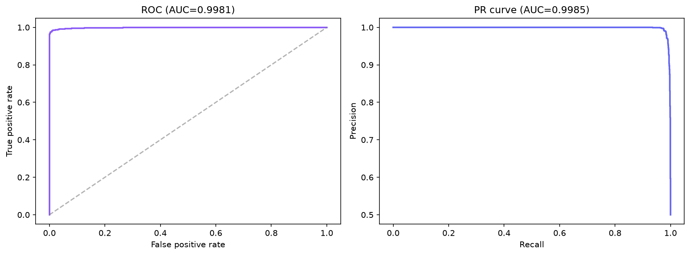
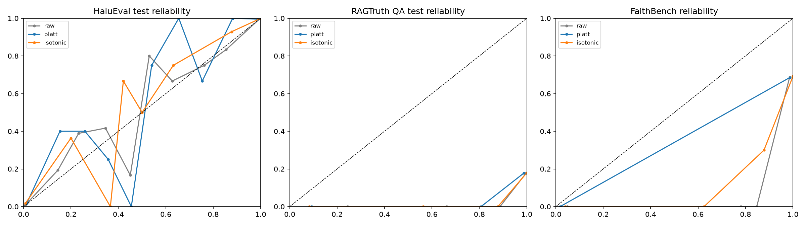
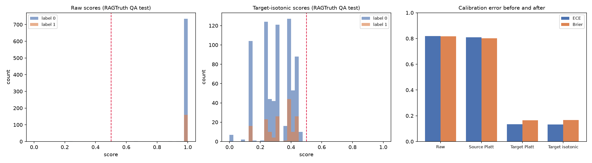
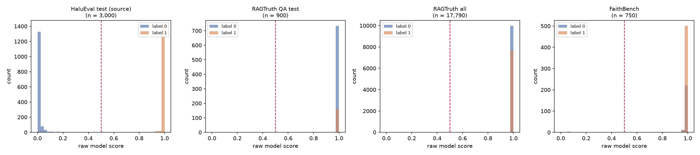
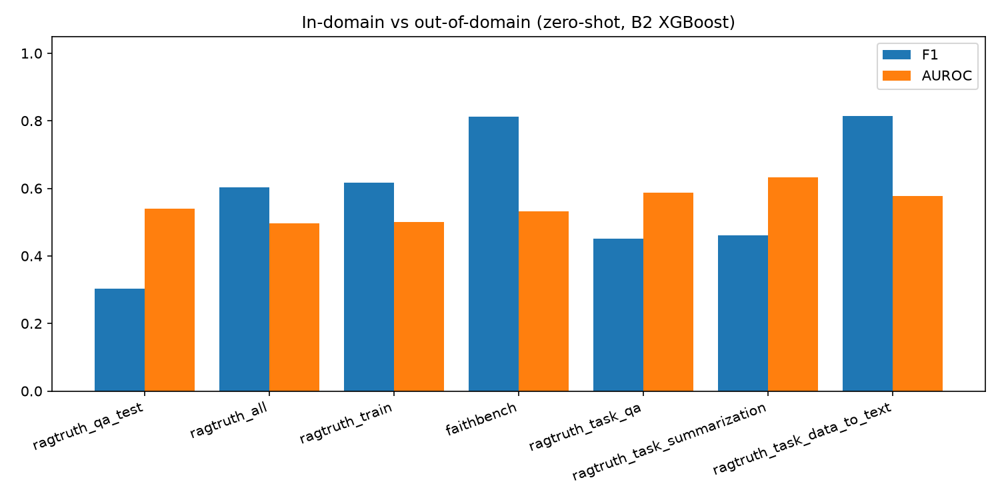
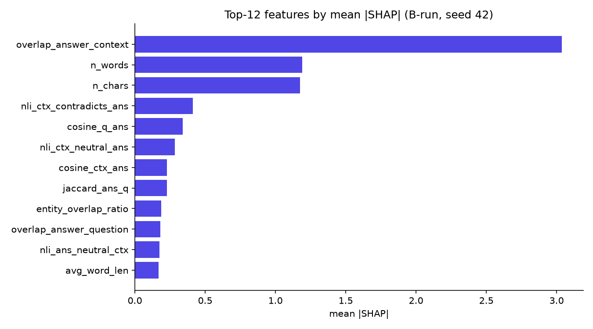

# HaluRISC — Experiments and Results

Every experiment the project ran, with the numbers, the interpretation, and the
artifact file each number comes from. Doc 1 explains how the system was built
([`01-project-and-methods.md`](01-project-and-methods.md)); this document
explains what was measured and what it means. The normative claims live in
[`../blueprint.md`](../blueprint.md) §10.

**Seed policy:** every stochastic experiment is repeated with seeds **42, 123,
456** and reported as the mean over seeds. Deterministic baselines (majority,
heuristic) run once. The test split is used once; tuning and calibration fitting
never touch it.

<!-- Figures below are committed copies under docs/figures/ because
artifacts/figures/ is gitignored and GitHub cannot render ignored files.
When a figure is regenerated, update the copy here as well. -->

## Contents

- [1. Reading Guide and Artifact Map](#1-reading-guide-and-artifact-map)
- [2. Model Comparison and Statistical Tests](#2-model-comparison-and-statistical-tests)
- [3. Leakage-Control Experiment](#3-leakage-control-experiment)
- [4. Calibration: Source Domain](#4-calibration-source-domain)
- [5. Calibration: Target Domain](#5-calibration-target-domain)
- [6. Cross-Domain Zero-Shot Transfer](#6-cross-domain-zero-shot-transfer)
- [7. Feature-Group Ablation](#7-feature-group-ablation)
- [8. Explanation Reliability](#8-explanation-reliability)
- [9. Expert Audit (B5.5)](#9-expert-audit-b55)
- [10. Error Analysis and the Length Confound](#10-error-analysis-and-the-length-confound)
- [11. Efficiency and LLM-Judge Comparison](#11-efficiency-and-llm-judge-comparison)
- [12. Negative-Results Summary](#12-negative-results-summary)
- [13. Claim → Artifact Traceability](#13-claim--artifact-traceability)

---

## 1. Reading Guide and Artifact Map

| Experiment | Primary artifact(s) |
|---|---|
| Model comparison (9 models) | `artifacts/results/b2/b2_model_comparison.csv` / `.json` |
| Per-seed metrics | `artifacts/results/b2/b2_per_seed_metrics.csv` |
| Tuning grid | `artifacts/results/b2/b2_tuning.json` |
| Statistical tests | `artifacts/results/b2/b2_statistical_tests.json`, `b2_bootstrap_cis.json` |
| Leakage comparison | `artifacts/results/b2/b2_leakage_comparison.json` |
| Confusion matrices | `artifacts/results/b2/b2_confusion_matrices.json` |
| Per-row test predictions | `artifacts/results/b2/b2_predictions.parquet` |
| Source-domain calibration | `artifacts/results/b4/b4_calibration_metrics.csv` / `.json` |
| Target recalibration | `artifacts/results/b4/b4_target_calibration.json` |
| Subgroup calibration | `artifacts/results/b4/b4_subgroup_calibration.csv` |
| Zero-shot transfer | `artifacts/results/b3/b3_dataset_metrics.csv`, `b3_transfer_comparison.csv`, `b3_subgroup_metrics.csv`, `b3_bootstrap_cis.json`, `b3_label_sensitivity.json` |
| Ablation | `artifacts/results/ablation_results.csv` |
| Explanation reliability | `artifacts/results/b5/b5_feature_importance.json`, `b5_stability_bootstrap.json`, `b5_neutralization.json`, `b5_perturbations.csv`, `b5_perturbation_aggregates.csv`, `b5_failure_cases.json` |
| Expert audit | `artifacts/results/b5/b5_review_cases_reviewed.csv`, `b5_review_cases.csv/.json` |
| Length confound | `artifacts/results/b5/b5_length_error_analysis.csv` / `.json` |
| Efficiency | `artifacts/results/latency_analysis.json` |
| LLM judge | `artifacts/results/llm_judge_results.json` |
| Error analysis | `artifacts/results/error_analysis.json`, `error_analysis_cases.json` |
| Everything at once | `docs/manifest.frozen.json` |

## 2. Model Comparison and Statistical Tests

Test set: HaluEval QA, n = 3,000, grouped split, mean over seeds. Source:
`b2/b2_model_comparison.csv`.

| Model | Precision | Recall | F1 | AUROC | PR-AUC | MCC |
|---|---|---|---|---|---|---|
| Majority (all 0) | 0.000 | 0.000 | 0.000 | n/a | n/a | 0.000 |
| Heuristic (1 − overlap) | 0.9473 | 0.9233 | 0.9352 | 0.9132 | 0.8196 | 0.8723 |
| TF-IDF (Q+C+A) | 0.6397 | 0.5647 | 0.5999 | 0.6754 | 0.6785 | 0.2484 |
| TF-IDF (answer only) | 0.9550 | 0.8920 | 0.9224 | 0.9696 | 0.9665 | 0.8519 |
| TF-IDF (context only) | 0.5000 | 1.0000 | 0.6667 | n/a | n/a | 0.0000 |
| NLI-only | 0.6479 | 0.6967 | 0.6714 | 0.7177 | 0.7531 | 0.3189 |
| Logistic regression | 0.9768 | 0.9553 | 0.9660 | 0.9932 | 0.9901 | 0.9329 |
| Random forest | 0.9897 | 0.9789 | 0.9842 | 0.9980 | 0.9983 | 0.9687 |
| **XGBoost (ours)** | **0.9932** | **0.9762** | **0.9846** | **0.9979** | **0.9983** | **0.9697** |

**Significance (McNemar on paired test predictions, `b2_statistical_tests.json`):**

| Comparison | p-value |
|---|---|
| XGBoost vs random forest | 0.0442 |
| XGBoost vs logistic regression | 0.4338 |
| XGBoost vs heuristic | 0.3531 |
| XGBoost vs NLI-only | 2.0 × 10⁻⁵ |
| XGBoost vs TF-IDF full | 8.8 × 10⁻⁶ |
| XGBoost vs TF-IDF answer-only | 1.3 × 10⁻⁶ |
| XGBoost vs TF-IDF context-only | < 10⁻¹⁵ |
| XGBoost vs majority | < 10⁻¹⁵ |

**Bootstrap 95% CIs (1,000 resamples):** F1 [0.9812, 0.9895], AUROC
[0.9964, 0.9989]. **Wilcoxon across seeds:** no difference vs random forest
(p = 1.0) or logistic regression (p = 0.25), expected with only three seeds.

**Interpretation.** XGBoost wins, but the honest reading matters:

- The overlap heuristic alone reaches F1 0.9352 without any training. Answer-only
  TF-IDF reaches 0.9224. A large share of the HaluEval signal is answer-style
  surface text, which is why artifact controls exist.
- Context-only has zero signal (F1 0.6667 = always positive), exactly as
  expected because both answer variants of a question share one context.
- NLI-only (F1 0.6714) is weak in isolation, but NLI remains the most
  interpretable contradiction signal inside the full model.
- The XGBoost vs random forest margin is 0.0004 F1, yet McNemar says it is
  significant on the paired predictions.

## 3. Leakage-Control Experiment

Source: `b2/b2_leakage_comparison.json`.

| Split design | F1 | AUROC | Note |
|---|---|---|---|
| Row-level split (invalid) | 0.9886 | ~0.998 | Two rows of one question can straddle partitions |
| **Grouped split (reported)** | **0.9846** | **0.9979** | Both variants stay in one partition |

The row-level split lets the model memorize answer-context pairings, inflating
F1 by 0.004. The corrected grouped split is the only one used for reported
numbers. This result is a feature of the paper: it shows the leakage was found,
quantified, and removed rather than hidden. (The earlier course-run reference,
which used row-level CV tuning, was F1 0.9842.)

## 4. Calibration: Source Domain

Source: `b4/b4_calibration_metrics.csv`, `b4/b4_reliability_data.json`.

| Method | F1 | ECE | Brier | NLL |
|---|---|---|---|---|
| Raw XGBoost | 0.985 | **0.0045** | **0.0117** | **0.045** |
| Platt (sigmoid) | 0.985 | 0.0091 | 0.0129 | 0.058 |
| Isotonic | 0.984 | 0.0070 | 0.0124 | 0.073 |

**This is a negative result, and it is reported as one.** XGBoost with a
logistic objective is already well calibrated on HaluEval; Platt and isotonic
fitting on the validation split both *increase* ECE and NLL. The calibration
stage adds no value in the source domain. Its value appears only after a domain
shift, which is the next experiment.

## 5. Calibration: Target Domain

Source: `b4/b4_target_calibration.json`. Calibrators are fitted on 5,034
RAGTruth QA rows; all numbers are on the disjoint 900-row test set.

| Calibrator | ECE | Brier | NLL | Predicted positive rate |
|---|---|---|---|---|
| Raw scores | 0.8185 | 0.8164 | 5.20 | 0.999 |
| Source Platt (fitted on HaluEval) | 0.8089 | 0.8011 | 3.62 | 0.999 |
| **Target Platt (fitted on RAGTruth)** | **0.1335** | 0.1639 | 0.51 | 0.000 |
| **Target isotonic (fitted on RAGTruth)** | **0.1316** | 0.1663 | 0.53 | 0.000 |

**Interpretation.** Out of domain the raw model is badly miscalibrated: it
predicts near-certainty for almost every sample, so ECE sits above 0.8. A
calibrator fitted on the source domain barely helps (0.8089), which shows the
problem is the domain shift, not the fitting method. Re-fitting on a small
target sample drops ECE to 0.13 and the Brier score from 0.80 to 0.16.

**Deployment caveat (say this in the defense).** After target recalibration the
predicted positive rate collapses to nearly zero at the fixed 0.5 threshold, so
a deployment must retune the decision threshold as well. The probabilities are
fixed, but the labels only follow after that second step.

## 6. Cross-Domain Zero-Shot Transfer

Source: `b3/b3_dataset_metrics.csv`, `b3/b3_transfer_comparison.csv`,
`b3/b3_subgroup_metrics.csv`, `b3/b3_bootstrap_cis.json`,
`b3/b3_label_sensitivity.json`. The HaluEval-trained model is applied with no
training or adaptation on the target corpora.

| Corpus | n | F1 | AUROC | PR-AUC | MCC | ECE |
|---|---|---|---|---|---|---|
| RAGTruth QA | 900 | 0.302 | 0.540 | 0.190 | 0.016 | 0.819 |
| RAGTruth all | 17,790 | 0.603 | 0.497 | 0.407 | 0.041 | 0.560 |
| FaithBench | 750 | 0.813 | 0.531 | 0.683 | 0.107 | 0.301 |

**Recall is 1.0 on every corpus.** The model flags almost everything as
hallucinated on natural responses, precision lands on the label prior, and
AUROC stays near chance (0.5). This is the **central negative result** of the
project: synthetic HaluEval patterns do not transfer to naturally generated
responses.

**Task breakdown (RAGTruth):** F1 0.4515 on QA, 0.4603 on summarization, 0.8140
on data-to-text (where answers closely mirror the structured input).
**Context length:** F1 rises from 0.4940 (context < 128 chars) to 0.7091
(128–511 chars), suggesting the model needs enough evidence text to work with.

**Label sensitivity:** the FaithBench worst-severity mapping was pre-registered,
and a sensitivity check confirms that changing the mapping changes labels but
not the model's predictions. FaithBench text is redacted from the shipped error
cases (`b3/b3_error_cases.json`) because of the CC BY-NC-SA license.

**Why it fails (the mechanism is measured, not guessed).** See §10: HaluEval's
hallucinated answers are systematically longer, and the model learned length as
a proxy for the label. Natural responses are full sentences, so they all read as
hallucination evidence. This is exactly the gap that the deployed per-claim
verification layer exists to cover.

## 7. Feature-Group Ablation

Source: `artifacts/results/ablation_results.csv`. Each group is removed, the
model is retrained from scratch with the same protocol, and the experiment is
repeated across the three seeds (7 groups × 3 seeds). Full model: F1 0.9846,
AUROC 0.9979.

| Removed group | F1 | ΔF1 | AUROC | Reading |
|---|---|---|---|---|
| Length | 0.9801 | −0.0045 | 0.9963 | Real but partly benchmark artifact |
| **Lexical** | 0.9600 | **−0.0247** | 0.9923 | Dominant signal |
| Entity | 0.9847 | +0.0001 | 0.9982 | Neutral |
| NLI | 0.9823 | −0.0023 | 0.9973 | Modest but contributes |
| Numeric | 0.9844 | −0.0002 | 0.9982 | Neutral |
| Hedging | 0.9848 | +0.0001 | 0.9981 | Neutral |
| Semantic | 0.9860 | +0.0014 | 0.9982 | Slightly harmful when present |

**Interpretation.** Lexical grounding carries the largest weight, which matches
the SHAP ranking in §8. Length is next. NLI contributes a smaller amount than
its interpretability value suggests. The entity, numeric, and hedging groups are
neutral on this benchmark and are reported as such rather than removed silently.
The semantic group is mildly harmful, a negative result kept and disclosed.

## 8. Explanation Reliability

Sources: `b5/b5_feature_importance.json`, `b5/b5_stability_bootstrap.json`,
`b5/b5_neutralization.json`, `b5/b5_perturbations.csv`,
`b5/b5_perturbation_aggregates.csv`, `b5/b5_failure_cases.json`.

**Importance triangulation.** The mean-|SHAP| ranking agrees with permutation
importance at **Kendall τ = 0.66**. Disagreement is concentrated in
mid-importance features; the top of the ranking (context overlap, answer length,
context-answer contradiction probability, question-answer cosine) is stable.

**Bootstrap stability.** The top-5 feature set is identical across 1,000
bootstrap resamples (**Jaccard = 1.0**).

**Neutralization.** Setting the top-*k* SHAP features of each sample to their
median produces a monotone drop in the mean score: **−0.079** at k = 1,
**−0.412** at k = 10. The features SHAP ranks highest are the ones actually
driving predictions.

**Perturbation stability.** Each test answer is edited, features are fully
re-extracted, and the calibrated score and SHAP ranking are compared.

| Operator | n | Mean Δscore | Large-change rate | Top-1 flips | Spearman |
|---|---|---|---|---|---|
| Entity replacement | 78 | 0.360 | 0.372 | 0.000 | 0.840 |
| Number replacement | 22 | 0.345 | 0.364 | 0.000 | 0.852 |
| Date replacement | 13 | 0.279 | 0.308 | 0.000 | 0.870 |
| Support removal | 66 | 0.272 | 0.288 | 0.000 | 0.874 |
| Irrelevant insert | 120 | 0.006 | 0.008 | 0.000 | 0.948 |
| Clause shuffle | 14 | 0.001 | 0.000 | 0.000 | 0.921 |

Content edits move the score in proportion to their semantic weight; neutral
edits leave it nearly untouched; the top-1 SHAP feature never flips under any
operator. Caveats are reported openly: date and clause-shuffle samples are small
(n = 13 and 14) because not every answer contains an editable element, and no
arbitrary pass thresholds are used.

## 9. Expert Audit (B5.5)

Sources: `b5/b5_review_cases.csv` (export), `b5/b5_review_cases_reviewed.csv`
(filled), tally via `src/models/review_tally.py`.

**Protocol.** The B5 run exported an error-enriched sheet of **26 cases**:
9 false positives, 10 false negatives, and 7 borderline cases with calibrated
scores in [0.35, 0.65] (each pool is capped by availability, so the sheet is
smaller than the original 40-case target). Two structured review passes were
performed with an **AI assistant**, recorded per row as `review_mode =
ai-expert`. Pass 1 judged evidence grounding: is the score direction sensible
for how well the answer is supported by the context? Pass 2 judged the SHAP
feature story: do the top-5 features reflect genuine support or contradiction
signals rather than brevity or overlap artifacts?

**Results.**

| Metric | Pass 1 (grounding) | Pass 2 (features) |
|---|---|---|
| Plausible | 6 | 7 |
| Unsure | 5 | 4 |
| Implausible | 15 | 15 |
| Agreement | **23 / 26 (88%)** | |

Disagreements (`agreement = no`): `q_4156_correct` (a grounded answer just above
the boundary), `q_1729_hallucinated` (context-supported numbers with the wrong
referent), and `q_5173_hallucinated` (ambiguous question, low score).

**Findings.**

- False positives follow the length/overlap confound quantified in §10: grounded
  short or mid-length answers receive high risk driven by brevity features.
- False negatives occur when a wrong answer reuses entities that appear in the
  context, keeping lexical overlap high.
- Two labeled-hallucinated cases (items **2251** and **2436**) are directly
  supported by their context, so the model's low score is defensible and the
  label looks like benchmark noise.

**Caveats (never omit).** The sheet deliberately oversamples FP/FN/borderline
cases, so these proportions describe the audit, not the test set. The review was
AI-assisted and must never be described as a two-human-reviewer study.

## 10. Error Analysis and the Length Confound

Sources: `artifacts/results/error_analysis.json`,
`artifacts/results/error_analysis_cases.json`,
`artifacts/results/b5/b5_length_error_analysis.csv`.

### 10.1 Error counts and taxonomy

The 3,000-sample test set contains **48 errors: 12 false positives and 36 false
negatives** (error rate 1.6%). A manual inspection of 20 sampled errors assigns
them to two categories:

| Category | FP | FN |
|---|---|---|
| Label ambiguity | 7 | 4 |
| Short-answer ambiguity | 3 | 6 |

Both categories trace back to benchmark construction: very short answers leave
neither lexical nor NLI evidence decisive, and some answers read as plausible
under both labels.

### 10.2 Length-binned analysis (the mechanism)

The B5 follow-up (`src/models/analyze_length_shortcut.py`) bins the entire test
set by answer length, mean over seeds:

| Words | Rows | Hallucinated share | FP rate | FN rate | F1 | Mean score |
|---|---|---|---|---|---|---|
| 1 | 524 | 0.021 | 0.004 | 0.182 | 0.818 | 0.024 |
| 2 | 514 | 0.033 | 0.000 | 0.176 | 0.903 | 0.035 |
| 3–4 | 474 | 0.127 | 0.002 | 0.178 | 0.897 | 0.126 |
| 5–8 | 641 | 0.902 | 0.106 | 0.031 | 0.978 | 0.888 |
| 9–16 | 600 | 0.982 | 0.000 | 0.003 | 0.998 | 0.980 |
| 17+ | 247 | 0.992 | 0.333 | 0.000 | 0.999 | 0.993 |

**Reading.**

- In HaluEval, answer length is close to a perfect label proxy: the hallucinated
  share climbs from 2.1% (one word) to 99.2% (17+ words).
- The model reproduces the confound: its mean score rises from 0.024 to 0.993
  across the same bins.
- **67% of all false positives** fall in the 5–8 word bin (10.6% FP rate), and
  false negatives concentrate in the 1–4 word bins (about 18% FN rate).
- The 17+ bin has only two negative rows, so its 0.333 FP rate is a tiny-sample
  artifact and is footnoted rather than interpreted.

**Why this matters.** It converts "transfer fails" into a concrete mechanism:
natural RAGTruth responses are full sentences, their length reads as
hallucination evidence, and that is why recall is 1.0 and AUROC is near chance
out of domain. It also justifies why the deployed interface leads with
per-claim evidence verdicts instead of the length-sensitive model score.

## 11. Efficiency and LLM-Judge Comparison

### 11.1 Latency

Source: `artifacts/results/latency_analysis.json`. Measured on 200 test samples,
RTX 3060 6 GB, NLI and embeddings on GPU, remaining features on CPU.

| Component | p50 (ms) | p95 (ms) | mean (ms) |
|---|---|---|---|
| Core lexical | 0.10 | 0.15 | 0.11 |
| Entity (spaCy NER) | 21.13 | 47.24 | 25.34 |
| NLI (2 directions) | 27.09 | 68.60 | 40.09 |
| Semantic (MiniLM) | 9.25 | 15.55 | 12.56 |
| XGBoost inference | 1.26 | 8.80 | 2.62 |
| SHAP explanation | 1.91 | 15.52 | 3.65 |
| **Total per sample** | **61.77** | | |

The deployed model artifact is ≈ 0.82 MB. Marginal cost is about **$0.001 per
1,000 predictions**, since the only consumable resource is electricity. NLI and
NER dominate latency; both are cached.

### 11.2 LLM-as-judge comparison

Source: `artifacts/results/llm_judge_results.json`. Same 200 samples, fixed
prompt, GPT 5.6 Luna.

| Model | Accuracy | Precision | Recall | F1 | Latency p50 | Cost / 1K |
|---|---|---|---|---|---|---|
| GPT 5.6 Luna judge | 0.860 | 0.974 | 0.740 | 0.841 | 1,310 ms | $0.105 |
| **XGBoost (ours)** | **0.985** | **0.980** | **0.990** | **0.985** | **62 ms** | **≈ $0.001** |

Agreement 84.5%. McNemar p = 1.6 × 10⁻⁵, and the discordant pairs are strongly
one-sided: 28 cases where the judge is wrong and the model is right, against 3
in the other direction. The practical difference is the cost gap: roughly
**100x cheaper and 20x faster** locally, with higher F1 on the measured sample.

## 12. Negative-Results Summary

Reported deliberately and with the same care as positive results:

1. **Source-domain calibration does not help.** Raw XGBoost ECE 0.0045 beats
   Platt (0.0091) and isotonic (0.0070). Calibration earns its keep only under
   domain shift.
2. **Zero-shot transfer fails.** Recall 1.0 and AUROC ≈ 0.5 on RAGTruth and
   FaithBench, with the length confound as the measured mechanism (§10).
3. **Three feature groups are neutral on HaluEval** (entity, numeric, hedging),
   and the semantic group is mildly harmful.
4. **The calibrated score is style-sensitive in conversation.** Full-sentence
   grounded answers can saturate it, which is why the interface leads with
   per-claim verdicts.
5. **The audit found benchmark label noise** (items 2251 and 2436) and a
   deliberately error-heavy sample, so its plausibility rate is not a test-set
   estimate.

What the negatives buy: they define exactly where a lightweight
benchmark-trained detector is trustworthy, and they motivate the claim-level
verification layer that the deployed system adds. The papers state each of these
in the Results and Limitations sections.

## 13. Claim → Artifact Traceability

| Claim | Artifact | Value |
|---|---|---|
| XGBoost in-domain F1 | `b2/b2_model_comparison.csv` | 0.9846 |
| XGBoost AUROC / MCC | `b2/b2_model_comparison.csv` | 0.9979 / 0.9697 |
| Bootstrap CI F1 / AUROC | `b2/b2_statistical_tests.json` | [0.9812, 0.9895] / [0.9964, 0.9989] |
| McNemar vs RF / answer-only | `b2/b2_statistical_tests.json` | 0.0442 / 1.3 × 10⁻⁶ |
| Row-level vs grouped F1 | `b2/b2_leakage_comparison.json` | 0.9886 → 0.9846 |
| Source ECE raw / Platt / isotonic | `b4/b4_calibration_metrics.csv` | 0.0045 / 0.0091 / 0.0070 |
| Target ECE raw → recalibrated | `b4/b4_target_calibration.json` | 0.8185 → 0.1335 |
| Transfer F1 (QA / all / FaithBench) | `b3/b3_dataset_metrics.csv` | 0.302 / 0.603 / 0.813 |
| Ablation ΔF1 lexical | `ablation_results.csv` | −0.0247 |
| SHAP vs permutation τ | `b5/b5_feature_importance.json` | 0.66 |
| Bootstrap Jaccard top-5 | `b5/b5_stability_bootstrap.json` | 1.0 |
| Neutralization k=1 → k=10 | `b5/b5_neutralization.json` | −0.079 → −0.412 |
| Perturbation Δscore (entity) | `b5/b5_perturbation_aggregates.csv` | 0.360 |
| Audit agreement | `b5/b5_review_cases_reviewed.csv` | 23/26 (88%) |
| Length share 1 word → 17+ | `b5/b5_length_error_analysis.csv` | 0.021 → 0.992 |
| FP share in 5–8 words | `b5/b5_length_error_analysis.csv` | 0.667 |
| Total latency p50 | `latency_analysis.json` | 61.77 ms |
| Judge F1 / cost | `llm_judge_results.json` | 0.841 / $0.105 per 1K |
| Test errors (FP / FN) | `error_analysis.json` | 12 / 36 |

